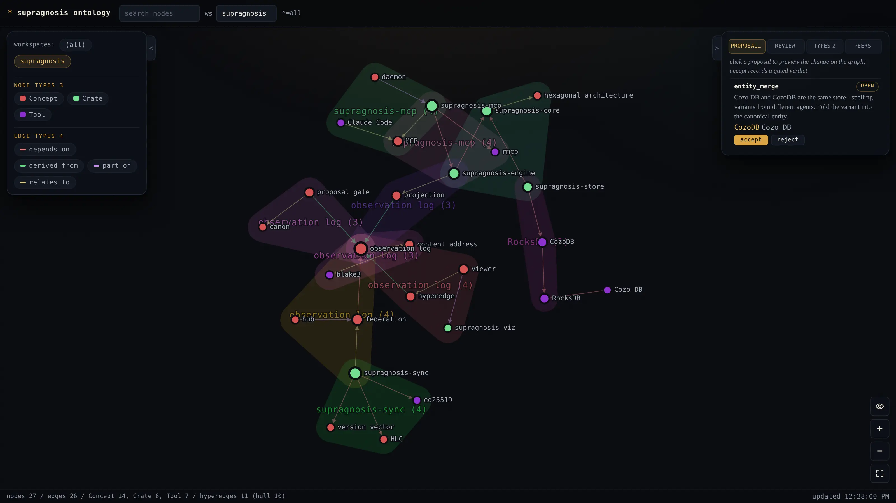

# supragnosis

**Memory for AI agents that remembers who said it.**

[](https://github.com/Ashon/supragnosis/actions/workflows/rust.yml)
[](#license)

An embedded, file-based knowledge server for MCP clients. Agents shed observations as a
by-product of work; every claim they store arrives carrying who asserted it, on what basis,
and how far this node has decided to trust it. Nothing leaves your machine unless you say so.

```
supragnosis = supra (above) + gnosis (knowing) - knowledge about knowledge.
```

## The problem it solves

Most agent memory answers *what was remembered*. It does not answer *who said so*.

That is fine for a single assistant remembering one user's preferences. It stops being fine
the moment two agents, two machines, or two people write into the same memory:

- Two agents assert opposite facts. Last write wins, and the disagreement is gone.
- An agent summarizes a poisoned document into memory. Nothing records where it came from,
  so nothing can trace what else that summary contaminated.
- You want to share project knowledge with a teammate but not your private notes. There is
  no boundary to draw, because the store has no concept of whose knowledge this is.
- A credential ends up in the log. There is no way to find it and no way to get it out.

supragnosis treats an assertion and a fact as different things. What is stored is never
"X is true" but "host H, at time T, on the basis of S, asserted X". The current belief is
computed from those assertions by a policy you can replace, so changing your mind about how
to resolve conflicts means recomputing, not rewriting.

## What that buys you

| | |
|---|---|
| **Provenance on every claim** | acting host, principal on whose behalf, workspace, source, observation time, confidence, and a trust tier the receiving node computes rather than accepts |
| **Conflicts stay visible** | contradictory assertions coexist and surface for mediation instead of one silently overwriting the other |
| **Nothing is destroyed** | the observation log is append-only and content-addressed. A correction is a new observation; a merge can be un-merged |
| **A gate before the canon** | entity merges, trust promotions, and schema changes go through a proposal with a computed diff of what the verdict would overturn |
| **Sharing is opt-in** | a workspace leaves the node only if you list it. Peers are authorized per workspace, on the sync path and the query path alike |
| **Secrets do not enter** | credential-shaped text is refused at ingest, not rewritten, because an append-only log that has replicated cannot take it back |
| **Local-first, no cloud** | one binary, an embedded pure-Rust store, no C toolchain, no account, no network unless you configure a peer |

## Quick start

```bash
brew tap ashon/tap
brew install supragnosis-server
brew services start supragnosis-server     # MCP on :7373 + local viewer

claude mcp add supragnosis --transport http http://127.0.0.1:7373/mcp \
  --header "Authorization: Bearer $(cat ~/.supragnosis/mcp.token)"
```

The daemon speaks HTTP on loopback, and loopback confines it to the *host*, not to one user - so
a bearer token is what makes it yours. It is generated on first start at `~/.supragnosis/mcp.token`
(mode 0600); `supragnosis status` prints the command above with the token filled in.

Not on Homebrew:

```bash
curl -fsSL https://supragnosis.dev/install.sh | sh    # ~/.local/bin, checksum-verified
claude mcp add supragnosis -- $(command -v supragnosis)
```

Prebuilt binaries are keyword search only. For local semantic recall (ONNX, no API calls),
build with `--features fastembed`.

### Your first minute

Ask the agent to remember something, in whatever words you would use:

> **you:** remember that auth in this repo is JWT with a 15-minute expiry, decided because the
> mobile client cannot hold a session cookie

The agent calls `observe`. What lands is not the sentence - it is an observation carrying the
entities it names, the relations between them, and who said it:

```
observed  "auth in this repo is JWT with a 15-minute expiry..."
          entities   JWT [AuthMechanism], mobile client [Component]
          relations  repo --uses--> JWT,  JWT --constrained_by--> mobile client
          provenance host=your-laptop  on_behalf_of=you  tier=human_confirmed
```

Later, in a different session, with none of that in the context window:

> **you:** how does auth work here?
>
> **agent:** JWT with a 15-minute expiry. That came from you directly rather than from reading the
> code, and the stated reason was that the mobile client cannot hold a session cookie.

The second half of that answer is the point. `search_knowledge` returns the provenance beside the
claim, so the agent can tell you *who said it and how sure to be* - and you can ask for the
observation it came from and read the original text.

The viewer runs alongside the daemon on a unix socket - the desktop app opens it, or read it
directly:

```bash
curl -s --unix-socket ~/.supragnosis/viz.sock http://localhost/api/graph
```

Watching it while an agent works is the part that is hard to convey in text:

<p align="center">
  
</p>

## What the agent gets

13 MCP tools, each one recurring intent:

- `observe` - free text plus optional structured assertions. No schema required up front.
- `search_knowledge` - hybrid keyword and semantic recall, labelled with the mode it used.
- `get_entity`, `traverse` - exact lookup and bounded graph walks.
- `workspace_map` - co-occurrence hyperedges: what tends to get said together.
- `define_type` - promote a pattern into the workspace glossary.
- `propose`, `review`, `list_proposals`, `get_proposal` - the gate to the canon.
- `sync_status`, `sync_pull`, `sync_push` - federation.

Plus dereferenceable resources: `supragnosis://workspaces`,
`supragnosis://workspace/{ws}/graph`, `supragnosis://workspace/{ws}/hypergraph`,
`supragnosis://workspace/{ws}/types`, `supragnosis://observation/{id}`.

## How it works

Three ideas, and everything else follows from them.

**Event sourcing.** Immutable, content-addressed observations are the source of truth. The
entity and relation graph is a projection you can throw away and rebuild by replaying the
log. Changing the resolution policy is a re-projection, not a migration.

**Topology-independent convergence.** Nodes holding the same set of observations materialize
the same graph, no matter which path events took or in what order they arrived. Content
addressing dedups, hybrid logical clocks order, and the projection is a deterministic fold.
Local-only, hub-and-spoke, direct peer, or a mix: the topology is an operational choice, not
a semantic one.

**Hexagonal ports.** The domain crate has zero IO dependencies. Store, embedder, and
transport sit behind ports held to one conformance suite. This is not an aspiration: a third
store adapter was added and the original backend deleted, a different query paradigm and a
different storage engine, without changing a line of `core` or `engine`.

## Documentation

| | |
|---|---|
| [architecture.md](docs/architecture.md) | what is built, how, and Section 14: the honest record of what is not |
| [principles.md](docs/principles.md) | the normative document. Every design decision is justified against it |
| [federation.md](docs/federation.md) | node identity, the sync protocol, trust evaluation |
| [proposal-workflow.md](docs/proposal-workflow.md) | the gate to the canon |
| [resolution.md](docs/resolution.md) | how assertions become a current belief |
| [excision.md](docs/excision.md) | the one act that removes knowledge, and why it is last |
| [CONTRIBUTING.md](CONTRIBUTING.md) | how to build, test, and send a change |

## Status

Working today: hybrid recall, belief resolution with contested claims surfaced, identity
resolution with an entity merge gate that can be reversed, hub-and-spoke log replication with
ed25519-signed events over TLS, and a live viewer.

Not yet: bitemporal time-travel queries, multi-principal governance, recall demotion and idle
consolidation, and automatic type induction.

That second list is not a roadmap gesture. Every unmet demand is a named clause with a
declared evidence state, tested by
[`principle_coverage.rs`](crates/supragnosis-engine/tests/principle_coverage.rs), and every
deferral names the milestone that repays it. If a guard is deleted or renamed, the clause
reports itself as unguarded. See [architecture.md](docs/architecture.md) Section 14.

Versions before 1.0 may break the store format. Migrations are provided and documented.

## Configuration

Everything has a default that works. `supragnosis --help` for the full surface;
[docs/architecture.md](docs/architecture.md) for the reasoning behind the defaults.

Most used:

- `SUPRAGNOSIS_WORKSPACE` - default workspace (default `default`)
- `SUPRAGNOSIS_DATA_DIR` - store directory (default `~/.supragnosis/redb`)
- `SUPRAGNOSIS_EMBED` - `fastembed` | `hashing` | `none`. Degrades to keyword search if absent
- `SUPRAGNOSIS_CONFIG` - path to `supragnosis.toml`. No file means a standalone node
- `SUPRAGNOSIS_MCP_AUTH` - `on` (default) | `off`. `off` drops the daemon's bearer check

The MCP HTTP daemon is loopback-only **and requires a bearer token**. Those are two different
guards because loopback answers a different question than people assume: it confines the surface
to this *host*, not to one *user*, so on a shared machine any local account could otherwise
`observe`, `review` and `sync_push` through it. The token (`~/.supragnosis/mcp.token`, mode 0600)
is what makes the surface yours, and it is the same access control the viewer gets from its socket
file - the viewer could move to a unix socket, and the daemon cannot, because MCP clients speak
HTTP.

The viewer has no TCP port at all: it serves over a unix socket whose 0600 mode is the access
control, and every response carries a Content-Security-Policy. A non-loopback federation bind
requires TLS and a non-empty allowlist, and refuses to start without both.

## Upgrading from a pre-0.2 store

Through v0.1.21 the store was Cozo. This build reads only redb and refuses to start beside an
un-migrated Cozo store rather than coming up empty next to one. Read
[docs/store-migration.md](docs/store-migration.md) Section 5 first, then:

```bash
supragnosis stop
curl -fsSL https://supragnosis.dev/install.sh | sh -s -- --version v0.1.21
supragnosis migrate-store
curl -fsSL https://supragnosis.dev/install.sh | sh
supragnosis start
```

## License

MIT OR Apache-2.0, at your option. See [LICENSE-MIT](LICENSE-MIT) and
[LICENSE-APACHE](LICENSE-APACHE).

Unless you state otherwise, any contribution you intentionally submit for inclusion is dual
licensed as above, with no additional terms.
