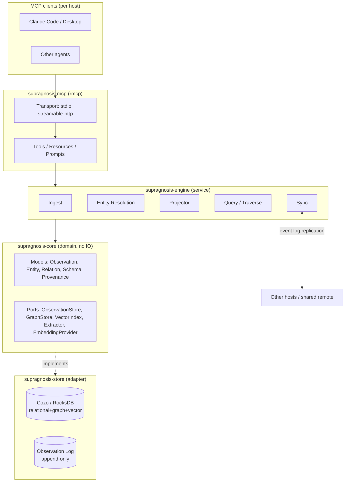
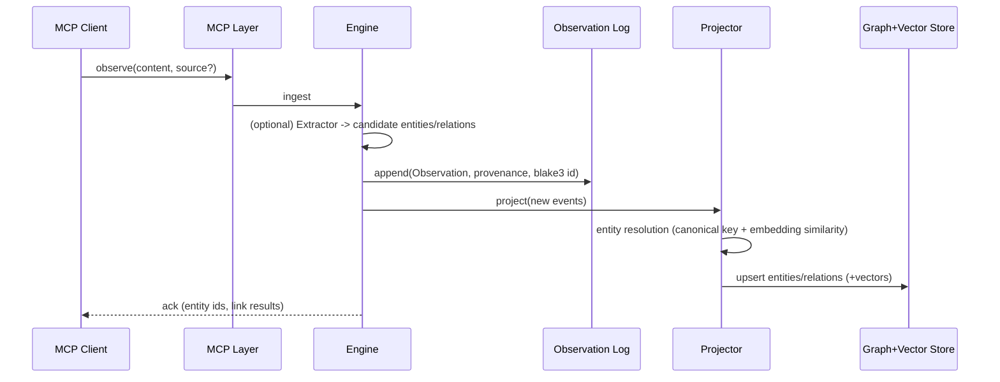
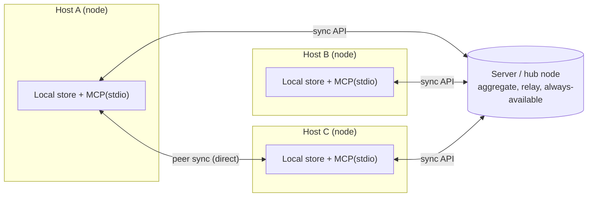

# supragnosis - Architecture Design

> An embedded/file-based Rust server that collects knowledge fragments arising across
> multiple **hosts** and **workspaces**, structures them into an
> **ontology (a concept/relation graph)**, and lets them be queried/explored via **MCP**.

- Name: `supragnosis` = *supra* (above/beyond) + *gnosis* (knowledge). Knowledge above knowledge = meta-knowledge.
- Namespace URI: `supragnosis://...`
- Status: **design phase (greenfield)**. This document is the baseline for implementation.
- Normative document: the design principles follow [`principles.md`](principles.md) (design principles).

---

## 1. Goals / Non-goals

### Goals
- Unify knowledge from multiple hosts/workspaces into a single ontology **while preserving provenance**.
- **Embedded/file-based**: runs as a single process on each host, with no separate DB server.
- Provides tools that let MCP clients (e.g. Claude Code/Desktop, various agents) **ingest (observe)** knowledge and
  **query it semantically/graph-wise (search/traverse)**.
- Converges distributed knowledge via **local-first** operation + **synchronization** across hosts.

### Non-goals (initial version)
- Knowledge extraction via a built-in LLM - initially the **client (the calling agent) is responsible for extraction**,
  and supragnosis serves as a deterministic storage/resolution/query substrate (the extractor is separated behind a port and attached later).
- Large-scale multi-tenancy/real-time collaborative editing - only eventual consistency at the level of event-log merging is targeted.
- A full OWL reasoner - start with lightweight rule-based inference.

---

## 2. Core Concepts & Domain Model

Borrowing the description-logic convention, we split into **two layers**.

- **Schema layer (T-Box)** - which entity types/relation types exist (the ontology's definitions).
- **Instance layer (A-Box)** - the actual entities/relations/knowledge fragments.

### 2.1 Entity (concept node)
| Field | Description |
|------|------|
| `id` | Stable identifier (the resolved canonical entity) |
| `type` | T-Box type (`Concept`,`Person`,`Project`,`Tool`,`File`,`Decision`,`Task`...) |
| `canonical_name` | Canonical name |
| `aliases` | Synonyms/spelling variants |
| `properties` | Type-specific properties (JSON) |
| `embedding` | (optional) vector for semantic search |

### 2.2 Relation (edge)
- Directed **typed relations**: `depends_on`, `part_of`, `authored_by`, `relates_to`,
  `derived_from`, `mentions` ...
- **Relation-type canonicalization**: the kind spelling goes through deterministic normalization (trim, separators/camelCase -> `_`,
  lowercase) before being reflected into the id and storage - spelling jitter from LLM extractors
  (`depends-on`/`dependsOn`) does not diverge into different edge ids (a pure function, Principle 16).
- **Bitemporal attributes** (Principle 4): **valid time** `valid_from`/`valid_to` (the period it was true in the world)
  vs **transaction time** `observed_at` (when the system learned of it, in provenance). Disproof is handled not as deletion but as
  closing `valid_to`.
- Others: `confidence`, `provenance` (including trust tier).

### 2.3 Observation - **the source of truth**
Knowledge first arrives as an **immutable observation event**. The entity/relation graph is a
**materialized projection** derived from the observation log (event sourcing).

| Field | Description |
|------|------|
| `id` | **Content address** (blake3 hash) -> automatic dedup no matter which path (server/peer) it arrives by |
| `content` | The raw knowledge fragment (text/structured) |
| `assertions` | (optional) candidate entities/relations handed over by the client - kept in the log **exactly as spelled** (normalization is the projection's job) and **included in id computation** (assertions, unlike lineage/embedding, are content identity - the same text with different assertions is a different observation) |
| `provenance` | a **list** of attestations (at least 1): each with `host` (acting), `on_behalf_of` (the delegating principal), `workspace`, `source_ref`, `observed_at` (transaction time), `confidence`, `trust_tier`. Re-arrival under the same content address accumulates as a monotonic union rather than overwriting (the merge norm of Principle 3) |
| `derived_from` | (optional) the source observation ids this observation was derived from - the recall list for contamination cleanup (Principle 18) |
| `origin` | `origin_host_id`, `origin_seq` (monotonically increasing per host) - the key for version-vector delta sync |
| `hlc` | Hybrid Logical Clock - a **deterministic causal order** independent of host wall-clock skew |
| `signature` | (optional) the origin node's signature - detects source forgery/tampering even after relaying through servers/peers |

### 2.4 Provenance - **first-class citizen, delegation chain, trust tier**
Every fact is stored with a provenance tag. Nothing is destructively overwritten.
- **Delegation chain** (Principle 2): "who" is expressed not as a flat host id but as `acting host` + `on_behalf_of`
  (e.g. `claude-code@macbook` acting on behalf of `ashon`). External/legacy observations without a chain are recorded with the
  acting host alone but treated as lower in trust evaluation.
- **Trust tier** (Principle 18): an observation carries a verification-level tier (human-confirmed > signed trusted host > a host's
  agent extraction > unverified) that feeds into resolution weighting/query ranking. Tier **promotion is explicit only**
  (human confirmation/cross-validation) - it does not rise merely with the passage of time.
- **Conflict preservation** (Principle 6): conflicting assertions all remain with their provenance, and the **resolution layer** (a swappable
  strategy) computes the "current belief" while leaving the existence of the contradiction queryable.

---

## 3. Architecture Overview (hexagonal / port-adapter)

The domain pure, IO as adapters. The store/embedding/extractor sit behind **traits (ports)**, making them swappable.



### Layers
1. **MCP protocol layer** (`rmcp`): tools/resources/prompts, transport (local stdio + remote HTTP).
2. **Service (engine) layer**: orchestration of the ingest/resolve/project/query/sync use cases.
3. **Domain layer**: models + port traits + schema/resolution/inference rules (zero external dependencies).
4. **Storage layer**: the embedded store adapter (observation log + materialized graph + vector index).
5. **Synchronization layer**: observation-log replication across hosts.

---

## 4. Data Flow

### 4.1 Ingest


### 4.2 Query
- `search`: **vector (HNSW) + keyword** hybrid for fragment/entity candidates -> graph-context enrichment -> ranking with provenance included.
- `traverse`: n-hop traversal from an entity (relation-type filter). Recursive traversal is expressed in Cozo Datalog.

### 4.3 Sync - topology-independent replication
- Each host appends to its local observation log. Observations are **immutable + content-addressed + origin/HLC**.
- Sync = **version-vector delta replication** - nodes exchange `{host_id: max_seq}` with each other and pull/push only the shortfall.
- dedup via CAS (blake3), deterministic order via HLC -> converges to **the same log set -> the same graph** (CRDT-like strong eventual consistency).
- This replication primitive is **independent** of the path (local/server/peer) -> all topologies in Section 5 reuse the same logic.

---

## 5. Connection Topology / Federation (Topology & Federation)

**A single binary, composed roles.** A single supragnosis instance can hold the roles below in overlapping combinations.

- **Local node (always)** - ontologizes that host's knowledge via the embedded store + local MCP (stdio).
- **Sync client** - pull/push its own observation log against a remote (server/peer).
- **Server (hub) node** - aggregates/relays multiple nodes' logs, always available, central authz.
- **Peer** - direct node<->node sync without a center (mesh).

### Supported topologies
1. **Standalone** - local only (offline).
2. **Hub-and-spoke (client-server)** - hosts sync to a central server. The server is the canonical set/relay/always-available.
   Even when hosts are not online simultaneously, they catch up via the server.
3. **Peer-to-peer (mesh)** - hosts sync directly. No center needed, ad-hoc/offline-first.
4. **Hybrid** - some peer directly + also sync to a hub at the same time. (**the default direction**)



### Distinguishing the two kinds of connection
| | MCP transport | Sync (federation) transport |
|--|----------------|-------------------------------|
| Target | **agent <-> node** | **node <-> node/server** |
| Protocol | MCP (stdio local / streamable-HTTP remote) | a dedicated sync API (HTTP(S), later gRPC) |
| What it does | observe/search/traverse tool calls | observation-log version-vector delta exchange |

> That is, "connecting to a server" is possible at both levels: (a) a remote agent connects to a node's MCP-HTTP,
> (b) a node syncs its log with a hub server. supragnosis supports both.

### Sync protocol (draft)
- `advertise` -> exchange the version vector `{host_id: max_seq}` (a summary of what I have).
- `pull(since)` -> stream in observations from the origin_seq ranges where the peer is ahead of me.
- `push(events)` -> send the ranges where I am ahead. The receiving side dedups via CAS, orders by HLC, then re-materializes.
- Trust: **sign** events with the node keypair -> guarantees source authenticity even through relays/peers.

### Selective sharing
Not all local knowledge should leave -> at the sync boundary, **filter/redact by workspace/sensitivity label**.
A node advertises only the workspaces it will share, and the server enforces per-node access.

---

## 6. Store Selection

| Criterion | **CozoDB (recommended)** | Oxigraph |
|------|-------------------|----------|
| Form | embedded relational+graph+vector, Datalog | embedded RDF triplestore, SPARQL |
| Vector search | [o] native HNSW | [x] (needs a separate component) |
| Graph traversal | [o] recursive Datalog | [o] SPARQL property path |
| Ontology standards (OWL/RDFS) | model the schema directly | [o] standards-optimal |
| Backend | RocksDB / SQLite / in-mem | RocksDB / in-mem |
| File-based | [o] | [o] |

**Recommended: CozoDB as the primary store.**
Reason - a knowledge system needs all of (1) **semantic recall of fragments (vector)**, (2) ontology **graph traversal**,
and (3) **relational queries over metadata/provenance**, and Cozo alone covers all three and is embedded.

> **Alternative condition**: if strict RDF/OWL standards compliance/SPARQL interoperability is a **hard requirement**, use Oxigraph.
> Because of the port-adapter structure, it can be swapped by reimplementing only the `GraphStore`/`VectorIndex` traits -
> the store choice is isolated so it does not leak into the domain code.

---

## 7. MCP Surface (Tools / Resources / Prompts)

### Tools
| Tool | Role |
|------|------|
| `observe` | ingest a knowledge fragment (free text + optional entities/relations/`on_behalf_of`/`derived_from`) -> creates an observation/links entities |
| `search_knowledge` | semantic + keyword hybrid search |
| `get_entity` | look up an entity + relations + provenance |
| `traverse` | n-hop graph traversal from an entity |
| `assert_relation` | explicitly assert a typed relation |
| `define_type` | extend the T-Box (types/relations) |
| `list_sources` | provenance/workspace introspection |
| `sync_status` / `sync_pull` / `sync_push` | synchronization (administrative) |
| `query` | advanced Datalog query (passthrough under an authorization guard) |
| `propose` | create a canon-promotion proposal (M3.5, Principle 23 - [proposal-workflow.md](proposal-workflow.md)) |
| `list_proposals` / `get_proposal` | proposal list / proposal + belief diff + checks (M3.5) |
| `review` | comment on or adjudicate a proposal (merge/reject); human confirmation via elicitation (M3.5) |

### Resources (read-only, addressable)
- `supragnosis://entity/{id}` - entity
- `supragnosis://observation/{id}` - observation (raw text + provenance + derived_from lineage).
  The dereference path for an observation id returned by a search hit - it fulfills the query surface's obligation to
  answer "where did this answer come from" (Principle 2) and the dereferenceability of observation identifiers (Principle 14).
- `supragnosis://workspace/{ws}/schema` - the type schema (the T-Box is workspace-scoped - Principle 11)
- `supragnosis://workspace/{ws}/summary` - a summary of the workspace's knowledge
- `supragnosis://proposal/{id}` - proposal (M3.5)
- `supragnosis://workspace/{ws}/canon-policy` - canon policy (M3.5)

### Prompts
- `what-do-we-know-about {topic}` - a guide prompt that fills in ontology context
- `summarize-workspace-knowledge {ws}`

### Long-running tasks / human mediation (Principle 21)
- `sync` / `consolidate` (consolidation) / bulk reprojection are exposed **without blocking**, as pollable
  **task handles** (aligned with the MCP Tasks extension).
- Merge approval / contradiction mediation / trust-tier promotion request human confirmation at the protocol level via
  MCP **elicitation (multi-round input)** (implementing the "human mediation" of Principles 6/18 as a protocol).

### LLM-friendly response conventions (Principles 5/21)
- Responses distinguish "not found (unknown)" from "false" (`{found:false}` vs an explicit negative assertion).
- Failure responses carry "why it failed and what to do differently" so the LLM can self-correct.
- Query results must be able to be accompanied by provenance (source/trust tier).

---

## 8. Technology Stack (Rust crates)

| Purpose | Crate |
|------|----------|
| MCP server SDK | `rmcp` (`server`, `transport-io`, `macros`) |
| Async runtime | `tokio` |
| Embedded store | `cozo` (RocksDB backend) *(alternative: `oxigraph`)* |
| Local embedding (optional) | `fastembed` (ONNX, local model) - if absent, degrade to keyword search / client-supplied |
| Serialization | `serde`, `serde_json` |
| Content-address ID | `blake3` |
| Errors | `thiserror` (library) / `anyhow` (binary) |
| Observability/logging | `tracing`, `tracing-subscriber` |
| Sync transport | `axum` (server) + `reqwest` (client) HTTP sync API *(later: `tonic`/gRPC)* |
| Node identity/signing | `ed25519-dalek` (event signing, node keypair) |
| Time/identifiers | `time`, `uuid` |
| Configuration | `figment` or `config` (TOML) |
| Testing | `insta` (snapshot) + in-memory store adapter |

---

## 9. Repository Structure (Cargo workspace)

```
supragnosis/
|- Cargo.toml                 # [workspace]
|- docs/architecture.md
|- crates/
|  |- supragnosis-core/       # domain models + port traits (zero IO)
|  |- supragnosis-store/      # adapters: cozo, in-memory
|  |- supragnosis-engine/     # service: ingest/resolve/project/query/sync
|  |- supragnosis-embed/      # EmbeddingProvider adapter (fastembed/remote/none)
|  |- supragnosis-sync/       # federation: version-vector delta replication, sync API, node signing
|  |- supragnosis-mcp/        # rmcp server: tools/resources/prompts + transport
|  `- supragnosis-cli/        # bin: `supragnosis serve|sync|...`
```

Keeping the domain (`core`) pure -> fast unit tests via an in-memory adapter, freedom to swap the store.

---

## 10. Configuration & Deployment

`supragnosis.toml`:
```toml
host_id     = "ashon-macbook"     # stable identifier for provenance/sync/signing
workspace   = "supragnosis"
data_dir    = "~/.supragnosis"    # RocksDB + observation log + node keypair
store       = "cozo"              # | "oxigraph"
embedding   = "fastembed"         # | "client" | "none"

[node]
role = ["local", "sync-client"]        # | "server" (hub). Combinable

[sync]
share_workspaces = ["supragnosis"]         # whitelist of workspaces to export outward
servers = ["https://hub.example/sync"]     # hub(s) to connect to
peers   = ["https://hostC.lan:7420/sync"]  # peers directly

[server]                                   # only when "server" is included in role
listen = "0.0.0.0:7420"
```
- **Local host (stdio)**: the MCP client launches supragnosis as a child process (per chat).
- **Standalone daemon (implemented)**: given `SUPRAGNOSIS_HTTP_ADDR` (e.g. 127.0.0.1:7373), it exposes
  MCP **streamable-HTTP** persistently instead of stdio (rmcp `StreamableHttpService` -> axum `/mcp`). Because the daemon is
  the sole holder of the db, the single-process lock problem disappears, and multiple agents connect via
  `claude mcp add --transport http http://127.0.0.1:7373/mcp` (without spawning per chat).
  **Loopback only** (Principle 17: local trust surface = no-auth justified). For concurrent requests, the tool handler
  offloads blocking store calls via `spawn_blocking` to prevent runtime starvation (a precondition from Section 14).
  For operations (launchd, etc.) see [`deploy/README.md`](../deploy/README.md).
  - Non-local (0.0.0.0) exposure + bearer/OAuth authentication (axum middleware) + Principle 17 sovereignty guard + TLS are follow-ups (M4).
- **Hub server**: runs the sync API persistently, aggregates/relays multiple nodes (M4).

### Ontology live viewer (for local inspection)

Given `SUPRAGNOSIS_VIZ_ADDR=127.0.0.1:7373`, it brings up a localhost HTTP viewer (the `supragnosis-viz` crate) in the
**same process** as the MCP server. Opening it in a browser draws the `engine.graph()`
projection (nodes-edges, type/degree/trust_tier/valid interval) on a canvas and refreshes by polling
`/api/graph` every few seconds. It is the channel by which a human visually inspects the knowledge graph.

- **Read-only**: it does not touch the observation log (Principle 1). Ingest remains exclusively via `observe`.
- **Loopback-only bind** (Principle 17: knowledge sovereignty): it rejects non-loopback addresses - remote exposure is
  not permitted until the sharing guard at the sync boundary exists.
- **Independent of the MCP tool surface** (Principle 21): being a separate human-facing channel, it does not add to the LLM's tools.
- **Single-process constraint**: because cozo/RocksDB is single-process, the viewer must be in-process with the server
  (sharing the same `Arc<Engine>`), and two server instances at once would contend for the port/db lock.
- Endpoints: `GET /` (viewer HTML), `GET /api/graph[?workspace=<ws>]` (empty/`*` = all),
  `GET /api/workspaces` (the list of workspaces that have knowledge - the viewer renders it as a clickable picker).
  The same list is also retrievable via the MCP resource `supragnosis://workspaces` (an agent's workspace discovery).
- **Planned (hyperedge view)**: as graph density grows, overlay the co-occurrence second-order structure (hyperedges) as
  bubble-set/concave regions and collapse/expand dense regions - a derived view with no change to the storage
  model (binary Relation) (Principles 1/12), where membership is deterministic and the hull shape is a
  rendering discretion (Principle 16). The norm for second-order structure is in [`principles.md`](principles.md) Principle 11 (second-order structure).

---

## 11. Cross-cutting Concerns

- **Provenance/trust/delegation**: every fact carries (acting host, on_behalf_of, workspace, source, confidence, trust_tier, time). Provenance filtering/trust weighting at query time.
- **Bitemporal** (Principle 4): observation = transaction time, relation = valid interval (valid_from/to) -> the two time-travel queries `as_of_valid(T)`/`as_of_recorded(T)`.
- **Contamination defense** (Principle 18): trust tier + `derived_from` lineage + quarantine + batch retraction by lineage back-tracing (cleanup). A signature is only transport integrity, not content authenticity.
- **Forgetting/consolidation** (Principle 7): the log is forever, recall is finite. Demotion touches only index weights (the log is immutable); consolidation is a deterministic idle-time reprojection (probabilistic summaries are recovered as derived observations).
- **Identity resolution**: canonical key first + embedding similarity only up to candidates, merge finalization deterministic/conservative. Merge history preserved/un-merge possible.
- **Security/privacy**: workspace scoping, an ingest redaction hook, a **sync-boundary filter** (sharing opt-in).
- **Node identity/transport**: node-keypair event **signing** (authenticity), sync TLS/mTLS.

---

## 12. Roadmap (phases)

1. **M0 - Skeleton [o]**: workspace scaffold, `core` models, in-memory store, an `observe`+`get_entity`+`search` (keyword) stdio MCP server. (rmcp 0.16, E2E handshake verified)
2. **M1 - Embedded store [o]**: Cozo adapter (observations/entities/relations), `traverse` (recursive Datalog), file persistence. (E2E verified)
3. **M2 - Semantic search**: `EmbeddingProvider` (fastembed) + HNSW hybrid. Recall benchmark (Appendix B) regression set.
4. **M3 - Resolution/schema/bitemporal**: conservative resolution + induced schema proposal -> explicit promotion (Principle 11), and as prerequisite work for it, a **type-usage statistics aggregate view** (usage frequency per entity/relation kind, Cozo aggregation - the input to induction) and a **hyperedge (co-occurrence second-order structure) projection** (repeated co-occurrence as the basis for type/resolution candidates - Principle 11 second-order structure/15), `define_type` consistency validation (Principle 9), treating type assignment as an assertion so that resolution computes the kind (Principle 1 - replacing the current last-write-wins projection), valid interval/time-travel queries (Principle 4), trust-tier resolution weighting (Principle 18).
5. **M3.5 - Proposal workflow**: the gateway to canon promotion (Principle 23). Proposal = observation event, state = deterministic fold, belief diff + blocking/informative checks, `propose`/`get_proposal`/`review`. Works in solo/single-canon (multi-node convergence presupposes M4's HLC). Design -> [proposal-workflow.md](proposal-workflow.md).
6. **M4 - Federation**: version-vector delta replication + sync API (hub -> peer -> hybrid), delegation-chain signing (Principle 2), selective sharing (Principle 17), sync/consolidate as **MCP Tasks** / human mediation as **elicitation** (Principle 21). HLC causal ordering completes multi-node convergence of proposal adjudication.
7. **M5 - Inference/extraction/contamination defense**: lightweight inference, the `Extractor` port, mandatory `derived_from` lineage/quarantine/cleanup (Principle 18).
8. **M6 - Forgetting/consolidation**: deterministic idle-time reprojection + recall demotion (Principle 7, sleep-time). Selection of consolidation targets is based on hyperedge stability/corroboration/cohesion metrics (Principle 11 second-order structure).

---

## 13. Open Decisions

**Decided**
- The identity of the "server" (Section 5): **a supragnosis hub node + remote MCP-HTTP exposure** (integrating an external backend is out of scope). [o]
- T-Box bootstrap: **a small default set + extension** - promoted to [`principles.md`](principles.md) Principle 10. [o]

**Open**
- Which default for embedding among **local (fastembed)** vs **client-supplied** vs **remote API**? (M2)
- The first federation topology: implement **hub** or **peer** first? (the design accommodates both, M4)
- The "current belief" policy on conflict: **latest-wins** vs **confidence-weighted** (or both). As a swappable strategy per Principle 1. (M3)

---

## 14. Principle Compliance Status (against [principles.md](principles.md))

Each milestone does not satisfy the entire set of principles at once. Below is a transparent record of
**intentional deferrals** (per the principles' preamble: expedient decisions are not allowed without documentation).

**Currently satisfied (M1)**
- Principle 2 (provenance first-class/delegation): every observation/entity/relation carries provenance, and provenance
  distinguishes the delegating principal (`on_behalf_of`) from the acting host (at the schema level). `observe` accepts them optionally.
- Principle 5 (open world): `get_entity` returns absence not as an error but as `{found:false, note:...}`.
- Principles 12/20 (minimal encoding bias/hexagonal): `core` has zero IO dependencies, Cozo concepts live only in the `store` adapter.
  The store sits behind the `KnowledgeStore` port - swapping mem/cozo leaves the domain unchanged.
- Principle 14 (stable identifiers): observation id = blake3 content address (including enclosed assertions), entity id = deterministic
  resolution of the canonical name, relation id = canonicalized kind (independent of spelling jitter) - all deterministic pure functions.
  The hash uses length-prefix encoding - boundary manipulation by embedding a delimiter in the content cannot collide an id
  with another observation (Principle 18).
- Principle 3 (observation log immutable): re-arrival of the same content address is absorbed not as an overwrite but as a
  **monotonic union** of provenance attestations / derived_from lineage (the merge norm of Principle 3). Reprojecting the log can
  restore the graph's attestations.
- Principle 4 (bitemporal) *schema*: introduced `valid_from`/`valid_to` (valid time) on relations and the `observed_at` (transaction time)
  field on provenance. The time-travel query **logic** is deferred.
- Principle 18 (contamination defense) *schema*: introduced the provenance `trust_tier` (default `AgentExtracted`, promotion explicit) +
  the observation `derived_from` (lineage) field. The tier-ranking/quarantine/cleanup **logic** is deferred.
- Principle 19 (deterministic core): storage/resolution/traversal are all deterministic, with no probabilistic element.
- Principle 21 (narrow surface): four tools (observe/get_entity/search_knowledge/traverse) - each at the granularity of an intent.

**Intentional deferrals (milestone-assigned)**
- Principles 1/6 (assertion<->belief separation, conflict preservation): currently `observe` does an **inline simple projection**
  after storing the observation (entity kind is last-write-wins, canonical_name is first-write-wins so spelling
  variants do not accumulate into aliases, relation provenance is singular replacement). Multi-attestation accumulation for
  observations is implemented at the log layer (the Principle 3 item above) - multi-attestation accumulation for **relations**,
  the representative-spelling/alias-accumulation rules, and a swappable resolution policy are in
  **M3** (the resolution layer).
  Note: because structured assertions (`assertions` - including entity kind) are enclosed in the observation log exactly as spelled,
  any resolution policy can be applied retroactively by reprojecting the log - the grounds that this deferral is
  non-destructive. (Whether the capture lands in the log is continuously guarded by tests, and its realization,
  reproject, is an entry condition for M3 - see below.)
- Principle 3 (atomicity of projection merge): an entity upsert splits into two store calls, get -> put, and is not
  atomic - if concurrent observations touch the same entity, the **projection's**
  attestations may be lost. Because the observation log is atomically merged at the store layer, it is safe
  (the Principle 3 item above), and the loss is confined to the derived view and recoverable by reprojection
  - but until that realization (reproject) exists, it is a theoretical guarantee.
  Because the entire projection write path is replaced by the M3 resolution layer, **full atomicity** is repaid together in **M3**.
  This deferral rested on the deployment fact that "concurrent tool calls are rare (a single stdio client)."
  **Update (introduction of the standalone daemon)**: the MCP-HTTP daemon permits concurrent tool calls, so that deployment
  premise breaks. So a write-serialization lock (`write_guard`) is introduced on the `Engine` to serialize observe's
  log-append + projection-upsert section - preventing attestation loss from concurrent same-entity observations
  (the read path is not locked, so it stays concurrent). This is a provisional repayment that does not replace M3's full atomicity
  (a fundamental redesign of read-merge-write in the resolution layer), and when M3 begins this lock is
  absorbed/removed into the resolution layer's write path.
- Principles 3/4 (supersede/bitemporal) *logic*: supersede/retraction observation handling, automatic valid_to closing,
  `as_of_valid`/`as_of_recorded` time-travel queries -> **M3-M4**. (Fields were introduced in M1.
  Ingest-surface capture is implemented: `observe`'s relation accepts optional `valid_from`/`valid_to` and encloses them in
  the log's assertions and the projection - separation of capture and processing, a clue of Principle 4.)
- Principle 7 (forgetting/consolidation): deterministic idle-time reprojection + recall demotion -> **M6**.
- Principle 11 (induced schema): propose type candidates from repeated patterns -> explicit `define_type` promotion -> **M3**.
- Principle 15 (resolution is the substrate's responsibility): currently exact match on the canonical name. Embedding candidates + conservative merge -> **M2-M3**.
- Principle 16 (topology-independent convergence) + property test: HLC-based deterministic re-materialization and a random-order-injection
  property test -> **M4** (federation).
- Principle 17 (knowledge sovereignty): a sharing opt-in whitelist / sync-boundary filter -> **M4**.
- Principle 18 (contamination defense) logic: mandatory `derived_from` lineage, quarantine, lineage back-tracing cleanup,
  trust-weighted ranking -> **M5** (together with the extraction port).
- Principle 21 (long-running tasks/human mediation): MCP Tasks exposure of sync/consolidate, merge/contradiction/promotion elicitation -> **M4**.
- Principle 22 (a byproduct of work): UX/prompts that blend curation into query results -> incremental, together with tool expansion.
- Principle 23 (the gateway to canon): the proposal workflow -> **M3.5**. The design is complete in [proposal-workflow.md](proposal-workflow.md); multi-node convergence presupposes M4 (HLC).

**Milestone entry conditions (when deferrals are repaid)**

Deferrals are not indefinite. Among the items above, those whose defense rests on "harmless because the state is
currently unreachable" are repaid as the **entry conditions** of the milestone that makes that state reachable:

- **On starting M3 (the resolution layer)**:
  - Implement reprojection (reproject) as the **first task** - repay, as a realization, the above deferrals' defense that
    "because assertions are in the log exactly as spelled, any resolution policy can be applied retroactively," and use it
    as the harness for swapping the resolution policy. As a prerequisite, add full enumeration of observations to
    `KnowledgeStore` (currently only individual get, so reprojection is structurally impossible).
  - Make the entity projection write (read-merge-write) atomic (repayment of the Principle 3 projection
    deferral above - included in the design of the resolution layer's projection write path).
  - The moment alias accumulation begins, restore the alias-matching parity of Cozo keyword search
    (currently only InMemory matches aliases - a latent state because aliases are always empty).
  - Once alias accumulation begins, also introduce an entity-embedding recomputation rule - currently the
    embedding is computed only once when absent, so a silent staleness arises where the vector is not updated even when the
    embedding text (canonical name + aliases) changes due to alias accumulation.
  - Change canonical_name representative-spelling selection to a deterministic rule independent of arrival order
    (Principle 16 convergence).
- **On starting M4 (sync - the appearance of a writer to the store outside the engine)**:
  - Enforce at least one provenance at the schema level. Currently it is guaranteed only by the engine's construction,
    and when a deserialization/direct-write path opens, that guarantee is bypassed (Principle 2).
  - The trust_tier of an observation received via sync is demoted to the sender's evaluation record, and the receiving
    node re-evaluates it (Principle 18 - "the tier is the receiver's evaluation").
  - Align the cross-adapter parity of traverse for relation endpoints without an entity row (dangling)
    (currently InMemory emits, Cozo drops - the partial-ingest state is first created by sync).
  - Bring up a random-order/partition-injection property test (Principle 16 - reaffirming the existing deferral item).
- **On introducing remote transport (`--http`, etc.)**:
  - Introduce a transport-aware guard that confines workspace-scope-less global queries to the local trust surface (stdio)
    (Principle 17 - currently stdio is the only transport so it is satisfied literally, but that satisfaction depends on a
    deployment fact rather than a guard).
  - Move the synchronous tool handler's blocking store/embedding calls behind an async boundary (spawn_blocking,
    etc.) - harmless with a single stdio client, but with concurrent clients they occupy runtime workers (this
    harmlessness also depends on a deployment fact).
