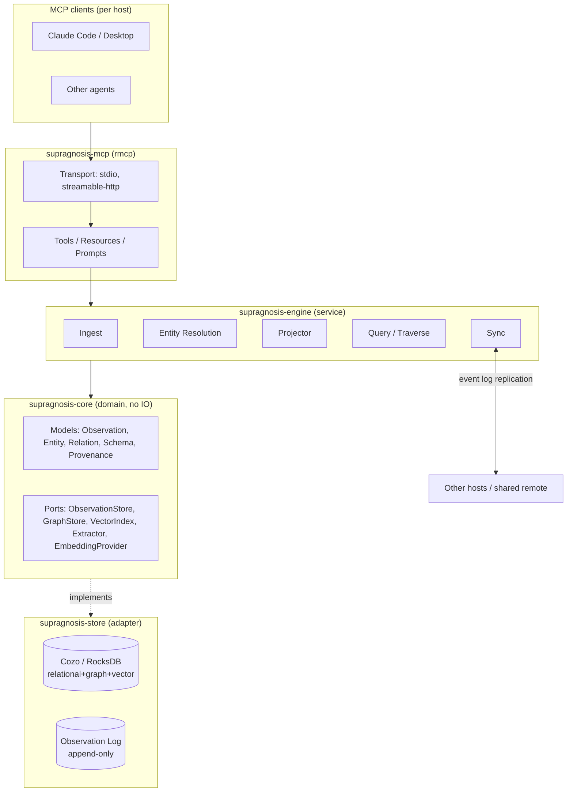
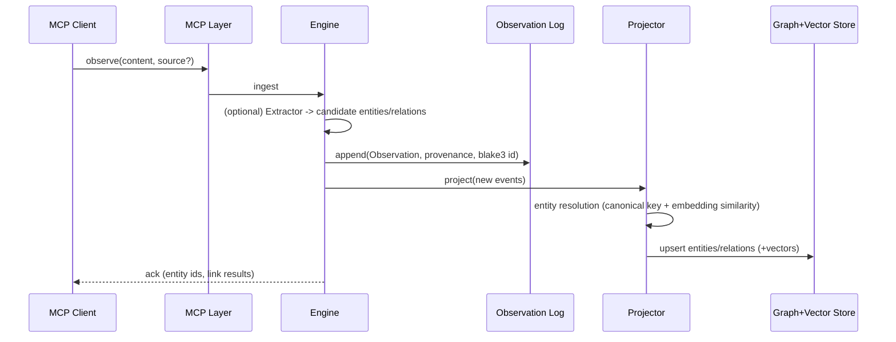
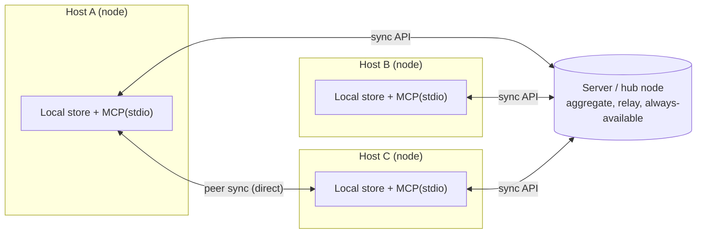

# supragnosis - Architecture Design

> An embedded/file-based Rust server that collects knowledge fragments arising across
> multiple **hosts** and **workspaces**, structures them into an
> **ontology (a concept/relation graph)**, and lets them be queried/explored via **MCP**.

- Name: `supragnosis` = *supra* (above/beyond) + *gnosis* (knowledge). Knowledge above knowledge = meta-knowledge.
- Namespace URI: `supragnosis://...`
- Status: **implemented through M4 Phase 4** (v0.1.5). M0-M2 and M3.5 are complete, M4 Phases 0-4 are
  complete (Phase 3.5 and 5+ pending), and **M3 (the resolution layer) has not started** - see Section
  12 for the per-milestone state and Section 14 for the compliance/deferral record. This document is
  no longer a forward-looking baseline: it describes what exists, and marks what does not.
- Normative document: the design principles follow [`principles.md`](principles.md) (design principles).
- Companion specs: [`federation.md`](federation.md) (M4), [`proposal-workflow.md`](proposal-workflow.md) (M3.5).

---

## 1. Goals / Non-goals

### Goals
- Unify knowledge from multiple hosts/workspaces into a single ontology **while preserving provenance**.
- **Embedded/file-based**: runs as a single process on each host, with no separate DB server.
- Provides tools that let MCP clients (e.g. Claude Code/Desktop, various agents) **ingest (observe)** knowledge and
  **query it semantically/graph-wise (search/traverse)**.
- Converges distributed knowledge via **local-first** operation + **synchronization** across hosts.

### Non-goals (initial version)
- Knowledge extraction via a built-in LLM - initially the **client (the calling agent) is responsible for extraction**,
  and supragnosis serves as a deterministic storage/resolution/query substrate (the extractor is separated behind a port and attached later).
- Large-scale multi-tenancy/real-time collaborative editing - only eventual consistency at the level of event-log merging is targeted.
- A full OWL reasoner - start with lightweight rule-based inference.

---

## 2. Core Concepts & Domain Model

Borrowing the description-logic convention, we split into **two layers**.

- **Schema layer (T-Box)** - which entity types/relation types exist (the ontology's definitions).
- **Instance layer (A-Box)** - the actual entities/relations/knowledge fragments.

### 2.1 Entity (concept node)
| Field | Description |
|------|------|
| `id` | Stable identifier (the resolved canonical entity) |
| `type` | T-Box type (`Concept`,`Person`,`Project`,`Tool`,`File`,`Decision`,`Task`...) |
| `canonical_name` | Canonical name |
| `aliases` | Synonyms/spelling variants |
| `properties` | Type-specific properties (JSON) |
| `embedding` | (optional) vector for semantic search |

### 2.2 Relation (edge)
- Directed **typed relations**: `depends_on`, `part_of`, `authored_by`, `relates_to`,
  `derived_from`, `mentions` ...
- **Relation-type canonicalization**: the kind spelling goes through deterministic normalization (trim, separators/camelCase -> `_`,
  lowercase) before being reflected into the id and storage - spelling jitter from LLM extractors
  (`depends-on`/`dependsOn`) does not diverge into different edge ids (a pure function, Principle 16).
- **Bitemporal attributes** (Principle 4): **valid time** `valid_from`/`valid_to` (the period it was true in the world)
  vs **transaction time** `observed_at` (when the system learned of it, in provenance). Disproof is handled not as deletion but as
  closing `valid_to`.
- Others: `confidence`, `provenance` (including trust tier).

### 2.3 Observation - **the source of truth**
Knowledge first arrives as an **immutable observation event**. The entity/relation graph is a
**materialized projection** derived from the observation log (event sourcing).

| Field | Description |
|------|------|
| `id` | **Content address** (blake3 hash) -> automatic dedup no matter which path (server/peer) it arrives by |
| `content` | The raw knowledge fragment (text/structured) |
| `assertions` | (optional) candidate entities/relations handed over by the client - kept in the log **exactly as spelled** (normalization is the projection's job) and **included in id computation** (assertions, unlike lineage/embedding, are content identity - the same text with different assertions is a different observation) |
| `provenance` | a **list** of attestations (at least 1): each with `host` (acting), `on_behalf_of` (the delegating principal), `workspace`, `source_ref`, `observed_at` (transaction time), `confidence`, `trust_tier`. Re-arrival under the same content address accumulates as a monotonic union rather than overwriting (the merge norm of Principle 3) |
| `derived_from` | (optional) the source observation ids this observation was derived from - the recall list for contamination cleanup (Principle 18) |
| `origin` | `origin_host_id`, `origin_seq` (monotonically increasing per host) - the key for version-vector delta sync |
| `hlc` | Hybrid Logical Clock - a **deterministic causal order** independent of host wall-clock skew |
| `signature` | (optional) the origin node's signature - detects source forgery/tampering even after relaying through servers/peers |

### 2.4 Provenance - **first-class citizen, delegation chain, trust tier**
Every fact is stored with a provenance tag. Nothing is destructively overwritten.
- **Delegation chain** (Principle 2): "who" is expressed not as a flat host id but as `acting host` + `on_behalf_of`
  (e.g. `claude-code@macbook` acting on behalf of `ashon`). External/legacy observations without a chain are recorded with the
  acting host alone but treated as lower in trust evaluation.
- **Trust tier** (Principle 18): an observation carries a verification-level tier (human-confirmed > signed trusted host > a host's
  agent extraction > unverified) that feeds into resolution weighting/query ranking. Tier **promotion is explicit only**
  (human confirmation/cross-validation) - it does not rise merely with the passage of time.
- **Conflict preservation** (Principle 6): conflicting assertions all remain with their provenance, and the **resolution layer** (a swappable
  strategy) computes the "current belief" while leaving the existence of the contradiction queryable.

---

## 3. Architecture Overview (hexagonal / port-adapter)

The domain pure, IO as adapters. The store/embedding/extractor sit behind **traits (ports)**, making them swappable.



### Layers
1. **MCP protocol layer** (`rmcp`): tools/resources/prompts, transport (local stdio + remote HTTP).
2. **Service (engine) layer**: orchestration of the ingest/resolve/project/query/sync use cases.
3. **Domain layer**: models + port traits + schema/resolution/inference rules (zero external dependencies).
4. **Storage layer**: the embedded store adapter (observation log + materialized graph + vector index).
5. **Synchronization layer**: observation-log replication across hosts.

---

## 4. Data Flow

### 4.1 Ingest


### 4.2 Query
- `search`: **vector (HNSW) + keyword** hybrid for fragment/entity candidates -> graph-context enrichment -> ranking with provenance included.
- `traverse`: n-hop traversal from an entity (relation-type filter). Recursive traversal is expressed in Cozo Datalog.

### 4.3 Sync - topology-independent replication
- Each host appends to its local observation log. Observations are **immutable + content-addressed + origin/HLC**.
- Sync = **version-vector delta replication** - nodes exchange `{host_id: max_seq}` with each other and pull/push only the shortfall.
- dedup via CAS (blake3), deterministic order via HLC -> converges to **the same log set -> the same graph** (CRDT-like strong eventual consistency).
- This replication primitive is **independent** of the path (local/server/peer) -> all topologies in Section 5 reuse the same logic.

---

## 5. Connection Topology / Federation (Topology & Federation)

**A single binary, composed roles.** A single supragnosis instance can hold the roles below in overlapping combinations.

- **Local node (always)** - ontologizes that host's knowledge via the embedded store + local MCP (stdio).
- **Sync client** - pull/push its own observation log against a remote (server/peer).
- **Server (hub) node** - aggregates/relays multiple nodes' logs, always available, central authz.
- **Peer** - direct node<->node sync without a center (mesh).

### Supported topologies
1. **Standalone** - local only (offline).
2. **Hub-and-spoke (client-server)** - hosts sync to a central server. The server is the canonical set/relay/always-available.
   Even when hosts are not online simultaneously, they catch up via the server.
3. **Peer-to-peer (mesh)** - hosts sync directly. No center needed, ad-hoc/offline-first.
4. **Hybrid** - some peer directly + also sync to a hub at the same time. (**the default direction**)



### Distinguishing the two kinds of connection
| | MCP transport | Sync (federation) transport |
|--|----------------|-------------------------------|
| Target | **agent <-> node** | **node <-> node/server** |
| Protocol | MCP (stdio local / streamable-HTTP remote) | a dedicated sync API (HTTP(S), later gRPC) |
| What it does | observe/search/traverse tool calls | observation-log version-vector delta exchange |

> That is, "connecting to a server" is possible at both levels: (a) a remote agent connects to a node's MCP-HTTP,
> (b) a node syncs its log with a hub server. supragnosis supports both.

### Sync protocol (draft)
- `advertise` -> exchange the version vector `{host_id: max_seq}` (a summary of what I have).
- `pull(since)` -> stream in observations from the origin_seq ranges where the peer is ahead of me.
- `push(events)` -> send the ranges where I am ahead. The receiving side dedups via CAS, orders by HLC, then re-materializes.
- Trust: **sign** events with the node keypair -> guarantees source authenticity even through relays/peers.

### Selective sharing
Not all local knowledge should leave -> at the sync boundary, **filter/redact by workspace/sensitivity label**.
A node advertises only the workspaces it will share, and the server enforces per-node access.

---

## 6. Store Selection

| Criterion | **CozoDB (recommended)** | Oxigraph |
|------|-------------------|----------|
| Form | embedded relational+graph+vector, Datalog | embedded RDF triplestore, SPARQL |
| Vector search | [o] native HNSW | [x] (needs a separate component) |
| Graph traversal | [o] recursive Datalog | [o] SPARQL property path |
| Ontology standards (OWL/RDFS) | model the schema directly | [o] standards-optimal |
| Backend | RocksDB / SQLite / in-mem | RocksDB / in-mem |
| File-based | [o] | [o] |

**Recommended: CozoDB as the primary store.**
Reason - a knowledge system needs all of (1) **semantic recall of fragments (vector)**, (2) ontology **graph traversal**,
and (3) **relational queries over metadata/provenance**, and Cozo alone covers all three and is embedded.

> **Alternative condition**: if strict RDF/OWL standards compliance/SPARQL interoperability is a **hard requirement**, use Oxigraph.
> Because of the port-adapter structure, it can be swapped by reimplementing only the `GraphStore`/`VectorIndex` traits -
> the store choice is isolated so it does not leak into the domain code.

---

## 7. MCP Surface (Tools / Resources / Prompts)

### Tools (13 implemented)
| Tool | Role |
|------|------|
| `observe` | ingest a knowledge fragment (free text + optional entities/relations/descriptions/`valid_from`/`valid_to`/`on_behalf_of`/`derived_from`/`confidence`) -> creates an observation, links entities |
| `search_knowledge` | semantic + keyword hybrid search; `scope` = `local` \| `remote` \| `both` (federated recall), response labels the `mode` actually used (Principle 16 4th) |
| `get_entity` | look up an entity + relations + provenance |
| `traverse` | n-hop graph traversal from an entity |
| `workspace_map` | co-occurrence contexts (hyperedges) for cold-start orientation (Principle 11 second-order structure) |
| `define_type` | extend the T-Box (entity/relation type + mandatory description, workspace-scoped) |
| `propose` | open a canon-change proposal (Principle 23 - [proposal-workflow.md](proposal-workflow.md)) |
| `review` | cast a verdict on a proposal (merge/reject/comment/withdraw) |
| `list_proposals` / `get_proposal` | proposal list / one proposal's folded state |
| `sync_status` / `sync_pull` / `sync_push` | federation (version vector, delta pull+apply, stamped push) |

**Specified but not implemented**: `assert_relation` (subsumed by `observe`'s relations - not a
separate recurring intent, Principle 21), `list_sources` (provenance rides every query response
instead), `query` (the Datalog passthrough escape hatch - deliberately still closed; opening it needs
the authorization guard of Principle 12/21).

### Resources (read-only, addressable)
Implemented:
- `supragnosis://workspaces` - the workspaces that hold knowledge (agent-side discovery)
- `supragnosis://workspace/{ws}/graph` - the ontology graph (node-link projection)
- `supragnosis://workspace/{ws}/hypergraph` - the co-occurrence second-order structure (Principle 11)
- `supragnosis://workspace/{ws}/types` - the type glossary (T-Box, workspace-scoped - Principles 8/11)
- `supragnosis://observation/{id}` - observation (raw text + provenance + derived_from lineage).
  The dereference path for an observation id returned by a search hit - it fulfills the query surface's obligation to
  answer "where did this answer come from" (Principle 2) and the dereferenceability of observation identifiers (Principle 14).

Specified but not implemented: `supragnosis://entity/{id}` (reachable via the `get_entity` tool, but
the URI is not dereferenceable - a standing Principle 14 gap), `supragnosis://workspace/{ws}/summary`,
`supragnosis://proposal/{id}`, `supragnosis://workspace/{ws}/canon-policy` (the canon-policy artifact
itself is M4 Phase 5).

### Prompts
**Not implemented.** `what-do-we-know-about {topic}` and `summarize-workspace-knowledge {ws}` remain
specified only; the server exposes no prompt capability today. This is the main outstanding piece of
Principle 22 (curation as a by-product of work) on the MCP surface.

### Long-running tasks / human mediation (Principle 21) - **not implemented**
- Target: `sync` / `consolidate` / bulk reprojection exposed **without blocking**, as pollable **task
  handles** (aligned with the MCP Tasks extension).
  **Today**: `sync_pull` / `sync_push` are ordinary blocking tool calls that return when the round
  finishes. Acceptable while a round is a single delta exchange over a small log; it becomes a real
  Principle 21 violation once a round can outlast a tool-call timeout.
- Target: merge approval / contradiction mediation / trust-tier promotion requesting human confirmation
  at the protocol level via MCP **elicitation (multi-round input)**.
  **Today**: human mediation happens out-of-band in the viewer's curation console (a loopback-gated
  confirmation surface that casts a verdict through `review`, never a direct write). The protocol-level
  elicitation path does not exist, so an agent-only client cannot route a decision to a human.

### LLM-friendly response conventions (Principles 5/21)
- Responses distinguish "not found (unknown)" from "false" (`{found:false}` vs an explicit negative assertion).
- Failure responses carry "why it failed and what to do differently" so the LLM can self-correct.
- Query results must be able to be accompanied by provenance (source/trust tier).

---

## 8. Technology Stack (Rust crates)

| Purpose | Crate |
|------|----------|
| MCP server SDK | `rmcp` (`server`, `transport-io`, `macros`) |
| Async runtime | `tokio` |
| Embedded store | `cozo` (RocksDB backend) *(alternative: `oxigraph`)* |
| Local embedding (optional) | `fastembed` (ONNX, local model) - if absent, degrade to keyword search / client-supplied |
| Serialization | `serde`, `serde_json` |
| Content-address ID | `blake3` |
| Errors | `thiserror` (library) / `anyhow` (binary) |
| Observability/logging | `tracing`, `tracing-subscriber` |
| Sync transport | `axum` (server) + `reqwest` (client) HTTP sync API *(later: `tonic`/gRPC)* |
| Node identity/signing | `ed25519-dalek` (event signing, node keypair) |
| Time/identifiers | `time`, `uuid` |
| Configuration | `figment` or `config` (TOML) |
| Testing | `insta` (snapshot) + in-memory store adapter |

---

## 9. Repository Structure (Cargo workspace)

```
supragnosis/
|- Cargo.toml                 # [workspace] - members: crates/*, e2e
|- docs/                      # architecture.md, principles.md, proposal-workflow.md, federation.md
|- crates/
|  |- supragnosis-core/       # domain models + port traits (zero IO)
|  |- supragnosis-store/      # adapters: cozo, in-memory
|  |- supragnosis-engine/     # service: ingest/project/query/curation/proposals/reproject
|  |- supragnosis-embed/      # EmbeddingProvider adapter (fastembed/hashing/none)
|  |- supragnosis-sync/       # federation: version-vector delta replication, sync API, node signing
|  |- supragnosis-mcp/        # rmcp server: tools/resources + transport
|  |- supragnosis-viz/        # live viewer + curation console (embedded HTML/JS, no build step)
|  `- supragnosis-cli/        # bin: `supragnosis serve|start|sync|reproject|migrate|identity|...`
`- e2e/                       # real-model measurement suite (scorecard, not a regression guard)
```

Keeping the domain (`core`) pure -> fast unit tests via an in-memory adapter, freedom to swap the store.
`e2e` is deliberately outside `crates/` (the deliverables): it drives live models (Ollama/Anthropic) and
its tests are `#[ignore]`d by default, so it measures behavior rather than guarding regressions.

---

## 10. Configuration & Deployment

Runtime options come from **flags > `SUPRAGNOSIS_*` env > defaults**. Federation is configured by file
only: `supragnosis.toml` at `SUPRAGNOSIS_CONFIG` or `~/.supragnosis/supragnosis.toml`. **No file = a
standalone node** (zero behavior change). Unknown keys are **rejected loudly** - a typo must not
silently disable a role.

```toml
[sync]
share_workspaces = ["supragnosis"]         # whitelist of workspaces to export outward (P17, default: none)
servers = ["https://hub.example:7420"]     # hub(s) this node syncs with
auth_token = "..."                         # bearer presented to the hub
insecure_tls = false                       # true only for a self-signed hub cert
origin_keys = { }                          # node_id -> public key directory (manual until Phase 5)

[server]                                   # present only when this node runs a hub
listen = "0.0.0.0:7420"
tls_cert = "cert.pem"
tls_key  = "key.pem"
allowlist = [ ]                            # per node: node_id, public_key_hex, bearer_hash, shared_workspaces
```
Node identity is **not** configured: an ed25519 keypair is generated once at `~/.supragnosis/node.key`
(mode 0600) and `node_id = blake3(pubkey)` - self-certifying and immutable (federation.md Section 2).
The older sketch above (`host_id`, `[node] role`, `peers`) is superseded: roles are implied by which
sections are present, and `peers` awaits the P2P phase.

- **Local host (stdio)**: the MCP client launches supragnosis as a child process (per chat).
- **Standalone daemon**: given `--http` / `SUPRAGNOSIS_HTTP_ADDR` (e.g. 127.0.0.1:7373), it exposes
  MCP **streamable-HTTP** persistently instead of stdio (rmcp `StreamableHttpService` -> axum `/mcp`). Because the daemon is
  the sole holder of the db, the single-process lock problem disappears, and multiple agents connect via
  `claude mcp add --transport http http://127.0.0.1:7373/mcp` (without spawning per chat).
  **Loopback only** (Principle 17: local trust surface = no-auth justified). The tool handlers offload
  blocking store calls via `spawn_blocking` to prevent runtime starvation - the Section 14 precondition
  for remote transport, now **discharged**.
  For operations (launchd, etc.) see [`deploy/README.md`](../deploy/README.md).
  - Authenticated non-loopback **MCP** exposure (bearer/OAuth) is still a follow-up. The MCP daemon has
    no auth layer, so it stays loopback-bound.
- **Hub server (implemented, M4 Phase 4)**: the `[server]` section starts the sync API alongside the
  daemon - axum routes `/sync/ping|advertise|pull|push|search` under bearer auth matched against the
  allowlist, then per-workspace authorization. A **non-loopback bind requires TLS and a non-empty
  allowlist** (`validate_bind`), checked at startup and again at serve time; a misconfigured `[server]`
  fails startup loudly rather than running without the role.

### Ontology live viewer (for local inspection)

Given `--viz` / `SUPRAGNOSIS_VIZ_ADDR` (daemon default `127.0.0.1:7374`), it brings up an HTTP viewer
(the `supragnosis-viz` crate) in the **same process** as the MCP server, over a hand-rolled tokio TCP
server with the whole UI as one embedded HTML/JS string (no CDN, no build step). It draws the
`engine.graph()` projection on a canvas force-graph and refreshes by polling. It is the channel by
which a human visually inspects and curates the knowledge graph.

- **Read-only with one gated exception** (Principle 1): it does not touch the observation log. The sole
  write is `/api/review`, which casts a **verdict observation** through `engine.review_proposal` - it
  routes through the Principle 23 gate, never a direct projection/log write. Ingest remains exclusively
  via `observe`.
- **Bind policy** (Principle 17): loopback-only by default. `SUPRAGNOSIS_VIZ_PUBLIC=1` is the owner's
  explicit opt-in to **read-only** network exposure; a non-loopback peer is answered 403 on the write
  endpoint, per connection. This is an interim surface, superseded by the authenticated read tier
  (federation Phase 3.5). See the standing caveat in Section 14 (a `workspace=*` read is not
  workspace-scoped).
- **Independent of the MCP tool surface** (Principle 21): being a separate human-facing channel, it does not add to the LLM's tools.
- **Single-process constraint**: because cozo/RocksDB is single-process, the viewer must be in-process with the server
  (sharing the same `Arc<Engine>`), and two server instances at once would contend for the port/db lock.
- Endpoints (all GET): `/` (viewer HTML), `/api/graph[?workspace=<ws>]` (unspecified = default
  workspace, `*`/`all`/empty = everything), `/api/hypergraph`, `/api/types`, `/api/curation`,
  `/api/proposals`, `/api/review` (the gated verdict), `/api/workspaces`, `/api/federation`, and
  `/api/events` (SSE live activity stream).
- **Implemented views**: the hyperedge overlay (co-occurrence hulls with density-based opacity),
  the **curation console** (duplicate/grab-bag/orphan signals, proposal list, accept/reject casting a
  verdict, and a belief-diff preview drawn on the canvas - entity_merge fold arrows, tbox_change type
  scope), the **type glossary** panel, and the
  **federation panel** (this node's id/role, per-hub health and per-workspace version-vector diff,
  known peers with last action). A derived view with no change to the storage model (binary Relation)
  (Principles 1/12): membership is deterministic and the hull shape is a rendering discretion
  (Principle 16). The norm for second-order structure is in [`principles.md`](principles.md) Principle 11.

---

## 11. Cross-cutting Concerns

- **Provenance/trust/delegation**: every fact carries (acting host, on_behalf_of, workspace, source, confidence, trust_tier, time). Provenance filtering/trust weighting at query time.
- **Bitemporal** (Principle 4): observation = transaction time, relation = valid interval (valid_from/to) -> the two time-travel queries `as_of_valid(T)`/`as_of_recorded(T)`.
- **Contamination defense** (Principle 18): trust tier + `derived_from` lineage + quarantine + batch retraction by lineage back-tracing (cleanup). A signature is only transport integrity, not content authenticity.
- **Forgetting/consolidation** (Principle 7): the log is forever, recall is finite. Demotion touches only index weights (the log is immutable); consolidation is a deterministic idle-time reprojection (probabilistic summaries are recovered as derived observations).
- **Identity resolution**: canonical key first + embedding similarity only up to candidates, merge finalization deterministic/conservative. Merge history preserved/un-merge possible.
- **Security/privacy**: workspace scoping, an ingest redaction hook, a **sync-boundary filter** (sharing opt-in).
- **Node identity/transport**: node-keypair event **signing** (authenticity), sync TLS/mTLS.

---

## 12. Roadmap (phases)

1. **M0 - Skeleton [o]**: workspace scaffold, `core` models, in-memory store, an `observe`+`get_entity`+`search` (keyword) stdio MCP server. (rmcp 0.16, E2E handshake verified)
2. **M1 - Embedded store [o]**: Cozo adapter (observations/entities/relations), `traverse` (recursive Datalog), file persistence. (E2E verified)
3. **M2 - Semantic search [o]**: `EmbeddingProvider` (fastembed BGE-small-en-v1.5, 384d) + Cozo native
   HNSW, RRF fusion of keyword/semantic-observation/semantic-entity lists, 1-hop graph enrichment.
   Recall regression set in place (`recall_eval.rs`: mean recall@5 >= 0.9, entity-gold subset >= 0.99).
4. **M3 - Resolution/schema/bitemporal [ ] NOT STARTED** (partially pre-built): conservative resolution
   + induced schema proposal -> explicit promotion (Principle 11), `define_type` consistency validation
   (Principle 9), treating type assignment as an assertion so that resolution computes the kind
   (Principle 1 - replacing the current last-write-wins projection), valid interval/time-travel queries
   (Principle 4), trust-tier resolution weighting (Principle 18).
   - Landed ahead of the milestone: the **hyperedge (co-occurrence second-order structure) projection**
     (`workspace_map` / `hypergraph`) and **reprojection** (`reproject`, the declared first task and
     entry condition) - both were pulled forward because M3.5/M4 needed them.
   - Still open: the resolution layer itself. Entity identity is exact canonical-name match, aliases
     never accumulate, kind is last-write-wins, and `canonical_name` is first-write-wins (arrival-order
     dependent). A **type-usage statistics aggregate view** exists only as per-graph `type_counts`, not
     as the induction input specified here.
   - **This is now the project's critical path**: M3.5 and M4 shipped on top of an M0-era resolution
     layer, so several of their guarantees rest on "one entity name, one spelling" holding by luck.
5. **M3.5 - Proposal workflow [o] (partial)**: the gateway to canon promotion (Principle 23). Proposal =
   observation event, state = deterministic fold with merge as the absorbing outcome,
   `propose`/`list_proposals`/`get_proposal`/`review`, entity-merge effect with transitive id
   forwarding, read-only curation signals (duplicates/grab-bags/orphans), curation console in the viewer.
   Design -> [proposal-workflow.md](proposal-workflow.md).
   - Open: **only `entity_merge` has a commit effect** (transitive id forwarding). `claim_promotion` /
     `claim_demotion` / `tbox_change` / `recall` are accepted and folded but enforce nothing. The
     **belief diff** exists as a canvas preview in the viewer, not as a computed artifact on
     `get_proposal`: `entity_merge` previews the fold (targets -> canonical), and `tbox_change` previews
     its scope by highlighting the affected edges/nodes carried on the proposal's `affected_types`
     (relation names normalized to the graph's edge kinds). So "no merge without a diff" is honored by UI
     convention, not by the gate. Blocking/informative checks are not implemented.
6. **M4 - Federation [o] Phases 0-4; Phase 3.5 and 5+ pending**: version-vector delta replication +
   sync API (hub-and-spoke), ed25519 per-attestation signing (Principle 2), selective sharing
   (Principle 17), HLC causal ordering + HLC-ordered re-materialization, federated recall, legacy-id
   migration. Design -> [federation.md](federation.md).
   - Open: peer-to-peer mesh and hybrid topology; the authenticated hub read tier (Phase 3.5);
     multi-principal governance - the `tbox_change` gate and the log-borne canon-policy artifact
     (Phase 5), which is why deployment is single-principal today; sync/consolidate as **MCP Tasks** and
     human mediation as **elicitation** (Principle 21) - see Section 7.
7. **M5 - Inference/extraction/contamination defense [ ]**: lightweight inference, the `Extractor` port, mandatory `derived_from` lineage/quarantine/cleanup (Principle 18).
8. **M6 - Forgetting/consolidation [ ]**: deterministic idle-time reprojection + recall demotion (Principle 7, sleep-time). Selection of consolidation targets is based on hyperedge stability/corroboration/cohesion metrics (Principle 11 second-order structure).

---

## 13. Open Decisions

**Decided**
- The identity of the "server" (Section 5): **a supragnosis hub node + remote MCP-HTTP exposure** (integrating an external backend is out of scope). [o]
- T-Box bootstrap: **a small default set + extension** - promoted to [`principles.md`](principles.md) Principle 10. [o]
- Embedding default: **local (fastembed)**, behind a compile feature. [o] Resolved in M2 - `fastembed`
  when built with the feature, else `none` (keyword degrade); `hashing` is a deterministic dev
  provider. Client-supplied and remote-API embedding were dropped: a remote API contradicts local-first
  and would make recall depend on network reachability.
- The first federation topology: **hub-and-spoke**. [o] Resolved in M4 - a hub gives always-available
  relay and catch-up between nodes that are never online together, and the replication primitive is
  topology-independent, so peer/mesh reuses it unchanged (federation.md).
- Store: **CozoDB** confirmed in practice. [o] Oxigraph remains the documented alternative (Section 6);
  no RDF/SPARQL requirement has materialized.

**Open**
- The "current belief" policy on conflict: **latest-wins** vs **confidence-weighted** (or both). As a
  swappable strategy per Principle 1. (M3 - still open; the projection is effectively last-write-wins
  by replay order, which is a default that was never chosen deliberately.)
- Entity-embedding **staleness policy**: the entity vector is computed once when absent, so it will not
  track alias accumulation once resolution begins. Recompute on change, or version the vector? (M3)
- Whether the **`query` Datalog passthrough** is ever opened, and under what authorization guard
  (Principles 12/21). Deliberately closed so far.

---

## 14. Principle Compliance Status (against [principles.md](principles.md))

Each milestone does not satisfy the entire set of principles at once. Below is a transparent record of
**intentional deferrals** (per the principles' preamble: expedient decisions are not allowed without documentation).

**Currently satisfied (as of M4 Phase 4)**
- Principle 2 (provenance first-class/delegation): every observation carries at least one attestation with
  acting `host` + `on_behalf_of` + workspace + `source_ref` + `observed_at` + `confidence` + `trust_tier`;
  under federation each attestation additionally carries `origin_node`/`origin_seq`/`hlc`/`signature`.
  Unspecified confidence is preserved as unspecified (no 1.0 substitution - 4th revision). *Caveat*: the
  "reject at ingest, schema-level" clause is still enforced by engine construction only (see deferrals).
- Principle 3 (supersede, don't delete + re-arrival merge norm): the log is immutable and content-addressed;
  `absorb` unions attestations and `derived_from` lineage monotonically; the 8th-revision **enrichment
  relation** is implemented element-wise (a sync stamp upgrades an attestation in place rather than
  forking a second one), so the join stays commutative/associative/idempotent. Guarded by a convergence
  test that shuffles arrival order with a seed-fixed LCG (no wall clock, no OS randomness).
- Principle 5 (open world): absence is `{found:false, note:...}`, never an error - and, symmetrically, a
  storage failure is never an empty result (the MCP layer returns a store-failure object; the viewer
  returns 500 with "NOT an empty graph").
- Principle 8 (clarity): `define_type` **rejects a type with no description**; entity/relation descriptions
  are optional at capture and are never erased by a later omission. The type glossary is a deterministic
  fold over the log, exposed as `supragnosis://workspace/{ws}/types`. Type definitions ride the
  observation log like any other assertion (Principles 1/23: no parallel storage). Descriptions are
  content identity (folded into the observation hash - Principle 14).
- Principles 12/20 (minimal encoding bias/hexagonal): `core` has zero IO dependencies, Cozo concepts live only in the `store` adapter.
  The store sits behind the `KnowledgeStore` port - swapping mem/cozo leaves the domain unchanged. The
  Datalog passthrough has deliberately never been opened.
- Principle 14 (stable identifiers + mechanical enforcement of structural evolution): observation id =
  blake3 content address over (workspace, content, assertions); entity id = canonical-name resolution;
  relation id = normalized kind (independent of spelling jitter). The hash uses length-prefix encoding, so
  planting a delimiter in the content cannot collide an id with another observation (Principle 18).
  `Assertions::hash_into`, `attestation_signing_bytes`, `provenance_order`, and `absorb` **exhaustively
  destructure** their inputs, so adding a model field is a compile error that forces the
  identity-vs-metadata and signed-vs-derived decisions to be explicit. *Caveat*:
  `supragnosis://entity/{id}` is not dereferenceable (Section 7) - a standing gap in this principle.
- Principle 16 (topology-independent convergence): CAS dedup + HLC total order + deterministic
  re-materialization (`reproject` replays the log in `(ordering_hlc, id)` order). Query responses pin ties
  and truncation by stable id. Per the 8th revision, the two convergence points are distinguished:
  fold-projections (workspaces, types, proposal state) converge continuously, while the materialized
  entity/relation projection converges **at re-materialization**, which the sync apply path triggers.
- Principle 16 (4th revision, two layers of determinism): `search_knowledge` labels the `mode` it actually
  used (hybrid vs keyword), so a client can tell the convergence surface from the node-local recall aid,
  and the tool description states that score scale differs per mode. Embeddings deliberately do not
  replicate - they are a node-local recall aid, exempt from the convergence norm.
- Principle 17 (knowledge sovereignty, sync boundary): sharing is a workspace whitelist defaulting to
  none; `export_delta` returns nothing for a non-shared workspace; the hub authenticates per node
  (bearer) and authorizes per workspace on every route. **Federated recall goes through the same
  authorization**, closing the "same knowledge through a different door" concern. A non-loopback sync bind
  requires TLS **and** a non-empty allowlist. *Caveat*: the viewer's public read mode does not honor this
  (see outstanding entry conditions).
- Principle 18 (transport authenticity portion): every exported attestation is ed25519-signed by its
  origin; the receiver **recomputes the content id** from (workspace, content, assertions) before
  verifying, so a forged or stale id never lands; the origin's lineage declaration is inside the signed
  bytes, so a relay cannot forge or strip it undetected.
- Principle 19 (deterministic core, probabilistic edge): embedding is a port. An absent or failing
  embedder degrades to keyword search and never blocks a write; an embedding failure is a warning while a
  store failure is an error - the two are not conflated.
- Principle 21 (narrow surface): 13 tools, each at the granularity of one recurring intent. Tool
  descriptions and failures are written for LLM self-correction. *Not satisfied*: non-blocking
  long-running work and elicitation (Section 7).
- Principle 11 (second-order structure as induction substrate): the hyperedge projection is implemented as
  a derived view identified by its member set, coexisting with (not replacing) binary Relations, generated
  deterministically, and exposed via `workspace_map` and the hypergraph resource.
- Principle 23 (gate to canon, *structure*): a proposal is itself an observation; its state is a
  deterministic fold with merge as the **absorbing** outcome (convergent and monotonic); no verdict
  deletes an assertion; the viewer's accept casts a verdict observation rather than writing the
  projection. *Not satisfied*: enforcement beyond `entity_merge`, the belief diff as a computed artifact,
  and the self-attested marker for the single-person exception (see deferrals).
- Principle 7 (7th revision, consolidation generates but does not commit): curation signals
  (duplicates/grab-bags/orphans) are a **read-only projection** that commits nothing, and the curation
  console routes acceptance through the verdict path. This landed ahead of its milestone.

**Intentional deferrals (milestone-assigned)**
- Principles 1/6 (assertion<->belief separation, conflict preservation): currently `observe` does an **inline simple projection**
  after storing the observation (entity kind is last-write-wins, canonical_name is first-write-wins so spelling
  variants do not accumulate into aliases, relation provenance is singular replacement). Multi-attestation accumulation for
  observations is implemented at the log layer (the Principle 3 item above) - multi-attestation accumulation for **relations**,
  the representative-spelling/alias-accumulation rules, and a swappable resolution policy are in
  **M3** (the resolution layer).
  Note: because structured assertions (`assertions` - including entity kind) are enclosed in the observation log exactly as spelled,
  any resolution policy can be applied retroactively by reprojecting the log - the grounds that this deferral is
  non-destructive. **This defense is now discharged rather than promised**: `reproject` is implemented (it was
  pulled forward for M4's re-materialization), so a new resolution policy really can be applied to existing logs.
  What remains missing is the policy itself.
  **Federation raises the cost of this deferral.** A last-write-wins projection over an exact-name-match resolution
  layer means two nodes that spell the same subject differently produce two entities that no mechanism will ever
  reconcile, and the `entity_merge` proposal is the only remedy - a manual one. Principle 15 says resolution is the
  substrate's job; today it is the operator's.
- Principle 3 (atomicity of projection merge): an entity upsert splits into two store calls, get -> put, and is not
  atomic - if concurrent observations touch the same entity, the **projection's**
  attestations may be lost. Because the observation log is atomically merged at the store layer, it is safe
  (the Principle 3 item above), and the loss is confined to the derived view and recoverable by reprojection
  - and since `reproject` now exists, that recovery is an actual procedure, not a theoretical guarantee.
  Because the entire projection write path is replaced by the M3 resolution layer, **full atomicity** is repaid together in **M3**.
  This deferral rested on the deployment fact that "concurrent tool calls are rare (a single stdio client)."
  **Update (introduction of the standalone daemon)**: the MCP-HTTP daemon permits concurrent tool calls, so that deployment
  premise breaks. So a write-serialization lock (`write_guard`) is introduced on the `Engine` to serialize observe's
  log-append + projection-upsert section - preventing attestation loss from concurrent same-entity observations
  (the read path is not locked, so it stays concurrent). This is a provisional repayment that does not replace M3's full atomicity
  (a fundamental redesign of read-merge-write in the resolution layer), and when M3 begins this lock is
  absorbed/removed into the resolution layer's write path.
  **Update (M4)**: `reproject` does **not** take `write_guard`, so a re-materialization concurrent with an `observe`
  can interleave. In practice re-materialization runs either from the CLI with the daemon stopped, or from the
  post-apply sync hook - but that is again a deployment fact, not a guard, and it is the same class of argument this
  section exists to retire. Repaid with M3's write path.
- Principles 3/4 (supersede/bitemporal) *logic*: supersede/retraction observation handling, automatic valid_to closing,
  `as_of_valid`/`as_of_recorded` time-travel queries -> **M3**. (Fields were introduced in M1.
  Ingest-surface capture is implemented: `observe`'s relation accepts optional `valid_from`/`valid_to` and encloses them in
  the log's assertions and the projection - separation of capture and processing, a clue of Principle 4.)
  Note the schedule slipped: this was assigned "M3-M4", and M4 shipped without it.
- Principle 7 (forgetting/consolidation): recall demotion + idle-time consolidation -> **M6**. The
  generate-side (read-only curation signals) landed early with M3.5; the demotion side does not exist.
- Principle 11 (induced schema): the **explicit `define_type` promotion act** is implemented (records entity/relation type
  definitions, workspace-scoped), and the induction **substrate** (hyperedges) now exists. What remains deferred is the
  **automatic candidate proposal** from repeated co-occurrence patterns (hyperedge -> type candidates) -> **M3**.
- Principles 9/23 (T-Box coherence check / gate to canon) re `define_type`: `define_type` still validates only
  **well-formedness** (non-empty name/description, Principle 8) and writes to the canon **directly - the `tbox_change`
  proposal kind exists but enforces nothing**. T-Box consistency (cyclic subtype / domain-range, Principle 9) is
  unimplemented, and the **self-attested marker** that the single-person exception calls for is **still not attached**.
  This was acceptable while the deployment was a single-user workspace; **federation raises the stakes** - in a shared
  workspace any spoke could silently rewrite the vocabulary for everyone, HLC-latest-write winning on every node.
  Enforcing the gate is therefore a federation prerequisite (federation.md Section 1a, F18). -> **M4 Phase 5**.
- Principle 13 (rigidity - essence vs role): no enforcement exists; `define_type` treats it as a written guideline only.
  There is no subtype hierarchy in the T-Box today, so the principle has nothing to bite on yet -> revisit when
  subtyping is introduced.
- Principle 15 (resolution is the substrate's responsibility): still exact match on the canonical name - no embedding
  candidate generation, no conservative merge band. The only entity merge that exists is the human-adjudicated
  `entity_merge` proposal effect. -> **M3**. (Assigned "M2-M3"; M2 shipped without it.)
- Principle 18 (contamination defense) *logic*: `trust_tier` and `derived_from` are stored but inert - no tier ranking
  in resolution or query, no quarantine, no lineage back-tracing cleanup, no trust-weighted ranking. Tier promotion is
  not implemented, which at least means it also cannot happen implicitly. One caveat: the graph projection's
  **representative tier takes the max over claimed tiers**, so a self-declared high tier is not only stored verbatim
  but becomes the node's displayed tier - harmless while all writers are local, compounding with the sync
  re-evaluation debt (entry condition 2 below) once they are not. -> **M5** (with the extraction port).
- Principle 3 (the destruction-demand exception) - **unscheduled**: the tombstone (the absorbing record left by a
  regulation/privacy destruction demand, including its sync propagation and re-ingest refusal) exists only in
  principles.md. No milestone owns it. This is the one deferral in this ledger with no assigned repayment point;
  it must be scheduled no later than the first multi-principal federation deployment, because that is when a
  destruction demand can first arrive from a principal who is not the node's operator.
- Principle 21 (long-running tasks/human mediation): MCP Tasks exposure of sync/consolidate, merge/contradiction/promotion elicitation -> **M4 remainder** (see Section 7).
- Principle 22 (a byproduct of work): partially met - the curation console surfaces curation as micro-decisions, but
  the MCP **prompts** that would induce voluntary observe/search during work do not exist (Section 7) -> incremental.
- Principle 23 (the gateway to canon) *enforcement*: the structure is in place, but only `entity_merge` has an effect;
  `claim_promotion`/`claim_demotion`/`tbox_change`/`recall` fold correctly and change nothing. The **belief diff** is a
  viewer-side canvas preview rather than a computed artifact on `get_proposal`, so "no merge without a diff" is honored
  by UI convention, not by the gate; blocking/informative checks are unimplemented; self-approval is not prohibited.
  Moreover the fold **hardcodes `self_attested: true` on every proposal view** regardless of whether the reviewing
  principal differs from the proposer - as a solo-mode blanket label it is honest, but it is a view-level flag, not
  the log-borne marker the exception calls for, and it cannot distinguish a genuinely reviewed merge from a
  self-approved one. When multi-principal support lands, this flag must be **computed** from the proposer/reviewer
  delegation chains, or it will label reviewed merges as self-attested (the inverse error).
  The **recall verdict's non-delegability** (a human's direct act) has no mechanism yet - which is safe only because
  `recall` enforces nothing. -> **M3.5 remainder / M4 Phase 5**.

**Milestone entry conditions (when deferrals are repaid)**

Deferrals are not indefinite. Among the items above, those whose defense rests on "harmless because the state is
currently unreachable" are repaid as the **entry conditions** of the milestone that makes that state reachable.

The point of this ledger is that an entry condition comes due **when the state becomes reachable, not when it becomes
convenient**. Two conditions below are now overdue: M4 shipped without them. They are recorded as debt, not silently
re-scheduled.

**Repaid [o]**
- Reprojection (`reproject`) is implemented, and `all_observations` was added to `KnowledgeStore` as its prerequisite -
  the M3 first task, pulled forward because M4's re-materialization needed it.
- The random-order convergence property test exists (seed-fixed LCG shuffling in `core`, plus sync convergence tests),
  discharging the Principle 16 test obligation. *Partition injection is still not exercised.*
- Blocking store/embedding calls are behind `spawn_blocking` on every MCP tool handler - the remote-transport
  precondition.
- The sharing opt-in whitelist and sync-boundary filter exist, and federated recall is governed by the same
  authorization (Principle 17 at the sync boundary).

**Overdue [x] - declared as M4 entry conditions, but M4 Phases 0-4 shipped without them**
1. **At least one provenance is still not enforced at the schema level.** It remains a guarantee of engine
   construction. M4 opened exactly the predicted bypass: `apply` builds an `Observation` from wire events. In practice
   `check_event` rejects an unstamped attestation, so a zero-provenance observation cannot currently land - but the
   type still permits one, which is the situation this condition was written to end (Principle 2).
2. **The receiving node does not re-evaluate `trust_tier`.** `check_event` clones the sender's attestation verbatim,
   so a peer's self-declared tier - including the highest - is stored as-is on the receiver. This directly contradicts
   Principle 18's "the tier is the receiver's evaluation", which exists precisely so that a malicious peer's
   self-declaration cannot contaminate the receiving graph's trust. It is bounded today by single-principal deployment
   and the allowlist (you sync only with nodes you configured), which is a **deployment-fact defense** - the kind this
   section exists to retire. **Repay before multi-principal federation (Phase 5).**
3. **Cross-adapter `traverse` parity for dangling relation endpoints** was not addressed, and sync is exactly what
   first creates partial-ingest state.

**Overdue [x] - from "on introducing remote transport"**
4. **No transport-aware guard confines workspace-scope-less global queries to the local trust surface**, and the state
   is now reachable: with `SUPRAGNOSIS_VIZ_PUBLIC=1`, `GET /api/graph?workspace=*` serves **every workspace** to an
   unauthenticated remote reader, bypassing the share whitelist that governs the sync door. Principle 17's "the sharing
   boundary applies to the remote query surface too" is honored by sync and federated recall, but **not** by the
   viewer. Until the guard lands, treat `SUPRAGNOSIS_VIZ_PUBLIC=1` as "publish this entire node, all workspaces,
   read-only" and set it only on a node whose whole contents are already shareable. Superseded by the authenticated
   read tier (federation Phase 3.5).

**Still latent - M3 entry conditions, unreachable today**
- Restore alias-matching parity for Cozo keyword search the moment alias accumulation begins (only InMemory matches
  aliases; latent because aliases are always empty).
- Introduce an entity-embedding recomputation rule once aliases accumulate - the vector is computed only when absent,
  so the embedding text changing would leave it silently stale.
- Make `canonical_name` representative-spelling selection deterministic and independent of arrival order. Today the
  incremental path is first-write-wins by arrival, which is masked because HLC-ordered `reproject` runs after every
  sync apply - so nodes agree **at re-materialization points** (the 8th-revision split of convergence points), not
  continuously. That is a narrower guarantee than Principle 16 states, and it should be made unnecessary rather than
  relied upon.
- Make the entity projection write (read-merge-write) atomic, absorbing `write_guard` into the resolution layer's
  write path.
