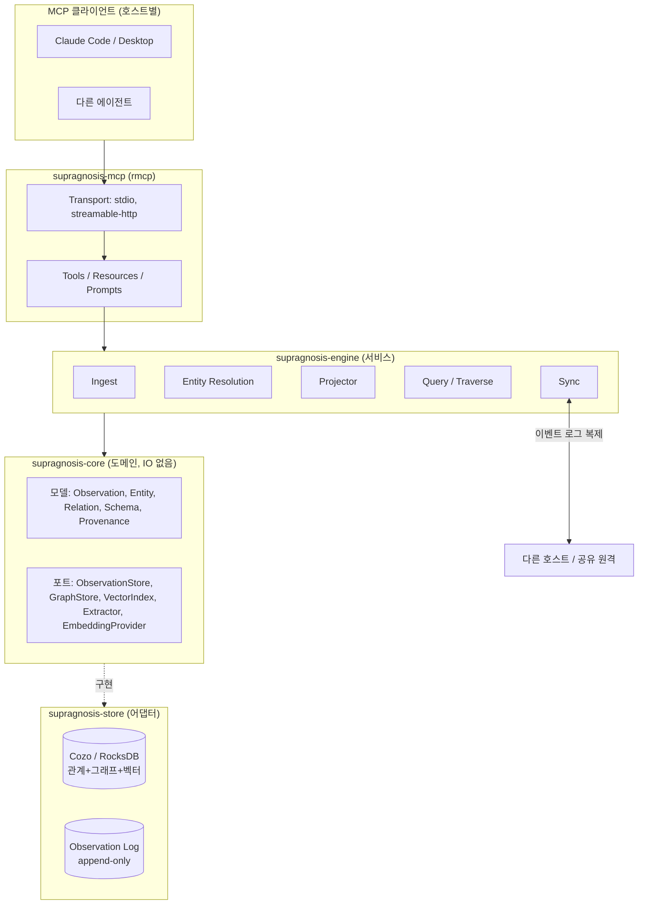
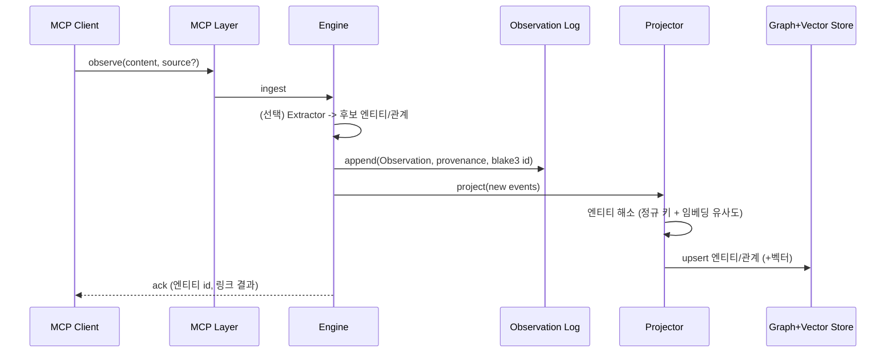
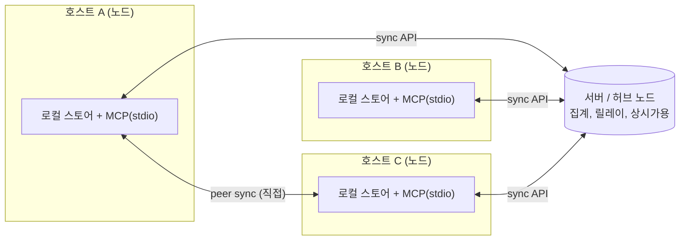

# supragnosis - 아키텍처 설계

> 여러 **호스트**와 **작업 공간(workspace)** 에서 발생하는 지식 조각을 수집해
> **온톨로지(개념/관계 그래프)** 로 구조화하고, **MCP** 를 통해 질의/탐색하게 하는
> 임베디드/파일 기반 Rust 서버.

- 이름: `supragnosis` = *supra*(위/너머) + *gnosis*(앎). 지식 위의 지식 = 메타지식.
- 네임스페이스 URI: `supragnosis://...`
- 상태: **설계 단계 (greenfield)**. 이 문서가 구현의 기준선.
- 규범 문서: 설계 원칙은 [`principles.md`](principles.md) (설계 원칙)를 따른다.

---

## 1. 목표 / 비목표

### 목표
- 여러 호스트/워크스페이스의 지식을 **출처(provenance)를 보존한 채** 하나의 온톨로지로 통합.
- **임베디드/파일 기반**: 별도 DB 서버 없이 각 호스트에서 단일 프로세스로 동작.
- MCP 클라이언트(예: Claude Code/Desktop, 각종 에이전트)가 지식을 **적재(observe)** 하고
  **의미/그래프 기반으로 조회(search/traverse)** 할 수 있는 도구 제공.
- **로컬 우선(local-first)** + 호스트 간 **동기화** 로 분산 지식을 수렴.

### 비목표 (초기 버전)
- 자체 내장 LLM으로 하는 지식 추출 - 초기엔 **클라이언트(호출한 에이전트)가 추출**을 담당하고,
  supragnosis는 결정론적 저장/해소/질의 substrate 역할 (추출기는 포트로 분리해 나중에 부착).
- 대규모 멀티테넌시/실시간 협업 편집 - 이벤트 로그 병합 수준의 최종 일관성만 목표.
- 완전한 OWL 추론기(reasoner) - 규칙 기반 경량 추론부터 시작.

---

## 2. 핵심 개념 & 도메인 모델

description-logic 관례를 빌려 **두 계층**으로 나눈다.

- **스키마 계층 (T-Box)** - 어떤 엔티티 타입/관계 타입이 존재하는가(온톨로지의 정의).
- **인스턴스 계층 (A-Box)** - 실제 엔티티/관계/지식 조각.

### 2.1 엔티티(개념 노드)
| 필드 | 설명 |
|------|------|
| `id` | 안정적 식별자 (해소된 정규 엔티티) |
| `type` | T-Box의 타입 (`Concept`,`Person`,`Project`,`Tool`,`File`,`Decision`,`Task`...) |
| `canonical_name` | 정규 명칭 |
| `aliases` | 동의어/표기 변형 |
| `properties` | 타입별 속성(JSON) |
| `embedding` | (선택) 의미 검색용 벡터 |

### 2.2 관계(엣지)
- 방향성 있는 **타입된 관계**: `depends_on`, `part_of`, `authored_by`, `relates_to`,
  `derived_from`, `mentions` ...
- **관계 타입 정준화**: kind 표기는 결정적 정규화(trim, 구분자/camelCase -> `_`,
  lowercase)를 거쳐 id 와 저장에 반영된다 - LLM 추출기의 표기 요동
  (`depends-on`/`dependsOn`)이 다른 엣지 id 로 갈라지지 않는다 (순수 함수, 원칙 16).
- **바이템포럴 속성**(원칙 4): **유효시간** `valid_from`/`valid_to`(세계에서 참이던 기간)
  vs **기록시간** `observed_at`(시스템이 알게 된 시점, provenance에). 반증은 삭제가 아니라
  `valid_to` 종료로 처리.
- 그 외: `confidence`, `provenance`(신뢰등급 포함).

### 2.3 관측(Observation) - **진실의 원천(source of truth)**
지식은 먼저 **불변 관측 이벤트**로 들어온다. 엔티티/관계 그래프는 관측 로그로부터 파생된
**물질화(materialized) 프로젝션**이다 (event sourcing).

| 필드 | 설명 |
|------|------|
| `id` | **콘텐츠 주소** (blake3 해시) -> 어떤 경로(서버/피어)로 들어와도 자동 dedup |
| `content` | 원문 지식 조각 (텍스트/구조화) |
| `assertions` | (선택) 클라이언트가 넘긴 후보 엔티티/관계 - **원문 표기 그대로** 로그에 남고(정규화는 프로젝션의 일), **id 계산에 포함**된다(주장은 계보/임베딩과 달리 내용 정체성 - 같은 텍스트에 다른 주장이면 다른 관측) |
| `provenance` | attestation **목록** (최소 1개): 각각 `host`(acting), `on_behalf_of`(위임 주체), `workspace`, `source_ref`, `observed_at`(기록시간), `confidence`, `trust_tier`. 같은 콘텐츠 주소로 재도착하면 덮어쓰지 않고 단조 합집합으로 누적 (원칙 3의 병합 규범) |
| `derived_from` | (선택) 이 관측이 파생된 원천 관측 id들 - 오염 소독의 리콜 명단(원칙 18) |
| `origin` | `origin_host_id`, `origin_seq`(호스트별 단조 증가) - 버전벡터 델타 동기화의 키 |
| `hlc` | Hybrid Logical Clock - 호스트 벽시계 편차와 무관한 **결정적 인과 순서** |
| `signature` | (선택) 원본 노드 서명 - 서버/피어 릴레이를 거쳐도 출처 위/변조 검출 |

### 2.4 출처(Provenance) - **1급 시민, 위임 사슬, 신뢰 등급**
모든 사실은 출처 태그를 달고 저장된다. 어떤 것도 파괴적으로 덮어쓰지 않는다.
- **위임 사슬**(원칙 2): "누가"는 평평한 host id 가 아니라 `acting host` + `on_behalf_of`
  (예: `claude-code@macbook` 가 `ashon` 을 대리)로 표현. 사슬 없는 외부/레거시 관측은
  acting host 단독으로 기록하되 신뢰 평가에서 낮게 취급.
- **신뢰 등급**(원칙 18): 관측은 검증 수준 등급(사람확인 > 서명 신뢰호스트 > 호스트의
  에이전트 추출 > 미검증)을 지니고 해소 가중/질의 랭킹에 반영. 등급 **승격은 명시적으로만**
  (사람 확인/교차검증) - 시간이 지났다고 오르지 않는다.
- **충돌 보존**(원칙 6): 상충 주장은 모두 provenance와 함께 남고, **해소 계층**(교체 가능
  전략)이 "현재 믿음"을 계산하되 모순 존재를 질의 가능하게 남긴다.

---

## 3. 아키텍처 개요 (헥사고날 / 포트-어댑터)

도메인은 순수하게, IO는 어댑터로. 저장소/임베딩/추출기는 **트레이트(포트)** 뒤에 두어 교체 가능.



### 계층
1. **MCP 프로토콜 계층** (`rmcp`): 도구/리소스/프롬프트, 트랜스포트(로컬 stdio + 원격 HTTP).
2. **서비스(엔진) 계층**: ingest/resolve/project/query/sync 유스케이스 오케스트레이션.
3. **도메인 계층**: 모델 + 포트 트레이트 + 스키마/해소/추론 규칙 (외부 의존 0).
4. **저장 계층**: 임베디드 스토어 어댑터 (관측 로그 + 물질화 그래프 + 벡터 인덱스).
5. **동기화 계층**: 호스트 간 관측 로그 복제.

---

## 4. 데이터 흐름

### 4.1 적재(Ingest)


### 4.2 질의(Query)
- `search`: **벡터(HNSW) + 키워드** 하이브리드로 조각/엔티티 후보 -> 그래프 문맥 보강 -> provenance 포함 랭킹.
- `traverse`: 엔티티 기점 n-hop 순회(관계 타입 필터). 재귀 순회는 Cozo Datalog로 표현.

### 4.3 동기화(Sync) - 위상 독립 복제
- 각 호스트는 로컬 관측 로그에 append. 관측은 **불변 + 콘텐츠 주소 + origin/HLC**.
- 동기화 = **버전벡터 델타 복제** - 노드가 서로 `{host_id: max_seq}` 를 교환하고 부족분만 pull/push.
- CAS(blake3)로 dedup, HLC로 결정적 순서 -> **동일 로그 집합 -> 동일 그래프**로 수렴 (CRDT류 강한 최종 일관성).
- 이 복제 프리미티브는 경로(로컬/서버/피어)에 **무관** -> 5절의 모든 위상이 같은 로직 재사용.

---

## 5. 연결 위상 / 페더레이션 (Topology & Federation)

**단일 바이너리, 역할 조합.** 한 supragnosis 인스턴스는 아래 역할을 겹쳐 가질 수 있다.

- **로컬 노드(항상)** - 임베디드 스토어 + 로컬 MCP(stdio)로 그 호스트의 지식을 온톨로지화.
- **동기화 클라이언트** - 자기 관측 로그를 원격(서버/피어)과 pull/push.
- **서버(허브) 노드** - 여러 노드의 로그를 집계/릴레이, 상시가용, 중앙 authz.
- **피어** - 중앙 없이 노드<->노드 직접 sync (mesh).

### 지원 위상
1. **Standalone** - 로컬 전용 (오프라인).
2. **Hub-and-spoke (클라이언트-서버)** - 호스트들이 중앙 서버로 sync. 서버가 정규 집합/릴레이/상시가용.
   호스트들이 동시에 온라인이 아니어도 서버 경유로 따라잡음.
3. **Peer-to-peer (mesh)** - 호스트들이 직접 sync. 중앙 불필요, 애드혹/오프라인 우선.
4. **Hybrid** - 일부는 피어 직접 + 동시에 허브로도 sync. (**기본 지향점**)



### 두 종류의 연결을 구분
| | MCP 트랜스포트 | 동기화(Federation) 트랜스포트 |
|--|----------------|-------------------------------|
| 대상 | **에이전트 <-> 노드** | **노드 <-> 노드/서버** |
| 프로토콜 | MCP (stdio 로컬 / streamable-HTTP 원격) | 전용 sync API (HTTP(S), 후에 gRPC) |
| 하는 일 | observe/search/traverse 도구 호출 | 관측 로그 버전벡터 델타 교환 |

> 즉 "서버와 연결"은 두 층위 모두에서 가능: (a) 원격 에이전트가 노드의 MCP-HTTP에 접속,
> (b) 노드가 허브 서버와 로그를 sync. supragnosis는 둘 다 지원한다.

### 동기화 프로토콜 (초안)
- `advertise` -> 버전벡터 `{host_id: max_seq}` 교환 (내가 가진 것 요약).
- `pull(since)` -> 상대가 나보다 앞선 origin_seq 구간의 관측을 스트림으로 수신.
- `push(events)` -> 내가 앞선 구간을 전송. 수신 측은 CAS로 dedup, HLC로 정렬 후 재물질화.
- 신뢰: 노드 keypair로 이벤트 **서명** -> 릴레이/피어를 거쳐도 출처 authenticity 보장.

### 선택적 공유
로컬 지식 전부가 밖으로 나가면 안 됨 -> sync 경계에서 **workspace/민감도 라벨 기준 필터/레드액션**.
노드는 공유할 workspace만 advertise, 서버는 노드별 접근을 enforce.

---

## 6. 저장소 선택

| 기준 | **CozoDB (권장)** | Oxigraph |
|------|-------------------|----------|
| 형태 | 임베디드 관계+그래프+벡터, Datalog | 임베디드 RDF 트리플스토어, SPARQL |
| 벡터 검색 | [o] 네이티브 HNSW | [x] (별도 필요) |
| 그래프 순회 | [o] 재귀 Datalog | [o] SPARQL property path |
| 온톨로지 표준(OWL/RDFS) | 스키마를 직접 모델링 | [o] 표준 최적 |
| 백엔드 | RocksDB / SQLite / in-mem | RocksDB / in-mem |
| 파일 기반 | [o] | [o] |

**권장: CozoDB 를 1차 스토어로.**
이유 - 지식 시스템은 (1) 조각의 **의미적 회상(벡터)**, (2) 온톨로지 **그래프 순회**,
(3) 메타데이터/출처 **관계형 질의** 를 모두 필요로 하는데 Cozo 하나가 셋을 커버하고 임베디드다.

> **대안 조건**: 엄격한 RDF/OWL 표준 준수/SPARQL 상호운용이 **하드 요구사항**이면 Oxigraph.
> 포트-어댑터 구조라 `GraphStore`/`VectorIndex` 트레이트만 다시 구현하면 교체 가능 -
> 스토어 선택은 도메인 코드에 새지 않게 격리한다.

---

## 7. MCP 표면 (Tools / Resources / Prompts)

### Tools
| 도구 | 역할 |
|------|------|
| `observe` | 지식 조각(자유텍스트 + 선택적 엔티티/관계/`on_behalf_of`/`derived_from`) 적재 -> 관측 생성/엔티티 링크 |
| `search_knowledge` | 의미+키워드 하이브리드 검색 |
| `get_entity` | 엔티티 + 관계 + 출처 조회 |
| `traverse` | 엔티티 기점 n-hop 그래프 순회 |
| `assert_relation` | 타입된 관계 명시적 주장 |
| `define_type` | T-Box(타입/관계) 확장 |
| `list_sources` | 출처/워크스페이스 introspection |
| `sync_status` / `sync_pull` / `sync_push` | 동기화 (관리용) |
| `query` | 고급 Datalog 질의 (권한 가드 하에 passthrough) |
| `propose` | 정본 승격 제안 생성 (M3.5, 원칙 23 - [proposal-workflow.md](proposal-workflow.md)) |
| `list_proposals` / `get_proposal` | 제안 목록 / 제안 + 믿음 diff + 검사 (M3.5) |
| `review` | 제안에 코멘트 또는 판정(merge/reject); 사람 확인은 elicitation (M3.5) |

### Resources (읽기 전용, 주소 지정)
- `supragnosis://entity/{id}` - 엔티티
- `supragnosis://observation/{id}` - 관측 (원문 + provenance + derived_from 계보).
  검색 히트가 돌려준 관측 id 의 역참조 경로 - "이 답이 어디서 왔는가"에 답하는
  질의 표면의 의무(원칙 2)와 관측 식별자의 역참조 가능성(원칙 14)을 이행한다.
- `supragnosis://workspace/{ws}/schema` - 타입 스키마 (T-Box 는 워크스페이스 스코프 - 원칙 11)
- `supragnosis://workspace/{ws}/summary` - 워크스페이스 지식 요약
- `supragnosis://proposal/{id}` - 제안 (M3.5)
- `supragnosis://workspace/{ws}/canon-policy` - 정본 정책 (M3.5)

### Prompts
- `what-do-we-know-about {topic}` - 온톨로지 문맥을 채워 넣는 가이드 프롬프트
- `summarize-workspace-knowledge {ws}`

### 장기 작업 / 사람 중재 (원칙 21)
- `sync` / `consolidate`(응고) / 대량 재프로젝션은 **블로킹하지 않고** 폴링 가능한
  **태스크 핸들**로 노출한다 (MCP Tasks 확장 정렬).
- 병합 승인 / 모순 중재 / 신뢰 등급 승격은 MCP **elicitation(다중 왕복 입력)** 으로
  사람 확인을 프로토콜 수준에서 요청한다 (원칙 6/18의 "사람 중재"를 프로토콜로 구현).

### LLM 친화 응답 규약 (원칙 5/21)
- 응답은 "찾지 못함(미지)"과 "거짓"을 구별한다 (`{found:false}` vs 명시적 부정 주장).
- 실패 응답은 "왜 실패했고 무엇을 다르게 하면 되는지"를 담아 LLM 이 자기 교정하게 한다.
- 질의 결과는 provenance(출처/신뢰등급)를 동반할 수 있어야 한다.

---

## 8. 기술 스택 (Rust 크레이트)

| 목적 | 크레이트 |
|------|----------|
| MCP 서버 SDK | `rmcp` (`server`, `transport-io`, `macros`) |
| 비동기 런타임 | `tokio` |
| 임베디드 스토어 | `cozo` (RocksDB 백엔드) *(대안: `oxigraph`)* |
| 로컬 임베딩(선택) | `fastembed` (ONNX, 로컬 모델) - 없으면 키워드 검색으로 degrade / 클라이언트 공급 |
| 직렬화 | `serde`, `serde_json` |
| 콘텐츠 주소 ID | `blake3` |
| 오류 | `thiserror`(라이브러리) / `anyhow`(바이너리) |
| 관측/로깅 | `tracing`, `tracing-subscriber` |
| 동기화 트랜스포트 | `axum`(서버) + `reqwest`(클라이언트) HTTP sync API *(후: `tonic`/gRPC)* |
| 노드 신원/서명 | `ed25519-dalek` (이벤트 서명, 노드 keypair) |
| 시간/식별자 | `time`, `uuid` |
| 설정 | `figment` 또는 `config` (TOML) |
| 테스트 | `insta`(스냅샷) + in-memory 스토어 어댑터 |

---

## 9. 저장소 구조 (Cargo workspace)

```
supragnosis/
|- Cargo.toml                 # [workspace]
|- docs/architecture.md
|- crates/
|  |- supragnosis-core/       # 도메인 모델 + 포트 트레이트 (IO 0)
|  |- supragnosis-store/      # 어댑터: cozo, in-memory
|  |- supragnosis-engine/     # 서비스: ingest/resolve/project/query/sync
|  |- supragnosis-embed/      # EmbeddingProvider 어댑터 (fastembed/remote/none)
|  |- supragnosis-sync/       # 페더레이션: 버전벡터 델타 복제, sync API, 노드 서명
|  |- supragnosis-mcp/        # rmcp 서버: tools/resources/prompts + 트랜스포트
|  `- supragnosis-cli/        # bin: `supragnosis serve|sync|...`
```

도메인(`core`)을 순수하게 유지 -> 인메모리 어댑터로 빠른 단위 테스트, 스토어 교체 자유.

---

## 10. 설정 & 배포

`supragnosis.toml`:
```toml
host_id     = "ashon-macbook"     # 출처/동기화/서명용 안정 식별자
workspace   = "supragnosis"
data_dir    = "~/.supragnosis"    # RocksDB + 관측 로그 + 노드 keypair
store       = "cozo"              # | "oxigraph"
embedding   = "fastembed"         # | "client" | "none"

[node]
role = ["local", "sync-client"]        # | "server"(허브). 조합 가능

[sync]
share_workspaces = ["supragnosis"]         # 밖으로 내보낼 workspace 화이트리스트
servers = ["https://hub.example/sync"]     # 연결할 허브(들)
peers   = ["https://hostC.lan:7420/sync"]  # 피어 직접

[server]                                   # role 에 "server" 포함 시에만
listen = "0.0.0.0:7420"
```
- **로컬 호스트**: MCP 클라이언트가 `supragnosis serve --stdio` 를 자식 프로세스로 기동 (+백그라운드 sync).
- **원격 에이전트**: `supragnosis serve --http` 로 MCP streamable-HTTP 노출.
- **허브 서버**: `supragnosis serve --server` 로 sync API 상시 기동, 여러 노드 집계/릴레이.

### 온톨로지 라이브 뷰어 (로컬 점검용)

`SUPRAGNOSIS_VIZ_ADDR=127.0.0.1:7373` 을 주면 MCP 서버와 **같은 프로세스**에서 localhost
HTTP 뷰어(`supragnosis-viz` 크레이트)를 함께 띄운다. 브라우저로 열면 `engine.graph()`
프로젝션(노드-엣지, 타입/degree/trust_tier/유효구간)을 canvas 로 그리고 몇 초마다
`/api/graph` 를 폴링해 갱신한다. 사람이 지식 그래프를 눈으로 점검하는 채널이다.

- **읽기 전용**: 관측 로그를 건드리지 않는다(원칙 1). 적재는 그대로 `observe` 로만.
- **loopback 전용 바인드**(원칙 17: 지식 주권): 비로opback 주소는 거부한다 - 원격 노출은
  sync 경계의 공유 가드가 생기기 전까지 허용하지 않는다.
- **MCP 도구 표면과 무관**(원칙 21): 사람용 별개 채널이라 LLM 도구가 늘지 않는다.
- **단일 프로세스 제약**: cozo/RocksDB 가 단일 프로세스라 뷰어는 서버 인프로세스여야
  하고(같은 `Arc<Engine>` 공유), 동시에 두 서버 인스턴스는 포트/db lock 을 다툰다.
- 엔드포인트: `GET /`(뷰어 HTML), `GET /api/graph[?workspace=<ws>]`(빈 값/`*`=전체),
  `GET /api/workspaces`(지식이 있는 워크스페이스 목록 - 뷰어가 클릭 가능한 피커로 렌더).
  같은 목록은 MCP 리소스 `supragnosis://workspaces` 로도 조회된다(에이전트의 워크스페이스 발견).

---

## 11. 횡단 관심사

- **출처/신뢰/위임**: 모든 사실에 (acting host, on_behalf_of, workspace, source, confidence, trust_tier, time). 질의 시 출처 필터/신뢰 가중.
- **바이템포럴**(원칙 4): 관측=기록시간, 관계=유효구간(valid_from/to) -> `as_of_valid(T)`/`as_of_recorded(T)` 두 시간여행 질의.
- **오염 방어**(원칙 18): 신뢰 등급 + `derived_from` 계보 + 격리(quarantine) + 계보 역추적 일괄 retraction(소독). 서명은 전송 무결성일 뿐 내용 진위가 아님.
- **망각/응고**(원칙 7): 로그는 영원, 회상은 유한. 강등은 인덱스 가중치만(로그 불변), 응고는 유휴시간 결정적 재프로젝션(확률적 요약은 파생 관측으로 회수).
- **정체성 해소**: 정규 키 우선 + 임베딩 유사도는 후보까지, 병합 확정은 결정적/보수적. 병합 이력 보존/un-merge 가능.
- **보안/프라이버시**: 워크스페이스 스코핑, 적재 레드액션 훅, **sync 경계 필터**(공유 opt-in).
- **노드 신원/전송**: 노드 keypair 이벤트 **서명**(authenticity), sync TLS/mTLS.

---

## 12. 로드맵 (단계)

1. **M0 - 골격 [o]**: workspace 스캐폴드, `core` 모델, in-memory 스토어, `observe`+`get_entity`+`search`(키워드) stdio MCP 서버. (rmcp 0.16, E2E 핸드셰이크 검증 완료)
2. **M1 - 임베디드 스토어 [o]**: Cozo 어댑터(관측/엔티티/관계), `traverse`(재귀 Datalog), 파일 영속. (E2E 검증)
3. **M2 - 의미 검색**: `EmbeddingProvider`(fastembed) + HNSW 하이브리드. 회상 벤치마크(부록 B) 회귀셋.
4. **M3 - 해소/스키마/바이템포럴**: 보수적 해소 + 유도 스키마 제안->명시 승격(원칙 11), 그 선행 작업으로 **타입 사용 통계 집계 뷰**(엔티티/관계 kind 별 사용 빈도, Cozo 집계 - 유도의 입력), `define_type` 정합성 검증(원칙 9), 타입 배정을 주장으로 취급해 해소가 kind 를 계산(원칙 1 - 현재의 last-write-wins 프로젝션 대체), 유효구간/시간여행 질의(원칙 4), 신뢰등급 해소 가중(원칙 18).
5. **M3.5 - 제안 워크플로**: 정본 승격의 관문(원칙 23). 제안=관측 이벤트, 상태=결정적 폴드, 믿음 diff + blocking/informative 검사, `propose`/`get_proposal`/`review`. solo/단일 정본에서 동작(다중 노드 수렴은 M4의 HLC 전제). 설계 -> [proposal-workflow.md](proposal-workflow.md).
6. **M4 - 페더레이션**: 버전벡터 델타 복제 + sync API(허브->피어->하이브리드), 위임사슬 서명(원칙 2), 선택적 공유(원칙 17), sync/consolidate를 **MCP Tasks**로/사람 중재를 **elicitation**으로(원칙 21). HLC 인과 순서로 제안 판정의 다중 노드 수렴 완성.
7. **M5 - 추론/추출/오염방어**: 경량 추론, `Extractor` 포트, `derived_from` 계보 의무화/격리/소독(원칙 18).
8. **M6 - 망각/응고**: 유휴시간 결정적 재프로젝션 + 회상 강등(원칙 7, sleep-time).

---

## 13. 열린 결정 사항

**확정됨**
- "서버"의 정체(5절): **supragnosis 허브 노드 + 원격 MCP-HTTP 노출** (외부 백엔드 연동은 범위 밖). [o]
- T-Box 부트스트랩: **작은 기본 세트 + 확장** - [`principles.md`](principles.md) 원칙 10으로 승격. [o]

**미결**
- 임베딩을 **로컬(fastembed)** vs **클라이언트 공급** vs **원격 API** 중 기본값? (M2)
- 1차 페더레이션 위상: **허브** vs **피어** 중 무엇부터 구현? (설계는 둘 다 수용, M4)
- 충돌 시 "현재 믿음" 정책: **최신 우선** vs **confidence 가중** (또는 둘 다). 원칙 1에 따라 교체 가능 전략으로. (M3)

---

## 14. 원칙 준수 현황 ([principles.md](principles.md) 대비)

각 마일스톤은 원칙 전체를 한 번에 만족시키지 않는다. 아래는 **의도적 이연(deferral)** 을
투명하게 기록한 것이다 (원칙 서문: 편의적 결정은 문서화 없이는 불허).

**현재(M1) 충족**
- 원칙 2(출처 1급/위임): 모든 관측/엔티티/관계가 provenance를 지니며, provenance가 위임 주체
  (`on_behalf_of`)와 acting host 를 구분해 표현(스키마 수준). `observe` 가 선택적으로 받음.
- 원칙 5(열린 세계): `get_entity` 는 부재를 에러가 아닌 `{found:false, note:...}` 로 반환.
- 원칙 12/20(인코딩 편향 최소/헥사고날): `core` 는 IO 의존 0, Cozo 개념은 `store` 어댑터에만.
  저장소는 `KnowledgeStore` 포트 뒤 - mem/cozo 교체가 도메인 무변경.
- 원칙 14(안정 식별자): 관측 id=blake3 콘텐츠주소(동봉 주장 포함), 엔티티 id=정규명
  결정적 해소, 관계 id=정준화된 kind(표기 요동 무관) - 전부 결정적 순수 함수.
  해시는 length-prefix 인코딩 - content 에 구분자를 심는 경계 조작으로 다른 관측과
  id 를 충돌시킬 수 없다 (원칙 18).
- 원칙 3(관측 로그 불변): 같은 콘텐츠 주소의 재도착은 덮어쓰기가 아니라
  provenance attestation / derived_from 계보의 **단조 합집합**으로 흡수된다
  (원칙 3의 병합 규범). 로그 재프로젝션으로 그래프의 attestation 을 복원할 수 있다.
- 원칙 4(바이템포럴) *스키마*: 관계에 `valid_from`/`valid_to`(유효시간), provenance `observed_at`
  (기록시간) 필드 도입. 시간여행 질의 **로직**은 이연.
- 원칙 18(오염 방어) *스키마*: provenance `trust_tier`(기본 `AgentExtracted`, 승격 명시적) +
  관측 `derived_from`(계보) 필드 도입. 등급 랭킹/격리/소독 **로직**은 이연.
- 원칙 19(결정적 코어): 저장/해소/순회 전부 결정론적, 확률적 요소 없음.
- 원칙 21(좁은 표면): 도구 4종(observe/get_entity/search_knowledge/traverse) - 모두 의도 단위.

**의도적 이연 (마일스톤 지정)**
- 원칙 1/6(주장<->믿음 분리, 충돌 보존): 현재 `observe` 는 관측 저장 후 **인라인 단순 프로젝션**
  (엔티티 kind 는 last-write-wins, canonical_name 은 first-write-wins 로 표기
  변형이 별칭(aliases)에 축적되지 않음, 관계 provenance 는 단수 교체). 관측의 다중
  attestation 누적은 로그 계층에서 구현됨(위 원칙 3 항목) - **관계**의 다중
  attestation 누적, 대표 표기/별칭 축적 규칙, 교체 가능한 해소 정책은
  **M3**(해소 계층).
  참고: 구조화 주장(`assertions` - 엔티티 kind 포함)이 관측 로그에 원문 그대로
  동봉되므로, 로그 재프로젝션으로 어떤 해소 정책이든 소급 적용 가능하다 - 이
  이연이 파괴적이지 않은 근거. (캡처가 로그에 실리는지는 테스트로 상시 가드되고,
  그 실행물인 reproject 는 M3 착수 조건이다 - 아래.)
- 원칙 3(프로젝션 병합의 원자성): 엔티티 업서트가 get -> put 두 스토어 호출로
  나뉘어 원자적이지 않다 - 동시 관측이 같은 엔티티를 만지면 **프로젝션**의
  attestation 이 소실될 수 있다. 관측 로그는 store 계층에서 원자 병합되므로
  무사하고(위 원칙 3 항목), 소실은 파생 뷰에 국한되어 재프로젝션으로 복구
  가능하다 - 다만 그 실행물(reproject)이 생기기 전까지는 이론상의 보장이다.
  프로젝션 쓰기 경로 전체가 M3 해소 계층으로 대체되므로 원자화도 **M3** 에서
  함께 상환한다. 이 이연은 "동시 도구 호출이 드물다(stdio 단일 클라이언트)"는
  배치의 사실에도 기대고 있음을 기록해 둔다.
- 원칙 3/4(대체/바이템포럴) *로직*: supersede/retraction 관측 처리, valid_to 자동 종료,
  `as_of_valid`/`as_of_recorded` 시간여행 질의 -> **M3~M4**. (필드는 M1 도입 완료.
  적재 표면 캡처는 구현됨: `observe` 의 관계가 선택적 `valid_from`/`valid_to` 를 받아
  로그의 주장과 프로젝션에 동봉한다 - 캡처와 처리의 분리, 원칙 4 단서.)
- 원칙 7(망각/응고): 유휴시간 결정적 재프로젝션 + 회상 강등 -> **M6**.
- 원칙 11(유도 스키마): 반복 패턴에서 타입 후보 제안 -> 명시 `define_type` 승격 -> **M3**.
- 원칙 15(해소는 기반의 책임): 현재는 정규명 완전일치. 임베딩 후보 + 보수적 병합 -> **M2~M3**.
- 원칙 16(위상 독립 수렴) + property test: HLC 기반 결정적 재물질화와 무작위 순서 주입
  property test -> **M4**(페더레이션).
- 원칙 17(지식 주권): 공유 opt-in 화이트리스트/sync 경계 필터 -> **M4**.
- 원칙 18(오염 방어) 로직: `derived_from` 계보 의무화, 격리(quarantine), 계보 역추적 소독,
  신뢰 가중 랭킹 -> **M5**(추출 포트와 함께).
- 원칙 21(장기작업/사람중재): sync/consolidate의 MCP Tasks 노출, 병합/모순/승격 elicitation -> **M4**.
- 원칙 22(작업의 부산물): 큐레이션을 질의 결과에 녹이는 UX/프롬프트 -> 도구 확장과 함께 점진.
- 원칙 23(정본으로의 관문): 제안 워크플로 -> **M3.5**. 설계는 [proposal-workflow.md](proposal-workflow.md)에 완료, 다중 노드 수렴은 M4(HLC) 전제.

**마일스톤 진입 조건 (이연의 상환 시점)**

이연은 무기한이 아니다. 위 항목들 중 "지금은 도달 불가능한 상태라 무해"가 방어
근거인 것들은, 그 상태를 도달 가능하게 만드는 마일스톤의 **착수 조건**으로
상환한다:

- **M3 (해소 계층) 착수 시**:
  - 재프로젝션(reproject)을 **첫 작업**으로 구현한다 - "주장이 로그에 원문
    그대로 있으므로 어떤 해소 정책이든 소급 적용 가능"이라는 위 이연들의 방어
    근거를 실행물로 상환하고, 해소 정책 교체의 하네스로 쓴다. 전제로
    `KnowledgeStore` 에 관측 전수 열거를 추가한다 (현재는 개별 get 뿐이라
    재프로젝션이 구조적으로 불가능하다).
  - 엔티티 프로젝션 쓰기(read-merge-write)를 원자화한다 (위 원칙 3 프로젝션
    이연의 상환 - 해소 계층의 프로젝션 기록 경로 설계에 포함).
  - 별칭 축적이 시작되는 순간 Cozo 키워드 검색의 별칭 매칭 parity 를 복구한다
    (현재 InMemory 만 aliases 를 매칭 - aliases 가 항상 비어 있어 잠재 상태).
  - 별칭 축적이 시작되면 엔티티 임베딩 재계산 규칙도 함께 도입한다 - 현재는
    임베딩이 없을 때 한 번만 계산하므로, 임베딩 텍스트(정규명 + 별칭)가 별칭
    축적으로 바뀌어도 벡터가 갱신되지 않는 조용한 staleness 가 생긴다.
  - canonical_name 대표 표기 선택을 도착 순서 무관의 결정적 규칙으로 바꾼다
    (원칙 16 수렴).
- **M4 (sync - store 의 엔진 외 기록자 등장) 착수 시**:
  - provenance 최소 1개를 스키마 수준에서 강제한다. 현재는 엔진의 구성(construction)
    으로만 보장되는데, 역직렬화/직접 기록 경로가 열리면 그 보장이 우회된다 (원칙 2).
  - sync 로 수신한 관측의 trust_tier 는 발신자의 평가 기록으로 강등하고 수신
    노드가 재평가한다 (원칙 18 - "등급은 수신자의 평가").
  - 엔티티 행이 없는 관계 끝점(dangling)에 대한 traverse 의 어댑터 간 parity 를
    맞춘다 (현재 InMemory 는 방출, Cozo 는 탈락 - 부분 적재 상태는 sync 가 처음
    만든다).
  - 무작위 순서/분할 주입 property test 를 가동한다 (원칙 16 - 기존 이연 항목의
    재확인).
- **원격 전송(`--http` 등) 도입 시**:
  - 워크스페이스 스코프 없는 전역 질의를 로컬 신뢰 표면(stdio)에 한정하는
    전송 인지 가드를 함께 도입한다 (원칙 17 - 현재는 stdio 가 유일 전송이라
    문구 그대로 충족되나, 그 충족이 가드가 아니라 배치의 사실에 의존한다).
  - 동기 도구 핸들러의 blocking 저장소/임베딩 호출을 async 경계(spawn_blocking
    등) 뒤로 옮긴다 - stdio 단일 클라이언트에선 무해하지만 동시 클라이언트가
    생기면 런타임 워커를 점유한다 (이 무해함도 배치의 사실에 의존한다).
