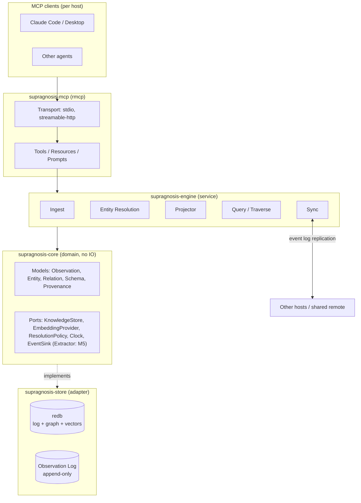
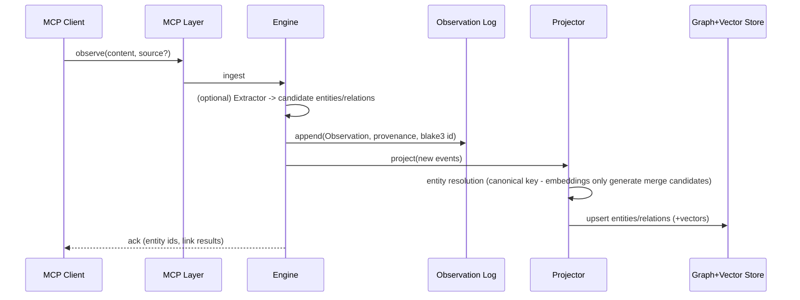
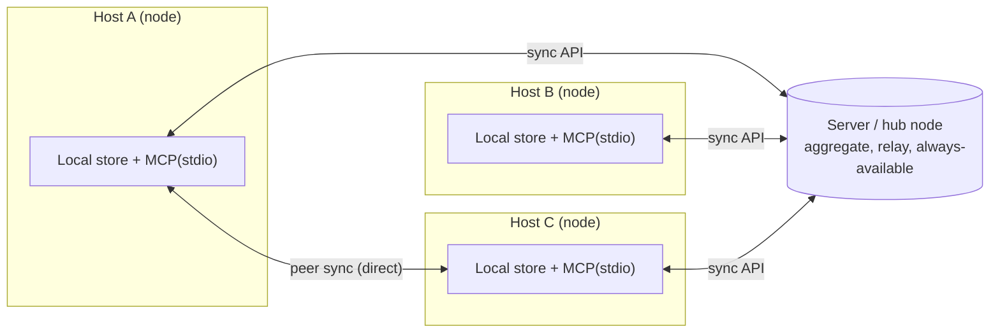

# supragnosis - Architecture Design

> An embedded/file-based Rust server that collects knowledge fragments arising across
> multiple **hosts** and **workspaces**, structures them into an
> **ontology (a concept/relation graph)**, and lets them be queried/explored via **MCP**.

- Name: `supragnosis` = *supra* (above/beyond) + *gnosis* (knowledge). Knowledge above knowledge = meta-knowledge.
- Namespace URI: `supragnosis://...`
- Status: **implemented through M4 Phase 4** (v0.3.1). M0-M2, **M3a (belief resolution) and M3b
  (identity resolution, except IR6)**, and **M3.5 (the proposal gate, both slices)** are complete; M4 Phases 0-4 are complete
  (Phase 3.5 and 5+ pending). Still open: M3c (bitemporal queries, blocked on negation semantics),
  M5, M6 - see Section 12 for the per-milestone state and Section 14 for the compliance/deferral
  record. This document is no longer a forward-looking baseline: it describes what exists, and marks
  what does not.
- Normative document: the design principles follow [`principles.md`](principles.md) (design principles).
- Companion specs: [`federation.md`](federation.md) (M4), [`proposal-workflow.md`](proposal-workflow.md) (M3.5),
  [`store-migration.md`](store-migration.md) (Cozo -> redb), [`excision.md`](excision.md) (the P3
  destruction exception, M4 Phase 5),
  [`resolution.md`](resolution.md) (M3a, implemented),
  [`resolution-identity.md`](resolution-identity.md) (M3b, implemented except IR6),
  [`consolidation.md`](consolidation.md) (M6, specified - Section 8 step 1 landed).

---

## 1. Goals / Non-goals

### Goals
- Unify knowledge from multiple hosts/workspaces into a single ontology **while preserving provenance**.
- **Embedded/file-based**: runs as a single process on each host, with no separate DB server.
- Provides tools that let MCP clients (e.g. Claude Code/Desktop, various agents) **ingest (observe)** knowledge and
  **query it semantically/graph-wise (search/traverse)**.
- Converges distributed knowledge via **local-first** operation + **synchronization** across hosts.

### Non-goals (initial version)
- Knowledge extraction via a built-in LLM - initially the **client (the calling agent) is responsible for extraction**,
  and supragnosis serves as a deterministic storage/resolution/query substrate (the extractor is separated behind a port and attached later).
- Large-scale multi-tenancy/real-time collaborative editing - only eventual consistency at the level of event-log merging is targeted.
- A full OWL reasoner - start with lightweight rule-based inference.

---

## 2. Core Concepts & Domain Model

Borrowing the description-logic convention, we split into **two layers**.

- **Schema layer (T-Box)** - which entity types/relation types exist (the ontology's definitions).
- **Instance layer (A-Box)** - the actual entities/relations/knowledge fragments.

### 2.1 Entity (concept node)
| Field | Description |
|------|------|
| `id` | Stable identifier (the resolved canonical entity) |
| `type` | T-Box type (`Concept`,`Person`,`Project`,`Tool`,`File`,`Decision`,`Task`...) |
| `canonical_name` | Canonical name |
| `aliases` | Synonyms/spelling variants |
| `properties` | Type-specific properties (JSON) |
| `embedding` | (optional) vector for semantic search |

### 2.2 Relation (edge)
- Directed **typed relations**: `depends_on`, `part_of`, `authored_by`, `relates_to`,
  `derived_from`, `mentions` ...
- **Relation-type canonicalization**: the kind spelling goes through deterministic normalization (trim, separators/camelCase -> `_`,
  lowercase) before being reflected into the id and storage - spelling jitter from LLM extractors
  (`depends-on`/`dependsOn`) does not diverge into different edge ids (a pure function, Principle 16).
- **Bitemporal attributes** (Principle 4): **valid time** `valid_from`/`valid_to` (the period it was true in the world)
  vs **transaction time** `observed_at` (when the system learned of it, in provenance). Disproof is handled not as deletion but as
  closing `valid_to`.
- Others: `confidence`, `provenance` (including trust tier).

### 2.3 Observation - **the source of truth**
Knowledge first arrives as an **immutable observation event**. The entity/relation graph is a
**materialized projection** derived from the observation log (event sourcing).

| Field | Description |
|------|------|
| `id` | **Content address** (blake3 hash) -> automatic dedup no matter which path (server/peer) it arrives by |
| `content` | The raw knowledge fragment (text/structured) |
| `assertions` | (optional) candidate entities/relations handed over by the client - kept in the log **exactly as spelled** (normalization is the projection's job) and **included in id computation** (assertions, unlike lineage/embedding, are content identity - the same text with different assertions is a different observation) |
| `provenance` | a **list** of attestations (at least 1): each with `host` (acting), `on_behalf_of` (the delegating principal), `workspace`, `source_ref`, `observed_at` (transaction time), `confidence`, `trust_tier`. Re-arrival under the same content address accumulates as a monotonic union rather than overwriting (the merge norm of Principle 3) |
| `derived_from` | (optional) the source observation ids this observation was derived from - the recall list for contamination cleanup (Principle 18) |
| `provenance[].sync` | (optional, **per attestation** - not an observation-level field) the federation stamp of federation.md Section 3: `origin_node` (key-derived node id), `origin_seq` (monotonic per origin+workspace - the version-vector key), `hlc` (Hybrid Logical Clock - a **deterministic causal order** independent of host wall-clock skew), `signature` (ed25519 by the origin - detects forgery/tampering even through relays), and the origin's signed lineage declaration. Excluded from the content address, and one observation can carry several origins' stamps |

### 2.4 Provenance - **first-class citizen, delegation chain, trust tier**
Every fact is stored with a provenance tag. Nothing is destructively overwritten.
- **Delegation chain** (Principle 2): "who" is expressed not as a flat host id but as `acting host` + `on_behalf_of`
  (e.g. `claude-code@macbook` acting on behalf of `ashon`). External/legacy observations without a chain are recorded with the
  acting host alone but treated as lower in trust evaluation.
- **Trust tier** (Principle 18): an observation carries a verification-level tier (human-confirmed > signed trusted host > a host's
  agent extraction > unverified) that feeds into resolution weighting/query ranking. Tier **promotion is explicit only**
  (human confirmation/cross-validation) - it does not rise merely with the passage of time.
- **Conflict preservation** (Principle 6): conflicting assertions all remain with their provenance, and the **resolution layer** (a swappable
  strategy) computes the "current belief" while leaving the existence of the contradiction queryable.

---

## 3. Architecture Overview (hexagonal / port-adapter)

The domain pure, IO as adapters. The store/embedding/extractor sit behind **traits (ports)**, making them swappable.


```mermaid
flowchart TB
    subgraph Clients["MCP clients (per host)"]
        C1["Claude Code / Desktop"]
        C2["Other agents"]
    end
    subgraph MCP["supragnosis-mcp (rmcp)"]
        T["Tools / Resources / Prompts"]
        TR["Transport: stdio, streamable-http"]
    end
    subgraph Engine["supragnosis-engine (service)"]
        ING["Ingest"]
        RES["Entity Resolution"]
        PRJ["Projector"]
        QRY["Query / Traverse"]
        SYN["Sync"]
    end
    subgraph Core["supragnosis-core (domain, no IO)"]
        M["Models: Observation, Entity, Relation, Schema, Provenance"]
        P["Ports: KnowledgeStore, EmbeddingProvider, ResolutionPolicy, Clock, EventSink (Extractor: M5)"]
    end
    subgraph Store["supragnosis-store (adapter)"]
        DB[("redb\nlog + graph + vectors")]
        LOG[("Observation Log\nappend-only")]
    end
    Clients --> TR --> T --> Engine
    Engine --> Core
    Core -. implements .-> Store
    SYN <-->|"event log replication"| Peers["Other hosts / shared remote"]
```

### Layers
1. **MCP protocol layer** (`rmcp`): tools/resources/prompts, transport (local stdio + remote HTTP).
2. **Service (engine) layer**: orchestration of the ingest/resolve/project/query/sync use cases.
3. **Domain layer**: models + port traits + schema/resolution/inference rules (zero external dependencies).
4. **Storage layer**: the embedded store adapter (observation log + materialized graph + vector index).
5. **Synchronization layer**: observation-log replication across hosts.

---

## 4. Data Flow

### 4.1 Ingest

```mermaid
sequenceDiagram
    participant Cl as MCP Client
    participant Mcp as MCP Layer
    participant Eng as Engine
    participant Log as Observation Log
    participant Prj as Projector
    participant G as Graph+Vector Store
    Cl->>Mcp: observe(content, source?)
    Mcp->>Eng: ingest
    Eng->>Eng: (optional) Extractor -> candidate entities/relations
    Eng->>Log: append(Observation, provenance, blake3 id)
    Eng->>Prj: project(new events)
    Prj->>Prj: entity resolution (canonical key - embeddings only generate merge candidates)
    Prj->>G: upsert entities/relations (+vectors)
    Eng-->>Cl: ack (entity ids, link results)
```

### 4.2 Query
- `search`: **vector (HNSW) + keyword** hybrid for fragment/entity candidates -> graph-context enrichment -> ranking with provenance included.
- `traverse`: n-hop traversal from an entity (relation-type filter). How the walk is expressed is the
  adapter's business - an explicit BFS in both shipping adapters, a recursive Datalog rule in the
  file-backed adapter that preceded them - while the
  port fixes what it must return: (depth, id) order, nearest-first truncation, and an unprojected
  endpoint traversed through but never described (Section 6, port conformance).

### 4.3 Sync - topology-independent replication
- Each host appends to its local observation log. Observations are **immutable + content-addressed + origin/HLC**.
- Sync = **version-vector delta replication** - nodes exchange `{host_id: max_seq}` with each other and pull/push only the shortfall.
- dedup via CAS (blake3), deterministic order via HLC -> converges to **the same log set -> the same graph** (CRDT-like strong eventual consistency).
- This replication primitive is **independent** of the path (local/server/peer) -> all topologies in Section 5 reuse the same logic.

---

## 5. Connection Topology / Federation (Topology & Federation)

**A single binary, composed roles.** A single supragnosis instance can hold the roles below in overlapping combinations.

- **Local node (always)** - ontologizes that host's knowledge via the embedded store + local MCP (stdio).
- **Sync client** - pull/push its own observation log against a remote (server/peer).
- **Server (hub) node** - aggregates/relays multiple nodes' logs, always available, central authz.
- **Peer** - direct node<->node sync without a center (mesh).

### Supported topologies
1. **Standalone** - local only (offline).
2. **Hub-and-spoke (client-server)** - hosts sync to a central server. The server is the canonical set/relay/always-available.
   Even when hosts are not online simultaneously, they catch up via the server.
3. **Peer-to-peer (mesh)** - hosts sync directly. No center needed, ad-hoc/offline-first.
4. **Hybrid** - some peer directly + also sync to a hub at the same time. (**the default direction**)


```mermaid
flowchart LR
    subgraph HostA["Host A (node)"]
        A1["Local store + MCP(stdio)"]
    end
    subgraph HostB["Host B (node)"]
        B1["Local store + MCP(stdio)"]
    end
    subgraph HostC["Host C (node)"]
        C1["Local store + MCP(stdio)"]
    end
    Hub[("Server / hub node\naggregate, relay, always-available")]
    A1 <-->|sync API| Hub
    B1 <-->|sync API| Hub
    C1 <-->|sync API| Hub
    A1 <-->|"peer sync (direct)"| C1
```

### Distinguishing the two kinds of connection
| | MCP transport | Sync (federation) transport |
|--|----------------|-------------------------------|
| Target | **agent <-> node** | **node <-> node/server** |
| Protocol | MCP (stdio local / streamable-HTTP remote) | a dedicated sync API (HTTP(S), later gRPC) |
| What it does | observe/search/traverse tool calls | observation-log version-vector delta exchange |

> That is, "connecting to a server" is possible at both levels: (a) a remote agent connects to a node's MCP-HTTP,
> (b) a node syncs its log with a hub server. supragnosis supports both.

### Sync protocol (draft)
- `advertise` -> exchange the version vector `{host_id: max_seq}` (a summary of what I have).
- `pull(since)` -> stream in observations from the origin_seq ranges where the peer is ahead of me.
- `push(events)` -> send the ranges where I am ahead. The receiving side dedups via CAS, orders by HLC, then re-materializes.
- Trust: **sign** events with the node keypair -> guarantees source authenticity even through relays/peers.

### Selective sharing
Not all local knowledge should leave -> at the sync boundary, **filter/redact by workspace/sensitivity label**.
A node advertises only the workspaces it will share, and the server enforces per-node access.

---

## 6. Store Selection

**The store is `redb`**: an embedded, pure-Rust B-tree with a single writer and MVCC readers, and no
transitive dependencies. It is the only file-backed adapter; `InMemoryStore` remains for tests and
non-persistent runs. Both are held to the `KnowledgeStore` port by one suite
(`crates/supragnosis-store/tests/port_conformance.rs`) that runs every case against every adapter.

| Criterion | **redb** | CozoDB (used through v0.1.21) | Oxigraph (never adopted) |
|------|-------------------|-------------------|----------|
| Form | embedded key-value B-tree | embedded relational+graph+vector, Datalog | embedded RDF triplestore, SPARQL |
| Vector search | brute-force cosine (no ANN index) | native HNSW | needs a separate component |
| Graph traversal | explicit BFS over a secondary index | recursive Datalog | SPARQL property path |
| Native toolchain | **none** | C++ (cozorocks -> bindgen/libclang) | C (librocksdb) |
| Upstream | actively released | last release 2023-12-11 | actively released |

**Why Cozo was replaced.** Not preference - what its expressiveness was actually spent on was
measured. The adapter ran nineteen query shapes, of which exactly one was genuinely recursive
(`traverse`'s bounded BFS); the rest were point get/put, scans with a workspace filter, a two-rule
union for `relations_of`, and an ANN lookup. No time-travel operator was used at all. And the `query`
passthrough has never been opened (Principles 12/21), so Datalog was an implementation detail of one
adapter rather than a surface anything depended on. Against that, `cozorocks` is a C++ RocksDB bridge
and was the only reason the build required `clang`/`libclang-dev`.

Measured on the read path when both existed (800 observations, release build): `graph` 9.91ms ->
5.64ms, `curation` 22.66ms -> 14.13ms; with vectors attached, `graph` 33.07ms -> 6.20ms, because an
f32 decode costs about 2ns per component against roughly 75ns to parse a JSON float.

**What was given up.** The native ANN index. Semantic recall is a cosine scan, which measured
*faster* below roughly 5-6k embedded rows and slower above it (at 20k: 12.4ms with the index, 39.4ms
without). Two things bound the cost: the index engaged only in a `--features fastembed` build, and an
ANN index is a node-local recall aid exempt from the convergence norm (Principle 16, 4th revision) -
so adding one back changes no answer the graph must agree on.

**Migration.** v0.1.21 is the last release that reads a Cozo store; its `migrate-store` copies the
log and replays it. This build refuses to start when it finds an un-migrated store rather than coming
up empty beside one (`refuse_unmigrated_store`), which is also what keeps Principle 3's "every
encoding the log has ever used stays readable" honest: the older encodings remain reachable through
the release that wrote them, and skipping it fails loudly. Procedure:
[store-migration.md](store-migration.md).

> **Alternative condition**: if strict RDF/OWL standards compliance/SPARQL interoperability ever
> becomes a hard requirement, Oxigraph remains the documented alternative. Because of the
> port-adapter structure it is a matter of reimplementing only the `KnowledgeStore` port - which is
> no longer a claim about a shape: the port has now survived one full backend replacement with no
> change in `core` or `engine`, and the conformance suite is what a third adapter would be held to.

---

## 7. MCP Surface (Tools / Resources / Prompts)

### Tools (13 implemented)
| Tool | Role |
|------|------|
| `observe` | ingest a knowledge fragment (free text + optional entities/relations/descriptions/`valid_from`/`valid_to`/`on_behalf_of`/`derived_from`/`confidence`) -> creates an observation, links entities |
| `search_knowledge` | semantic + keyword hybrid search; `scope` = `local` \| `remote` \| `both` (federated recall), response labels the `mode` actually used (Principle 16 4th) |
| `get_entity` | look up an entity + relations + provenance |
| `traverse` | n-hop graph traversal from an entity |
| `workspace_map` | co-occurrence contexts (hyperedges) for cold-start orientation (Principle 11 second-order structure) |
| `define_type` | extend the T-Box (entity/relation type + mandatory description, workspace-scoped) |
| `propose` | open a canon-change proposal (Principle 23 - [proposal-workflow.md](proposal-workflow.md)) |
| `review` | cast a verdict on a proposal (merge/reject/comment/withdraw) |
| `list_proposals` / `get_proposal` | proposal list / one proposal's folded state |
| `sync_status` / `sync_pull` / `sync_push` | federation (version vector, delta pull+apply, stamped push) |

**Specified but not implemented**: `assert_relation` (subsumed by `observe`'s relations - not a
separate recurring intent, Principle 21), `list_sources` (provenance rides every query response
instead), `query` (the Datalog passthrough escape hatch - deliberately still closed; opening it needs
the authorization guard of Principle 12/21).

### Resources (read-only, addressable)
Implemented:
- `supragnosis://workspaces` - the workspaces that hold knowledge (agent-side discovery)
- `supragnosis://workspace/{ws}/graph` - the ontology graph (node-link projection)
- `supragnosis://workspace/{ws}/hypergraph` - the co-occurrence second-order structure (Principle 11)
- `supragnosis://workspace/{ws}/types` - the type glossary (T-Box, workspace-scoped - Principles 8/11)
- `supragnosis://observation/{id}` - observation (raw text + provenance + derived_from lineage).
  The dereference path for an observation id returned by a search hit - it fulfills the query surface's obligation to
  answer "where did this answer come from" (Principle 2) and the dereferenceability of observation identifiers (Principle 14).

Specified but not implemented: `supragnosis://entity/{id}` (reachable via the `get_entity` tool, but
the URI is not dereferenceable - a standing Principle 14 gap), `supragnosis://workspace/{ws}/summary`,
`supragnosis://proposal/{id}`, `supragnosis://workspace/{ws}/canon-policy` (the canon-policy artifact
itself is M4 Phase 5).

### Prompts
**Not implemented.** `what-do-we-know-about {topic}` and `summarize-workspace-knowledge {ws}` remain
specified only; the server exposes no prompt capability today. This is the main outstanding piece of
Principle 22 (curation as a by-product of work) on the MCP surface.

### Long-running tasks / human mediation (Principle 21) - **not implemented**
- Target: `sync` / `consolidate` / bulk reprojection exposed **without blocking**, as pollable **task
  handles** (aligned with the MCP Tasks extension).
  **Today**: `sync_pull` / `sync_push` are ordinary blocking tool calls that return when the round
  finishes. Acceptable while a round is a single delta exchange over a small log; it becomes a real
  Principle 21 violation once a round can outlast a tool-call timeout.
- Target: merge approval / contradiction mediation / trust-tier promotion requesting human confirmation
  at the protocol level via MCP **elicitation (multi-round input)**.
  **Today**: human mediation happens out-of-band in the viewer's curation console (a local
  unix-socket confirmation surface that casts a verdict through `review`, never a direct write). The protocol-level
  elicitation path does not exist, so an agent-only client cannot route a decision to a human.

### LLM-friendly response conventions (Principles 5/21)
- Responses distinguish "not found (unknown)" from "false" (`{found:false}` vs an explicit negative assertion).
- Failure responses carry "why it failed and what to do differently" so the LLM can self-correct.
- Query results must be able to be accompanied by provenance (source/trust tier).

---

## 8. Technology Stack (Rust crates)

| Purpose | Crate |
|------|----------|
| MCP server SDK | `rmcp` (`server`, `transport-io`, `macros`; `transport-streamable-http-server` in the CLI) |
| Async runtime | `tokio` |
| Embedded store | `redb` (pure Rust B-tree) *(documented alternative: `oxigraph`)* |
| Local embedding (optional) | `fastembed` (ONNX, local model) - if absent, degrade to keyword search |
| Serialization | `serde`, `serde_json` |
| Content-address ID | `blake3` |
| Errors | `thiserror` (library) / `anyhow` (binary) |
| Observability/logging | `tracing`, `tracing-subscriber` |
| Sync transport | `axum` + `axum-server` (in-process `rustls` TLS) + `reqwest` (client) *(later: `tonic`/gRPC)* |
| Node identity/signing | `ed25519-dalek` (event signing, node keypair) |
| Time/identifiers | std `SystemTime` (epoch millis) + `blake3` content addresses / derived ids - no `time`/`uuid` crates |
| Configuration | `toml` + `serde` (`deny_unknown_fields` - a typo cannot silently disable a role) |
| Testing | plain `cargo test` + the in-memory store adapter; property-style convergence tests (no snapshot crate) |

---

## 9. Repository Structure (Cargo workspace)

```
supragnosis/
|- Cargo.toml                 # [workspace] - members: crates/*, e2e
|- docs/                      # architecture.md, principles.md, proposal-workflow.md, federation.md
|- crates/
|  |- supragnosis-core/       # domain models + port traits (zero IO)
|  |- supragnosis-store/      # adapters: redb, in-memory (one conformance suite over both)
|  |- supragnosis-engine/     # service: ingest/project/query/curation/proposals/reproject
|  |- supragnosis-embed/      # EmbeddingProvider adapter (fastembed/hashing/none)
|  |- supragnosis-sync/       # federation: version-vector delta replication, sync API, node signing
|  |- supragnosis-mcp/        # rmcp server: tools/resources + transport
|  |- supragnosis-viz/        # live viewer + curation console (embedded HTML/JS, no build step)
|  `- supragnosis-cli/        # bin: `supragnosis serve|start|sync|reproject|migrate|identity|...`
|- app/                       # desktop shell (Tauri, tray-resident): daemon lifecycle + viz:// -> unix-socket proxy + SSE bridge
`- e2e/                       # real-model measurement suite (scorecard, not a regression guard)
```

Keeping the domain (`core`) pure -> fast unit tests via an in-memory adapter, freedom to swap the store.
`e2e` is deliberately outside `crates/` (the deliverables): it drives live models (Ollama/Anthropic) and
its tests are `#[ignore]`d by default, so it measures behavior rather than guarding regressions.

---

## 10. Configuration & Deployment

Runtime options come from **flags > `SUPRAGNOSIS_*` env > defaults**. Federation is configured by file
only: `supragnosis.toml` at `SUPRAGNOSIS_CONFIG` or `~/.supragnosis/supragnosis.toml`. **No file = a
standalone node** (zero behavior change). Unknown keys are **rejected loudly** - a typo must not
silently disable a role.

```toml
[sync]
share_workspaces = ["supragnosis"]         # whitelist of workspaces to export outward (P17, default: none)
servers = ["https://hub.example:7420"]     # hub(s) this node syncs with
auth_token = "..."                         # bearer presented to the hub
insecure_tls = false                       # true only for a self-signed hub cert
origin_keys = { }                          # node_id -> public key directory (manual until Phase 5)

[server]                                   # present only when this node runs a hub
listen = "0.0.0.0:7420"
tls_cert = "cert.pem"
tls_key  = "key.pem"
allowlist = [ ]                            # per node: node_id, public_key_hex, bearer_hash, shared_workspaces
```
Node identity is **not** configured: an ed25519 keypair is generated once at `~/.supragnosis/node.key`
(mode 0600) and `node_id = blake3(pubkey)` - self-certifying and immutable (federation.md Section 2).
The older sketch above (`host_id`, `[node] role`, `peers`) is superseded: roles are implied by which
sections are present, and `peers` awaits the P2P phase.

- **Local host (stdio)**: the MCP client launches supragnosis as a child process (per chat).
- **Standalone daemon**: given `--http` / `SUPRAGNOSIS_HTTP_ADDR` (e.g. 127.0.0.1:7373), it exposes
  MCP **streamable-HTTP** persistently instead of stdio (rmcp `StreamableHttpService` -> axum `/mcp`). Because the daemon is
  the sole holder of the db, the single-process lock problem disappears, and multiple agents connect via
  `claude mcp add --transport http http://127.0.0.1:7373/mcp --header "Authorization: Bearer ..."`
  (without spawning per chat).
  **Loopback and a bearer token** - two guards, because loopback alone answers the wrong question
  (Principle 17): it confines the surface to the local HOST, not to a single user, so on a
  multi-user host any local OS account reached the full tool surface, writes and `sync_push`
  included. That was an overdue M4 entry condition (Section 14). **Repaid**: the daemon now requires
  `Authorization: Bearer <token>` against `~/.supragnosis/mcp.token` (32 bytes of entropy, hex, mode
  0600, in the 0700 `~/.supragnosis` dir), generated once on first start. It is the viewer's repair
  applied to the surface that could not take it - the viewer moved to a unix socket and let the
  file's 0600 mode be the access control, and a daemon MCP clients reach as
  `http://127.0.0.1:7373/mcp` cannot follow, so the confinement moves from the socket to a secret
  that the same file mode protects. The check is the outermost layer, so an unauthenticated request
  is refused before the session bookkeeping can allocate state for it; it answers `401` with
  `WWW-Authenticate: Bearer`, deliberately not the `404` that the stale-session rewrite produces
  (that one means "re-handshake", which here would fail identically). `SUPRAGNOSIS_MCP_AUTH=off`
  disables it for a single-user box - opt-out, like the ingest secret scan, and it warns on every
  start naming what is exposed rather than that a setting is off; anything other than an explicit
  `off` means on, so a typo fails safe. Guarded by `only_the_exact_token_is_admitted` and
  `digest_equality_separates_digests_that_differ_anywhere`. The tool handlers offload
  blocking store calls via `spawn_blocking` to prevent runtime starvation - the Section 14 precondition
  for remote transport, now **discharged**.
  For operations (launchd, etc.) see [`deploy/README.md`](../deploy/README.md).
  - Authenticated non-loopback **MCP** exposure (bearer/OAuth) is still a follow-up. The MCP daemon has
    no auth layer, so it stays loopback-bound.
- **Hub server (implemented, M4 Phase 4)**: the `[server]` section starts the sync API alongside the
  daemon - axum routes `/sync/ping|advertise|pull|push|search` under bearer auth matched against the
  allowlist, then per-workspace authorization. A **non-loopback bind requires TLS and a non-empty
  allowlist** (`validate_bind`), checked at startup and again at serve time; a misconfigured `[server]`
  fails startup loudly rather than running without the role.

### Ontology live viewer (for local inspection)

Given `--viz` / `SUPRAGNOSIS_VIZ_SOCK` (daemon default `~/.supragnosis/viz.sock`), it brings up an
HTTP-over-unix-socket viewer (the `supragnosis-viz` crate) in the **same process** as the MCP server,
over a hand-rolled tokio server with the UI as embedded HTML/CSS/JS assets (no CDN). It draws the
`engine.graph()` projection on a canvas force-graph and refreshes by polling. It is the channel by
which a human visually inspects and curates the knowledge graph; clients are the desktop shell or any
HTTP-over-UDS client (`curl --unix-socket`).

- **Every write is gated or is observe ingest** (Principles 1/23): the viewer never writes the
  projection or the log directly. Its four write endpoints all route through the same engine surfaces
  every client uses - `/api/review` and `/api/resolve` cast **verdict observations** through
  `engine.review_proposal` (the Principle 23 gate; resolve also opens the claim_promotion it
  confirms), `/api/propose_merge` opens an entity_merge proposal (a gate OPEN, not a commit - the
  verdict stays a separate act), and `/api/reify` asserts a group entity through the normal observe
  ingest (free ingest, Principle 22). Everything else is read-only. This bullet used to say "the sole
  write is /api/review"; the write surface grew with M3a/M3b and the sentence had not - what holds
  invariantly is not "one write path" but "no path that bypasses the gate or the observe ingest".
- **Bind policy** (Principle 17): a unix socket only - never TCP. The socket file (0600, in the 0700
  `~/.supragnosis` dir) is the whole access control: the OS admits only the owning user, so every
  request is attributable to the local principal (F19), and the browser-borne attack classes of a
  localhost port (DNS rebinding, CSRF, cross-site fetch) cannot reach it - those defenses were deleted
  with the TCP listener. The authenticated network read tier is federation Phase 3.5 and rides the sync
  crate's TLS stack, not this server. See the standing caveat in Section 14 (a `workspace=*` read is
  not workspace-scoped).
  - **Precisely: no THIRD-PARTY origin can reach it.** The desktop shell is a webview that does reach
    the socket - `app/` proxies it through a `viz://` protocol handler, path and query verbatim - so
    "no browser is involved" is not the property that holds. What holds is that the only page on that
    surface is the one the daemon itself serves, so there is no attacker origin for rebinding, CSRF or
    cross-site fetch to come from. The class that survives is **stored XSS in that page**: it renders
    entity names, descriptions and proposal rationale, which under federation are synced,
    attacker-influenceable input. That is why output escaping there is a guarded invariant
    (`viz_source_escapes_untrusted_names`, plus `no-unsanitized` over the innerHTML sinks in CI) and
    not a matter of style. **Repaid**: every viewer response now carries a **Content-Security-Policy**
    (and `X-Content-Type-Options: nosniff`), so the second line of defence no longer rests on nobody
    ever missing an `esc()`. `script-src` is strict - the page carries no inline `<script>`, so an
    injected `<script>`, an `onclick=` attribute and a `javascript:` URI are all refused - while
    `style-src` takes `'unsafe-inline'` for the six generated `style="background:<color>"` spans,
    whose only exfiltration route is a URL fetch that `default-src 'none'` + `img-src 'self' data:`
    already close. Guarded by `every_response_carries_a_script_strict_csp`, which asserts the header
    on the page and on the API responses and pins `script-src` against widening - a policy dies not
    by deletion but by one directive loosened to make a feature work. The **desktop shell forwards
    it**: the `viz://` proxy kept only `content-type` and `cache-control`, so the one surface a human
    actually looks at was the one getting no policy. It now forwards the daemon's verbatim - never a
    restated copy, since the shell shares no code with the server and a second copy would be a second
    thing to keep in step - and applies a tighter shell-authored policy to the splash and error
    bodies it writes itself. This was the CSP half of the federation.md 6d web-hardening checklist,
    due earlier than the Phase 3.5 surface that named it because the shell renders synced content
    today.
- **Independent of the MCP tool surface** (Principle 21): being a separate human-facing channel, it does not add to the LLM's tools.
- **Single-process constraint**: an embedded store admits one process at a time (RocksDB and redb
  alike), so the viewer must be in-process with the server (sharing the same `Arc<Engine>`), and two
  server instances at once would contend for the port/db lock.
- Endpoints (all GET - acceptable because the socket admits no third-party origin, per the bind policy
  above; the Phase 3.5 network read tier forbids state-changing GET, federation.md 6d): `/` (viewer HTML),
  `/api/graph[?workspace=<ws>]` (unspecified = default
  workspace, `*`/`all`/empty = everything), `/api/hypergraph`, `/api/types`, `/api/curation`,
  `/api/proposals`, `/api/proposal?id=` (one proposal with its computed belief diff and check
  results - per-proposal because a diff is two belief folds),
  `/api/observations` (the observation-log browser - per workspace, or the evidence set behind one
  entity), `/api/explain` (one entity's belief explained: per-field candidates with their effective
  tiers and asserting observations), `/api/review` (the gated verdict), `/api/resolve` (contested-belief mediation:
  propose claim_promotion + Console merge verdict in one act - both gated appended events),
  `/api/propose_merge` (open an entity_merge proposal from a merge suggestion - a gate open, its
  rationale whitelisted to the surface that actually generated the candidate),
  `/api/reify` (hyperedge promotion: assert a group entity + member_of relations as a
  lineage-bearing observation - free ingest, Principle 11/22),
  `/api/workspaces`, `/api/federation`, and `/api/events` (SSE live activity stream).
- **Implemented views**: the hyperedge overlay (co-occurrence hulls with density-based opacity),
  the **curation console** (contested-belief and merge-cycle signals with per-value confirm actions
  (M3a), duplicate/grab-bag/orphan signals, proposal list, accept/reject casting a
  verdict, the **computed belief diff and blocking-check results** on the selected proposal (before -> after
  rows; a failing check disables accept), plus the canvas preview - entity_merge fold arrows, tbox_change type
  scope), the contested amber ring on graph nodes with competitor rows in the inspector (M3a),
  the **type glossary** panel, and the
  **federation panel** (this node's id/role, per-hub health and per-workspace version-vector diff,
  known peers with last action). A derived view with no change to the storage model (binary Relation)
  (Principles 1/12): membership is deterministic and the hull shape is a rendering discretion
  (Principle 16). The norm for second-order structure is in [`principles.md`](principles.md) Principle 11.

---

## 11. Cross-cutting Concerns

- **Provenance/trust/delegation**: every fact carries (acting host, on_behalf_of, workspace, source, confidence, trust_tier, time). Provenance filtering/trust weighting at query time.
- **Bitemporal** (Principle 4): observation = transaction time, relation = valid interval (valid_from/to) -> the two time-travel queries `as_of_valid(T)`/`as_of_recorded(T)`.
- **Contamination defense** (Principle 18): trust tier + `derived_from` lineage + quarantine + batch retraction by lineage back-tracing (cleanup). A signature is only transport integrity, not content authenticity.
- **Forgetting/consolidation** (Principle 7): the log is forever, recall is finite. Demotion touches only index weights (the log is immutable); consolidation is a deterministic idle-time reprojection (probabilistic summaries are recovered as derived observations).
- **Identity resolution**: canonical key first + embedding similarity only up to candidates, merge finalization deterministic/conservative. Merge history preserved/un-merge possible.
- **Security/privacy**: workspace scoping, an ingest redaction hook, a **sync-boundary filter** (sharing opt-in).
- **Node identity/transport**: node-keypair event **signing** (authenticity), sync TLS/mTLS.

---

## 12. Roadmap (phases)

1. **M0 - Skeleton [o]**: workspace scaffold, `core` models, in-memory store, an `observe`+`get_entity`+`search` (keyword) stdio MCP server. (rmcp 0.16, E2E handshake verified)
2. **M1 - Embedded store [o]**: file-backed adapter (observations/entities/relations), `traverse`,
   file persistence. (E2E verified. Delivered on Cozo/RocksDB; replaced by redb in v0.2.0 - Section 6.)
3. **M2 - Semantic search [o]**: `EmbeddingProvider` (fastembed BGE-small-en-v1.5, 384d) + a native
   HNSW index in the then-current store, RRF fusion of keyword/semantic-observation/semantic-entity lists, 1-hop graph enrichment.
   Recall regression set in place (`recall_eval.rs`: mean recall@5 >= 0.9, entity-gold subset >= 0.99).
4. **M3 - Resolution/schema/bitemporal: M3a [o] and M3b [o] done (M3b except IR6), M3c open** (split into slices):
   - **M3a - belief resolution [o] ([resolution.md](resolution.md))**: a replaceable
     `ResolutionPolicy` port with the `TierWeighted` default (effective tier -> ordering HLC -> id;
     confidence carried verbatim, never selecting), receiver-evaluated **effective tier** (a remote
     claimed tier can never evaluate above HostSigned - the read-path repayment of overdue entry
     condition 2 below), contested-belief surfacing where trust ties + merge-cycle surfacing
     (Principle 6), `claim_promotion`/`claim_demotion` commit effects, and the human-direct
     **surface ceiling** so an agent-cast verdict cannot grant HumanConfirmed (Principle 18).
     Closes the "current belief" open decision (Section 13). The belief is policy-current on the
     read path (graph/curation/entity views - continuous fold) and materialized at `reproject`;
     the incremental observe upsert keeps its arrival-order interim within the same transient
     window that already exists (F5).
   - **M3b - identity resolution [o] ([resolution-identity.md](resolution-identity.md)), except IR6**:
     alias accumulation (IR1), the conservative merge band with embedding candidates (generation
     only - commitment stays gated, Principle 15), the unified resolution write path (project_entities
     shared by observe and reproject, so incremental == replay - IR3, and write_guard is no longer a
     divergence source), keyword-search alias parity + entity-embedding staleness (the Section 14
     latent conditions, repaid), and T-Box conflict surfacing (Principle 9 minimal + IR5).
     **Deferred to M5**: induced type candidates (IR6) - the recurring-set substrate is already
     surfaced (hyperedges/grab-bags/reify), but naming the induced type is probabilistic and belongs
     with the extractor (resolution-identity.md Section 7 [impl]).
   - **M3c - bitemporal query logic (split from M3b, after it)**: `as_of_valid`/`as_of_recorded`
     time-travel queries and automatic `valid_to` closing - needs negation semantics (Principle 5's
     explicit negative assertion is not yet modeled). Capture is complete, so the deferral stays
     non-destructive (Principle 4).
   - Landed ahead of the milestone: the **hyperedge (co-occurrence second-order structure) projection**
     (`workspace_map` / `hypergraph`) and **reprojection** (`reproject`, the declared first task and
     entry condition) - both were pulled forward because M3.5/M4 needed them.
   - Still open from this milestone: a **type-usage statistics aggregate view** exists only as
     per-graph `type_counts`, not as the induction input specified here (it feeds IR6 -> M5).
   - **Historical note, resolved.** This entry used to read "the resolution layer itself is still
     open - aliases never accumulate, kind is last-write-wins, `canonical_name` is first-write-wins"
     and called M3 the project's critical path, because M3.5 and M4 had shipped on top of an M0-era
     resolution layer and several of their guarantees rested on "one entity name, one spelling"
     holding by luck. M3a and M3b repaid exactly that: aliases accumulate and forward (IR1), kind and
     representative spelling are `TierWeighted` selections rather than write-order artifacts, and one
     shared write path makes an incremental write equal a fresh replay (IR3). The debt is recorded in
     Section 14 rather than deleted, since it is why those two slices exist.
5. **M3.5 - Proposal workflow [o]**: the gateway to canon promotion (Principle 23). Proposal =
   observation event, state = deterministic fold with merge as the absorbing outcome,
   `propose`/`list_proposals`/`get_proposal`/`review`, entity-merge effect with transitive id
   forwarding, read-only curation signals (duplicates/grab-bags/orphans), curation console in the viewer.
   Design -> [proposal-workflow.md](proposal-workflow.md).
   - **M3.5a and M3.5b are both complete** (proposal-workflow.md Section 13 defines the scope):
     M3.5a is the proposal entity, events, fold state machine and claim promotion/demotion; M3.5b is
     the belief diff, the blocking checks, and `propose`/`get_proposal`/`review`. Commit effects
     exist for `entity_merge` (transitive id forwarding) and, since M3a, for
     `claim_promotion`/`claim_demotion`. `tbox_change` and `recall` fold correctly and change
     nothing - and that is not an M3.5 gap: Section 13 assigns those two kinds, the quorum policy
     and the auto-merge executor to **M4+**. The
     **belief diff** exists as a canvas preview in the viewer, not as a computed artifact on
     `get_proposal`: `entity_merge` previews the fold (targets -> canonical), and `tbox_change` previews
     its scope by highlighting the affected edges/nodes carried on the proposal's `affected_types`
     (relation names normalized to the graph's edge kinds). **Repaid**: `get_proposal` now returns a
     COMPUTED diff for the two kinds with a commit effect, and the blocking checks of Section 6 are
     enforced by the fold - see the M3.5 entry in the compliance record below. The shipped state
     machine covers the solo decision rule; the base-frontier machinery (I7/I12, the Stale state)
     did not ship with it and is recorded as debt (Section 14; proposal-workflow.md Section 4
     [impl]).
6. **M4 - Federation [o] Phases 0-4; Phase 3.5 and 5+ pending**: version-vector delta replication +
   sync API (hub-and-spoke), ed25519 per-attestation signing (Principle 2), selective sharing
   (Principle 17), HLC causal ordering + HLC-ordered re-materialization, federated recall, legacy-id
   migration. Design -> [federation.md](federation.md).
   - Open: peer-to-peer mesh and hybrid topology; the authenticated hub read tier (Phase 3.5);
     multi-principal governance - the `tbox_change` gate and the log-borne canon-policy artifact
     (Phase 5), which is why deployment is single-principal today; sync/consolidate as **MCP Tasks** and
     human mediation as **elicitation** (Principle 21) - see Section 7.
7. **M5 - Inference/extraction/contamination defense [ ]**: lightweight inference, the `Extractor` port, mandatory `derived_from` lineage/quarantine/cleanup (Principle 18).
8. **M6 - Forgetting/consolidation [ ]**: deterministic idle-time reprojection + recall demotion (Principle 7, sleep-time). Selection of consolidation targets is based on hyperedge stability/corroboration/cohesion metrics (Principle 11 second-order structure). Design -> [consolidation.md](consolidation.md), which also carries the recall half of M5's P18 clause and the commit effect M3.5 left `recall` without: all three wait on one mechanism, a per-item recall weight. It now exists as a fold and is reported (`demotion_candidates`), and the three clauses stay unmet because nothing consumes it - `fuse_rrf` still fuses by rank position and has nowhere for a weight to enter. A weight that ranks nothing forgets nothing.

---

## 13. Open Decisions

**Decided**
- The identity of the "server" (Section 5): **a supragnosis hub node + remote MCP-HTTP exposure** (integrating an external backend is out of scope). [o]
- T-Box bootstrap: **a small default set + extension** - promoted to [`principles.md`](principles.md) Principle 10. [o]
- Embedding default: **local (fastembed)**, behind a compile feature. [o] Resolved in M2 - `fastembed`
  when built with the feature, else `none` (keyword degrade); `hashing` is a deterministic dev
  provider. Client-supplied and remote-API embedding were dropped: a remote API contradicts local-first
  and would make recall depend on network reachability.
- The first federation topology: **hub-and-spoke**. [o] Resolved in M4 - a hub gives always-available
  relay and catch-up between nodes that are never online together, and the replication primitive is
  topology-independent, so peer/mesh reuses it unchanged (federation.md).
- Store: **redb** - settled, and the second answer to this question. [o] The file-backed store was
  Cozo/RocksDB through v0.1.21 and is redb from v0.2.0 (Section 6): what the Datalog was actually
  spent on turned out to be one recursive query, while its C++ RocksDB bridge was the only reason the
  build needed `clang` - which it no longer does. Oxigraph remains the documented alternative; no
  RDF/SPARQL requirement has materialized. That the swap left the knowledge model untouched is the
  standing evidence for Principle 12.
- The "current belief" policy on conflict: **tier-weighted** (effective tier -> ordering HLC -> id),
  as a swappable strategy per Principle 1; confidence is carried verbatim but never selects (the
  Principle 2 combining rule, stated explicitly). [o] Decided and implemented in M3a
  ([resolution.md](resolution.md) Section 2).

**Open**
- Whether the **`query` Datalog passthrough** is ever opened, and under what authorization guard
  (Principles 12/21). Deliberately closed so far.

---

## 14. Principle Compliance Status (against [principles.md](principles.md))

Each milestone does not satisfy the entire set of principles at once. Below is a transparent record of
**intentional deferrals** (per the principles' preamble: expedient decisions are not allowed without documentation).

**Currently satisfied (as of M4 Phase 4)**
- Principle 2 (provenance first-class/delegation): every observation carries at least one attestation with
  acting `host` + `on_behalf_of` + workspace + `source_ref` + `observed_at` + `confidence` + `trust_tier`;
  under federation each attestation additionally carries `origin_node`/`origin_seq`/`hlc`/`signature`.
  Unspecified confidence is preserved as unspecified (no 1.0 substitution - 4th revision). *Caveat*: the
  "reject at ingest, schema-level" clause is still enforced by engine construction only (see deferrals).
- Principle 3 (supersede, don't delete + re-arrival merge norm): the log is immutable and content-addressed;
  `absorb` unions attestations and `derived_from` lineage monotonically; the 8th-revision **enrichment
  relation** is implemented element-wise (a sync stamp upgrades an attestation in place rather than
  forking a second one), so the join stays commutative/associative/idempotent. Guarded by a convergence
  test that shuffles arrival order with a seed-fixed LCG (no wall clock, no OS randomness).
- Principle 5 (open world): absence is `{found:false, note:...}`, never an error - and, symmetrically, a
  storage failure is never an empty result (the MCP layer returns a store-failure object; the viewer
  returns 500 with "NOT an empty graph").
- Principle 8 (clarity): `define_type` **rejects a type with no description**; entity/relation descriptions
  are optional at capture and are never erased by a later omission. The type glossary is a deterministic
  fold over the log, exposed as `supragnosis://workspace/{ws}/types`. Type definitions ride the
  observation log like any other assertion (Principles 1/23: no parallel storage). Descriptions are
  content identity (folded into the observation hash - Principle 14).
- Principles 12/20 (minimal encoding bias/hexagonal): `core` has zero IO dependencies and store
  concepts live only in the `store` adapter. This stopped being a claim about a shape and became one
  that was exercised end to end: a third adapter was added, and then the original backend was
  **deleted** - a different query paradigm, a different storage engine, a different dependency tree -
  with no change in `core` or `engine`. What made that possible is that the Datalog passthrough was
  never opened, so the query language was only ever an implementation detail of one adapter; and what
  made it safe is that the port's contract is checked by one suite every adapter runs
  (`crates/supragnosis-store/tests/port_conformance.rs`), so the demands outlived the backend that
  used to carry them.
- Principle 10 (schema open to extension, closed to modification): the core ontology (Observation,
  Entity, Relation, Provenance, Workspace) is fixed in `core`, while the domain vocabulary extends
  through `define_type` without touching it - a new domain type invalidates no existing observation,
  since the T-Box is a fold over the log like any other assertion. The clause with teeth is "a core
  change demands a migration path": the assertion encoding changed three times across 0.x (the
  description field, type_defs, proposal_events), and `migrate` is that path honored rather than
  promised - it re-creates pre-formula rows under the current content address so they can sync again.
  Guarded by `legacy_id_rows_stay_local_and_migrate`.
  A **fourth** core change had no path and went unnoticed until a real store was inspected:
  `Observation.provenance` became a LIST of attestations (the Principle 3 merge norm), and rows written
  before it held a single bare object. Those rows failed reconstruction entirely - 23 of 141 in the
  author's own store - so they fell out of `all_observations` and `get_observation` and were invisible to
  every fold. `migrate` structurally could not repair them: migration walks `all_observations`, the very
  enumeration an unreadable row drops out of, so the rows needing repair were the ones it could not see.
  The repair is therefore a permanent **read shim** (`provenance_from_json`), not a migration: since the
  log is append-only and a row can never be rewritten away, every encoding it has ever used has to stay
  readable, or Principle 3's "nothing is destroyed" quietly stops holding at the storage layer.
  Guarded by `legacy_object_provenance_reads_as_one_attestation`.
  Note what this does NOT change, since the blast radius was easy to overstate: keyword and semantic
  search read the observation table's columns directly and never reconstruct, so those rows were always
  recallable. What was broken is everything downstream of reconstruction - the folds, the log browser,
  `supragnosis://observation/{id}` dereference (so a search could return a hit whose provenance could not
  be inspected, Principles 2/14), and `add_observation`'s merge baseline, which propagates a read failure
  by design and so refused to absorb a re-observation of that content at all.
- Principle 14 (stable identifiers + mechanical enforcement of structural evolution): observation id =
  blake3 content address over (workspace, content, assertions); entity id = canonical-name resolution;
  relation id = normalized kind (independent of spelling jitter). The hash uses length-prefix encoding, so
  planting a delimiter in the content cannot collide an id with another observation (Principle 18).
  `Assertions::hash_into`, `attestation_signing_bytes`, `provenance_order`, and `absorb` **exhaustively
  destructure** their inputs, so adding a model field is a compile error that forces the
  identity-vs-metadata and signed-vs-derived decisions to be explicit. *Caveat*:
  `supragnosis://entity/{id}` is not dereferenceable (Section 7) - a standing gap in this principle.
- Principle 16 (topology-independent convergence): CAS dedup + HLC total order + deterministic
  re-materialization (`reproject` replays the log in `(ordering_hlc, id)` order). Query responses pin ties
  and truncation by stable id. Per the 8th revision, the two convergence points are distinguished:
  fold-projections (workspaces, types, proposal state) converge continuously, while the materialized
  entity/relation projection converges **at re-materialization**, which the sync apply path triggers.
- Principle 16 (4th revision, two layers of determinism): `search_knowledge` labels the `mode` it actually
  used (hybrid vs keyword), so a client can tell the convergence surface from the node-local recall aid,
  and the tool description states that score scale differs per mode. Embeddings deliberately do not
  replicate - they are a node-local recall aid, exempt from the convergence norm. The curation report
  applies the same rule to its one embedding-dependent signal: `merge_band`
  (`available`/`embedded`/`examined`) accompanies `merge_suggestions`, so an empty list separates "no
  near pairs" from "no embedder here" from "ran over part of the workspace" instead of collapsing the
  three (the other curation signals are deterministic and need no such caveat).
- Principle 17 (knowledge sovereignty, sync boundary): sharing is a workspace whitelist defaulting to
  none; `export_delta` returns nothing for a non-shared workspace; the hub authenticates per node
  (bearer) and authorizes per workspace on every route. **Federated recall goes through the same
  authorization**, closing the "same knowledge through a different door" concern. A non-loopback sync bind
  requires TLS **and** a non-empty allowlist. *Caveat*: the viewer's public read mode does not honor this
  (see outstanding entry conditions).
- Principle 18 (transport authenticity portion): every exported attestation is ed25519-signed by its
  origin; the receiver **recomputes the content id** from (workspace, content, assertions) before
  verifying, so a forged or stale id never lands; the origin's lineage declaration is inside the signed
  bytes, so a relay cannot forge or strip it undetected.
- Principle 19 (deterministic core, probabilistic edge): embedding is a port. An absent or failing
  embedder degrades to keyword search and never blocks a write; an embedding failure is a warning while a
  store failure is an error - the two are not conflated.
- Principle 21 (narrow surface): 13 tools, each at the granularity of one recurring intent. Tool
  descriptions and failures are written for LLM self-correction. *Not satisfied*: non-blocking
  long-running work and elicitation (Section 7). *Caveat*: "one recurring intent per tool" is a
  **judgment, not a checked property** - the coverage registry files it as unguarded for exactly that
  reason, since a tool count is not a predicate and pretending it is would put a number where the
  argument belongs (Appendix B.1: items that stay judgments legitimately stay judgments). This bullet
  used to read as a satisfied clause, which is the one place the ledger and the registry answered the
  same question differently.
- Principle 11 (second-order structure as induction substrate): the hyperedge projection is implemented as
  a derived view identified by its member set, coexisting with (not replacing) binary Relations, generated
  deterministically, and exposed via `workspace_map` and the hypergraph resource. Membership resolves
  through accepted entity-merges (canonicalized sets union, merged-away rows drop - the former
  follow-up, repaid), and the **reify promotion path** exists: a recurring context can be asserted as
  a group entity + `member_of` relations through the normal observe ingest, `derived_from` naming
  every co-asserting observation (P18 lineage) - the hyperedge stays a derived view; only the
  asserted grouping becomes first-class and is managed like any other edge. Hyperedges themselves are
  deliberately NOT edge-managed (no direct edit/refute surface): a derived view has no state, and the
  management policy is projection hygiene + gated promotion (P1/P19), plus recall demotion at M6.
- Principle 23 (gate to canon, *structure*): a proposal is itself an observation; its state is a
  deterministic fold with merge as the **absorbing** outcome (convergent and monotonic); no verdict
  deletes an assertion; the viewer's accept casts a verdict observation rather than writing the
  projection. The belief diff is now a computed artifact and the blocking checks are enforced by the fold.
  *Not satisfied*: commit effects beyond `entity_merge`/`claim_promotion`/`claim_demotion`,
  and the self-attested marker for the single-person exception (see deferrals).
- Principle 7 (7th revision, consolidation generates but does not commit): curation signals
  (duplicates/grab-bags/orphans/contradictions/merge-cycles) are a **read-only projection** that
  commits nothing, and the curation console routes acceptance through the verdict path. This landed
  ahead of its milestone.
- Principles 1/6/15/18/23 (M3a - belief resolution, [resolution.md](resolution.md)): the current
  belief is computed by a **replaceable pure policy** (`TierWeighted`: effective tier -> ordering
  HLC -> id; confidence carried verbatim, never selecting - the Principle 2 combining rule). The
  tier consumed by resolution and display is the **receiver's evaluation** (a wire claim caps at
  HostSigned; the claimed tier stays verbatim in the log for audit). The stamp-dropping re-key and
  migration paths clamp a carried claim to its pre-strip evaluation, so an operator act cannot
  raise what a claim evaluates to (guarded by
  `p18_rekey_and_migration_clamp_a_synced_claim_to_its_evaluation`). **Contested beliefs are
  surfaced** where trust ties (graph nodes carry contested/competitors; the curation report lists
  all live conflicts and contradictory merge cycles - the Principle 6 introspection query).
  `claim_promotion`/`claim_demotion` have their **commit effects** (a merged verdict sets the gate
  tier the policy consumes; a demotion overrides below base - the fast-path), capped by the
  **human-direct surface ceiling**: HumanConfirmed is grantable only from the console (viz unix
  socket, local principal); the agent MCP path caps at HostSigned. All of it is fold-derived from
  the log (I2/P16 - guarded by the extended convergence tests). The mediation UX: contested nodes
  ring amber in the viewer, the inspector/curation panel shows competitors with a confirm action
  that routes propose + Console verdict through the gate (never a direct write).

**Intentional deferrals (milestone-assigned)**
- Principles 1/6 (assertion<->belief separation, conflict preservation): **repaid by M3a + M3b** for
  entities - the swappable resolution policy computes kind/representative-spelling/aliases, conflicts
  are preserved AND surfaced, and `observe` and `reproject` now share one fold so the incremental
  write equals a fresh replay (IR3 - the arrival-order interim is gone on the local side). Spelling
  variants accumulate into **aliases** (IR1). Still open: **relation** provenance is a single
  attestation (relations do not yet accumulate multi-attestation like entities/observations do) and
  relations have no belief resolution beyond last-write - deferred with negation semantics to M3c/M5
  (a relation "conflict" needs an explicit negative assertion to be more than coexistence).
  Note: because structured assertions (`assertions` - including entity kind) are enclosed in the observation log exactly as spelled,
  any resolution policy can be applied retroactively by reprojecting the log - the grounds that this deferral is
  non-destructive. **This defense is now discharged rather than promised**: `reproject` is implemented (it was
  pulled forward for M4's re-materialization), so a new resolution policy really can be applied to existing logs.
  What remains missing is the policy itself.
  **Federation raises the cost of this deferral.** A last-write-wins projection over an exact-name-match resolution
  layer means two nodes that spell the same subject differently produce two entities that no mechanism will ever
  reconcile, and the `entity_merge` proposal is the only remedy - a manual one. Principle 15 says resolution is the
  substrate's job; today it is the operator's.
- Principle 3 (atomicity of projection merge): an entity upsert splits into two store calls, get -> put, and is not
  atomic - if concurrent observations touch the same entity, the **projection's**
  attestations may be lost. Because the observation log is atomically merged at the store layer, it is safe
  (the Principle 3 item above), and the loss is confined to the derived view and recoverable by reprojection
  - and since `reproject` now exists, that recovery is an actual procedure, not a theoretical guarantee.
  Because the entire projection write path is replaced by the M3 resolution layer, **full atomicity** is repaid together in **M3**.
  This deferral rested on the deployment fact that "concurrent tool calls are rare (a single stdio client)."
  **Update (introduction of the standalone daemon)**: the MCP-HTTP daemon permits concurrent tool calls, so that deployment
  premise breaks. So a write-serialization lock (`write_guard`) is introduced on the `Engine` to serialize observe's
  log-append + projection-upsert section - preventing attestation loss from concurrent same-entity observations
  (the read path is not locked, so it stays concurrent). This is a provisional repayment that does not replace M3's full atomicity
  (a fundamental redesign of read-merge-write in the resolution layer), and when M3 begins this lock is
  absorbed/removed into the resolution layer's write path.
  **Update (M4)**: `reproject` does **not** take `write_guard`, so a re-materialization concurrent with an `observe`
  can interleave. In practice re-materialization runs either from the CLI with the daemon stopped, or from the
  post-apply sync hook - but that is again a deployment fact, not a guard, and it is the same class of argument this
  section exists to retire. Repaid with M3's write path.
- Principles 3/4 (supersede/bitemporal) *logic*: supersede/retraction observation handling, automatic valid_to closing,
  `as_of_valid`/`as_of_recorded` time-travel queries -> **M3c** (split out of M3b, since it needs negation
  semantics rather than identity work - resolution-identity.md Section 8). (Fields were introduced in M1.
  Ingest-surface capture is implemented: `observe`'s relation accepts optional `valid_from`/`valid_to` and encloses them in
  the log's assertions and the projection - separation of capture and processing, a clue of Principle 4.)
  Note the schedule slipped: this was assigned "M3-M4", and M4 shipped without it.
- Principle 7 (forgetting/consolidation): recall demotion + idle-time consolidation -> **M6**. The
  generate-side (read-only curation signals) landed early with M3.5; the demotion side does not exist.
- Principle 11 (induced schema): the **explicit `define_type` promotion act** is implemented (records entity/relation type
  definitions, workspace-scoped), and the induction **substrate** (hyperedges) now exists. What remains deferred is the
  **automatic candidate proposal** from repeated co-occurrence patterns (hyperedge -> type candidates) -> **M5**.
  M3b delivers everything that candidate needs except the type's NAME, and naming a T-Box type is not a
  deterministic function of a member set - it is the probabilistic extraction the `Extractor` port owns
  (resolution-identity.md Section 7 [impl], IR6). This entry read "-> M3" while Section 12 and the coverage
  registry both said M5.
- Principles 9/23 (T-Box coherence check / gate to canon) re `define_type`: `define_type` still validates only
  **well-formedness** (non-empty name/description, Principle 8) and writes to the canon **directly - the `tbox_change`
  proposal kind has no commit effect** (Section 13 of proposal-workflow.md assigns it, with `recall`, to M4+).
  Since M3.5b a `tbox_change` proposal IS gated by one structural check - a name its own affected_types declare on
  both the entity and relation axes blocks the merge (Principle 9: a structural contradiction is a bug, unlike a
  contradiction between assertions). The check is deliberately scoped to the proposal itself, not the live glossary:
  a glossary-scoped check could flip an already-merged proposal to blocked when a later `define_type` lands (the
  merged -> blocked direction I16 forbids), so the cross-glossary collision surfaces as an informative curation
  signal instead (proposal-workflow.md Section 6 [impl]). The rest of T-Box consistency (cyclic subtype / domain-range) stays unimplemented because no subtype
  hierarchy exists to check, and the **self-attested marker** that the single-person exception calls for is
  **still not attached**.
  This was acceptable while the deployment was a single-user workspace; **federation raises the stakes** - in a shared
  workspace any spoke could silently rewrite the vocabulary for everyone, HLC-latest-write winning on every node.
  Enforcing the gate is therefore a federation prerequisite (federation.md Section 1a, F18). -> **M4 Phase 5**.
- Principles 3/15/23 (un-merge must be possible): **repaid.** `entity_split` is a proposal kind with
  blocking and informative checks; a merged one stops its named merge forwarding, the separated pair
  is suppressed as a suggestion so the band cannot ask to undo it, and the act is reachable from the
  MCP `propose` tool and from an un-merge button on a committed merge in the console. Originally read:
  the `entity_split` half of the third gated intent **does not exist**. `PROPOSAL_KINDS` ships five names and the third is `entity_merge` alone, while
  Principle 3 requires that "un-merge must be possible", Principle 15 requires a wrong merge and a wrong
  split to be "both reversible", and proposal-workflow.md Section 3 names the kind "entity-merge /
  split". A merge is therefore the one canon change with no way back, and P23's "every proposal kind
  the surface accepts has a commit effect" is the same hole from the other side. The mechanism is
  cheap - `merge_forwarding` is a single chokepoint and the store port has no delete, so the separated
  rows are still there - and the cost was in the decisions [docs/unmerge.md](unmerge.md) fixes, of
  which the merge band re-suggesting a pair a human just split is the one that bit.
- Principle 13 (rigidity - essence vs role): no enforcement exists; `define_type` treats it as a written guideline only.
  There is no subtype hierarchy in the T-Box today, so the principle has nothing to bite on yet -> revisit when
  subtyping is introduced.
- Principle 15 (resolution is the substrate's responsibility): **repaid by M3b**. Entity identity is
  still exact canonical-name match, but the **conservative merge band** now generates entity-merge
  candidates from name-embedding similarity (a curation signal, `merge_suggestions`) - the substrate
  proposes, the gate commits (IR2). Aliases accumulate and forward (IR1/P14). What is intentionally
  NOT done: automatic merge (the top-band auto-merge executor stays M4+, I15 re-validation).
- Principle 18 (contamination defense) *logic*: **partially repaid by M3a** - the tier now decides
  resolution weighting and display through the receiver-evaluated **effective tier** (the
  max-over-claimed-tiers representative computation is retired; a wire claim caps at HostSigned),
  and tier promotion exists as an explicit gated act with the human-direct surface ceiling. Still
  open -> **M5** (with the extraction port): quarantine of lineage-less derived assertions, lineage
  back-tracing cleanup (sanitize, the `recall` effect), and trust-weighted **search/recall ranking**
  (the tier weights belief selection today, not the ranked recall surfaces).
- Principle 3 (the destruction-demand exception) - **unscheduled**: the tombstone (the absorbing record left by a
  regulation/privacy destruction demand, including its sync propagation and re-ingest refusal) exists only in
  principles.md. No milestone owns it. This is the one deferral in this ledger with no assigned repayment point;
  it must be scheduled no later than the first multi-principal federation deployment, because that is when a
  destruction demand can first arrive from a principal who is not the node's operator.
  **Now owned: M4 Phase 5.** That phase IS the first multi-principal deployment, so the condition
  above already named its own due date without anyone writing it down - which is exactly how an
  unscheduled item stays unscheduled. Recorded here so the ledger has no entry without a repayment
  point. **Specified in [excision.md](excision.md)**, which also records the demand that arrives before
  any regulator does - a secret an agent observed while working (P22 makes capture a by-product, so
  eventually one of them reads a credential) - and the ordering that follows from it: an ingest
  redaction hook, then detection without destruction, then containment, then excision. A partial
  excision is worse than none, because it reports a removal it did not perform (E9).
- Principle 21 (long-running tasks/human mediation): MCP Tasks exposure of sync/consolidate, merge/contradiction/promotion elicitation -> **M4 remainder** (see Section 7).
- Principle 17 (the secret-redaction hook at ingest): **met** - credential-shaped text is refused at
  every local ingest door, never rewritten (P1 forbids transforming before the log; a rewrite would
  also move the content address). Deliberately absent from the sync apply path, because a detector's
  patterns grow and acceptance must not become version-dependent (P16). Patterns are narrow by design:
  a generic entropy heuristic fires on hashes and ids, and a detector the operator learns to override
  is worse than none. Defence in depth, not a replacement for the sharing filter - and the reason it
  comes first is that the removal path it backstops does not exist ([excision.md](excision.md)).
- Principle 22 (a byproduct of work): partially met - the curation console surfaces curation as micro-decisions, but
  the MCP **prompts** that would induce voluntary observe/search during work do not exist (Section 7) -> incremental.
- Principle 23 (the gateway to canon) *enforcement*: the structure is in place, and **three kinds now
  have effects** - `entity_merge` (id forwarding), and since M3a `claim_promotion`/`claim_demotion`
  (the gate tier, surface-capped); `tbox_change`/`recall` fold correctly and change nothing
  (-> Phase 5 / M5). The **belief diff** is a
  now a **computed artifact** on `get_proposal`, so "no merge without a diff" is a property of the gate rather than a UI
  convention: gate proposals report the tier moves and the beliefs they overturn (carrying contested before/after, so
  Section 5 item 3 falls out of the same comparison), and `entity_merge` reports the references that rewire and which
  edges become self-loops and therefore vanish from the graph. Both sides run the same `belief_fold` with a single
  input varied - the grants for a gate proposal, the forwarding map for a merge - so the "after" side IS the code path
  a merged verdict takes and cannot promise an outcome the merge would not deliver. The **blocking checks** of
  Section 6 are enforced as well (referential integrity, canonical-target well-formedness, T-Box axis collision):
  recomputed by the fold rather than read from a `check_reported` event (I13), so a merge verdict on a failing
  proposal folds to `blocked` instead of `merged` - and the commit-effect folds (gate grants, merge forwarding)
  consult that same folded state, so a blocked merge also grants and rewires nothing (the state fold and the effect
  folds give one answer to "did this merge commit"). The fold is the enforcement point on purpose - a replicated
  verdict arrives as an observation and never passes through `review_proposal`, so a gate living there would not be
  a gate. Still open: the informative checks (impact analysis, trust profile) and the authority check;
  self-approval is not prohibited.
  Also still open, and previously unrecorded in this ledger: the **base-frontier machinery of the state machine**
  does not exist. A proposal never pins its base at open (I7), the Stale state is never computed, and a verdict is
  not bound to the base it reviewed (I12) - so an approval of a stale diff can still merge. Of the validity
  conditions in proposal-workflow.md 7.1 the fold checks only (b), the blocking gate: (a) authority is the
  self-approval gap above, (c) base match and (d) the Open-state check are unimplemented - one concrete consequence
  of the missing (d) is that a merge verdict cast after a withdrawal still folds to merged, an edge the Section 4
  state machine does not have - and (e) automatic-verdict routing re-validation (I15) rides the auto-merge executor
  already recorded as M4+. Low-stakes while solo (proposer and reviewer are the same principal, so a stale-diff
  approval is self-inflicted), and coming due with multi-principal operation.
  -> **M4 Phase 5** (with the quorum/revise rules of proposal-workflow.md Section 13).
  Moreover the fold **hardcodes `self_attested: true` on every proposal view** regardless of whether the reviewing
  principal differs from the proposer - as a solo-mode blanket label it is honest, but it is a view-level flag, not
  the log-borne marker the exception calls for, and it cannot distinguish a genuinely reviewed merge from a
  self-approved one. When multi-principal support lands, this flag must be **computed** from the proposer/reviewer
  delegation chains, or it will label reviewed merges as self-attested (the inverse error).
  The **recall verdict's non-delegability** (a human's direct act) has no mechanism yet - which is safe only because
  `recall` enforces nothing. -> **M3.5 remainder / M4 Phase 5**.

**Milestone entry conditions (when deferrals are repaid)**

Deferrals are not indefinite. Among the items above, those whose defense rests on "harmless because the state is
currently unreachable" are repaid as the **entry conditions** of the milestone that makes that state reachable.

The point of this ledger is that an entry condition comes due **when the state becomes reachable, not when it becomes
convenient**. One condition below is now overdue: M4 shipped without it. It is recorded as debt, not silently
re-scheduled. (It was two until the cross-adapter `traverse` parity was repaid - entry 3 below.)

**Repaid [o]**
- Reprojection (`reproject`) is implemented, and `all_observations` was added to `KnowledgeStore` as its prerequisite -
  the M3 first task, pulled forward because M4's re-materialization needed it.
- The random-order convergence property test exists (seed-fixed LCG shuffling in `core`, plus sync convergence tests),
  discharging the Principle 16 test obligation. Partition injection is now exercised for the fold
  surfaces - `i8_blocking_check_conclusion_is_arrival_order_independent` delivers one event set whole,
  reversed, and one event per batch. The batch-partitioned graph-identity sliver is now closed too:
  `p16_partitioned_and_duplicated_delivery_converges` compares the two nodes' graphs **serialized
  whole** rather than by shape, so belief values, contested flags, effective tiers, aliases and edge
  metadata are inside the equality. Shape-only comparison is not a smaller version of this check but a
  different one - it is what let an order-dependent duplicate-edge pick sit in `graph` while the P16
  suite stayed green.
- Every "guarded by <test>" claim in this ledger is now **actually enforced**: `.github/workflows/rust.yml`
  runs clippy and the test suite on push and PR. Until it existed, CI built release binaries and linted the
  viewer's JS but ran no Rust test, so each guard held only while someone remembered to run it - which is
  how the Principle 16 determinism guard `aliases_accumulate_and_converge` sat failing roughly 1 run in 8
  unnoticed. A guarantee that nothing checks is a guarantee only on paper.
- Blocking store/embedding calls are behind `spawn_blocking` on every MCP tool handler - the remote-transport
  precondition.
- The sharing opt-in whitelist and sync-boundary filter exist, and federated recall is governed by the same
  authorization (Principle 17 at the sync boundary).

**Overdue [x] - declared as M4 entry conditions, but M4 Phases 0-4 shipped without them**
1. **At least one provenance is still not enforced at the schema level.** It remains a guarantee of engine
   construction. M4 opened exactly the predicted bypass: `apply` builds an `Observation` from wire events. In practice
   `check_event` rejects an unstamped attestation, so a zero-provenance observation cannot currently land - but the
   type still permits one, which is the situation this condition was written to end (Principle 2).
2. **The receiving node does not re-evaluate `trust_tier`.** PARTIALLY REPAID (M3a, read path): every
   read surface now consumes the receiver-evaluated **effective tier** - a synced claim caps at
   HostSigned regardless of what it self-declares, and the representative-tier max-over-claims is
   retired ([resolution.md](resolution.md) Section 3). The apply path still stores the claim verbatim,
   which is now **by design** (log data, audit - F13), not a deferral. What remains for **Phase 5**:
   canon-policy-based evaluation (principal-to-key bindings deciding what a remote verdict/marker may
   grant - today a replicated console marker is honored under the single-principal premise).
3. **Cross-adapter `traverse` parity for dangling relation endpoints** - REPAID. A relation endpoint with
   no projected entity row is now **dropped by every adapter and traversed through** (the rule is a case
   of the port conformance suite, `traverse_passes_through_an_unprojected_endpoint`, so a new backend
   inherits it rather than rediscovering it), so a node behind the
   gap stays reachable while nothing is invented about the gap itself. Cozo's final rule already
   inner-joined `*entity`; the InMemory adapter was the outlier, emitting a hit whose `name` was the empty
   string - a node claimed to exist under a blank name. Dropping is also what `graph()` and `curation()`
   already do with an edge whose endpoint falls outside the node set, so the three projections now agree.
   Guarded by `traverse_dangling_endpoint_parity_across_adapters`, which fails on the pre-fix InMemory
   behavior. Sync's partial-ingest state, the condition that made this reachable, no longer splits the
   answer by adapter (Principle 16).

**Overdue [x] - from "on introducing remote transport"**
4. **No transport-aware guard confines workspace-scope-less global queries to the local trust surface** - RETIRED by
   removing the reachable state, not by building the guard: the viewer's TCP listener and the `SUPRAGNOSIS_VIZ_PUBLIC`
   opt-in were deleted when the viewer moved to a local unix socket, so `GET /api/graph?workspace=*` is once again
   reachable only by the local principal. The guard itself is still owed: the moment federation Phase 3.5 opens the
   authenticated network read tier, workspace enumeration and `workspace=*` MUST be filtered by that user's grants
   (already stated as a Phase 3.5 requirement in federation.md 6d).
   **Correction (2026-08): the retirement covered one of the two surfaces.** The MCP streamable-http
   daemon still served the same workspace-scope-less queries (`search_knowledge` with no workspace,
   `workspace_map` over `*`, the workspaces resource) - and every write tool - on loopback TCP with no
   auth, so on a multi-user host any local OS account reached them. Loopback is host-local, not
   single-user, and the P17 registry row that used to cite the viewer/sync guards as covering "the
   local read surface" over-claimed exactly this.
   **REPAID (2026-08)**, by the second of the two routes this entry named: an auth layer rather than a
   unix-socket transport, because MCP clients reach the daemon over HTTP and cannot speak the socket.
   A per-node bearer token at `~/.supragnosis/mcp.token` (0600) is now required on every request, so
   the confinement the viewer gets from its socket file is the same one this surface gets from its
   token file - one OS user, enforced by the OS. Section 10 carries the mechanism and the opt-out.
   What is NOT repaid by this and stays owed for federation Phase 3.5: the transport-aware guard
   proper - once the authenticated network read tier exists, workspace enumeration and `workspace=*`
   must be filtered by *that user's grants* rather than admitted wholesale to whoever holds the local
   token (federation.md 6d). A single-user gate is not a per-principal one; it is what makes the
   deployment single-principal, which is the premise the rest of this ledger already rests on.

**Repaid by M3b (formerly M3 latent conditions)**
- Keyword-search alias parity - REPAID: the file-backed search matches aliases as InMemory does (an
  alias pass over the workspace's entity rows), guarded by `search_matches_canonical_name_and_alias`
  in the port conformance suite, so every adapter inherits it. (The original per-adapter guard was
  named here long after it was gone; the conformance case is the one that runs.) Now that aliases actually accumulate (IR1), the condition became reachable and was met in
  the same slice.
- Entity-embedding recomputation on text change - REPAID (IR4): `project_entities` recomputes the
  name-meaning vector only when `canonical_name + aliases` changed since the stored row, so it is
  never silently stale. Guarded by `embedding_recomputed_on_alias_change`.
- `canonical_name` representative-spelling determinism - REPAID (M3a for `reproject`, M3b for the
  incremental path): both paths now run the same `project_entities` fold, so the incremental write
  equals a fresh replay (IR3, `incremental_write_equals_replay`). The F5 transient window that
  affected the incremental path is closed on the local side; the cross-node window (stamps arriving)
  still converges at re-materialization as specified (8th revision).
- Entity projection write atomicity - the read-merge-write field-wise upsert is GONE: `observe`
  re-projects the touched entities from the log through the same fold `reproject` uses, so there is
  no field-wise interim to lose under concurrency, and the section stays serialized by the engine
  `write_guard`. A store-level atomic upsert would still be a refinement, but the divergence this
  condition guarded against no longer exists.
