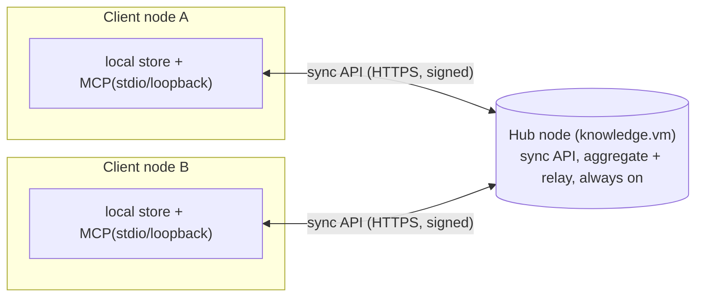

# Federation (M4)

Status: living spec - Phases 0-4 implemented (core foundations, sync core, re-materialization,
transport, CLI/config wiring); Phases 3.5 and 5+ pending. This document is the specification agreed before the code; implementation feedback
is folded back as revisions (see the 8th revision note in principles.md). It fixes the data model, the
sync protocol, the trust/auth model, the invariants (F1..), and the propositions deriving convergence
from them (8a). It refines the M4 sketch in [architecture.md](architecture.md) Section 5 and Section 10, and
the multi-node convergence note in [proposal-workflow.md](proposal-workflow.md).

Scope of this milestone: **hub-and-spoke** (client-server). A persistent "server" node aggregates and
relays multiple client nodes' observation logs. Peer-to-peer mesh reuses the same primitive and is a
follow-up (see "Deferred"). See [principles.md](principles.md) for the principles referenced (P1, P2, P3,
P4, P5, P7, P14, P16, P17, P18, P19, P21, P23) and [proposal-workflow.md](proposal-workflow.md) for the
invariants (I1, I2, I9, I11, I16, I17, I18).

## 1. What federation is (and is not)

Federation replicates the **observation log**, never the projection. A node ships signed log events to
another node; the receiver dedups by content-address, absorbs provenance, and re-projects locally. This is
the only mechanism - there is no "sync the graph" path (P1: the graph is a projection of the log).

Two connection kinds stay distinct and independent:

| | MCP transport | Sync transport (federation) |
|--|----------------|------------------------------|
| Target | agent <-> node | node <-> node/server |
| Surface | MCP (stdio local / streamable-HTTP loopback) | dedicated sync API (HTTPS) |
| Payload | observe/search/traverse tool calls | signed observation-log delta exchange + federated recall (search) |
| Bind | loopback only (P17, unchanged) | network bind allowed, but only with auth + TLS (see 6) |

"Connecting to a server" happens at both levels: (a) a remote agent connects to a node's MCP-HTTP; (b) a
node syncs its log to a hub. This document is about (b).

## 1a. Working set vs canon - what the accept gate governs

Two layers of the projection must not be conflated; federation's guarantees differ per layer.

- **Working set (ungated, immediate)**: entities, relations, hyperedges - and, today, the type glossary -
  project directly from every observation in the log (P1). `observe` and `define_type` write claims, and
  the projection reflects them at once; that is not a federation choice but P1 itself (the graph is a
  projection of the log). The working set is deterministic and converges (P16), so a synced observation
  **joins the receiver's working projection immediately** - it shows up in search, the graph view, and the
  workspace map. Assertion-level last-write-wins fields (entity/relation descriptions, and currently the
  T-Box definition per (target, name)) are working-set semantics, ordered by HLC under federation.
- **Canon (gate-committed)**: the layer only the proposal accept gate can change (I18) - the entity-merge
  effect today; claim promotion/demotion, `tbox_change`, and recall as their enforcement lands. This is
  the layer Sections 6b/7a/7b and F16 speak about.

Consequence for inbound defense (6b): a contaminated synced claim is **visible in the working set**. The
defense is that it arrives down-weighted on recall surfaces and cannot reach the canon layer without a
verdict - NOT that it is invisible. Any statement of the form "nothing changes until a verdict" applies to
the canon layer only.

The T-Box caveat (governance): today `define_type` writes the shared vocabulary as working set - ungated,
last-write-wins. In a single-principal workspace that is the P23 solo exception at work. In a
**multi-principal shared workspace it is unacceptable**: any spoke (including a machine) could silently
rewrite the vocabulary for everyone, with the HLC-latest write winning on every node - contradicting the
reviewed-canon governance of 7b. Enforcing the `tbox_change` gate for shared workspaces is therefore a
**federation prerequisite** (F18; Phasing, Phase 5).

## 2. Node identity

- Each node holds an **ed25519 keypair** persisted under `data_dir` (e.g. `~/.supragnosis/node.key`),
  generated once on first run, never leaving the node. The public key is what other nodes put on their
  allowlist (see 6).
- `node_id` must be **globally unique** across the federation - it keys the version vector, the per-origin
  `origin_seq`, and the origin of every signed attestation. The current `host` / `SUPRAGNOSIS_HOST` value
  defaults to `"localhost"`, so it CANNOT be reused verbatim: two nodes on the default would collide their
  version vectors and origin sequences and convergence would break (and one node could be mistaken for
  another). Therefore `node_id` is **derived from the public-key fingerprint** (self-certifying:
  `node_id = blake3(pubkey)[..N]`) and is **immutable once generated** - it keys the version vector and is
  the final tiebreak of the HLC total order, so it must never change. A human-readable host label may be
  carried as a separate display-only field; it does not enter `node_id`. The sync role **refuses to start**
  if `node_id` is empty, the default, or collides on the allowlist.
- `node_id` is provenance identity (who acted, P2); the keypair is transport authenticity (that the acting
  node really produced this event, even through a relay). Because `node_id` is bound to the key, an event's
  claimed origin cannot be forged by a party that lacks the key.

## 3. Content identity vs sync metadata (P14)

The content-address id already covers `content + assertions + workspace` (exhaustive `hash_into`
destructuring). Federation adds per-attestation metadata that MUST be **excluded** from the id, exactly
like `embedding` and lineage are excluded today:

- `origin_node` - the node_id that authored this attestation.
- `origin_seq` - a monotonic counter the origin keeps **per (origin_node, workspace)** over its outgoing
  attestations in that workspace (starts at 1; see Section 5).
- `hlc` - hybrid logical clock stamp at authoring time (see 4).
- `signature` - ed25519 signature over the canonical bytes of `(content_id, origin_node, origin_seq, hlc,
  host, on_behalf_of, workspace, source_ref, observed_at, confidence, trust_tier,
  derived_from-as-declared)`. The canonical bytes use the same **length-prefixed deterministic encoding**
  as `hash_field` (P14 anti-collision), so a relay reproduces identical bytes and the origin's signature
  verifies unchanged downstream. The origin's **lineage declaration** (`derived_from` as that origin stated
  it) is inside the signed bytes deliberately: lineage is an inbound-defense surface (6b, F13) - if it rode
  unsigned, a relay could forge or strip it undetected. The observation's lineage set is then the union of
  per-origin **signed** declarations, merged exactly like attestations (P3, `absorb`).

Rationale (F2): if two nodes independently observe the same content, the content-address id is identical,
so the receiver dedups and merges instead of duplicating. If any sync metadata were folded into the id, the
"same fact from two hosts" case would fork into two ids and never converge.

Where the fields live and how P14 is enforced. The content-address id is `blake3(workspace + content +
assertions)` (`Observation::with_assertions`); `Assertions::hash_into` exhaustively destructures the
assertions, and `Provenance` is **not** part of the hash at all. (Storage form, Phase 1: one optional
`sync` block on `Provenance` holding the four fields plus the origin's lineage declaration - the
declaration must be stored so the signature stays verifiable after the observation-level `derived_from`
union grows.) The four sync fields live on `Provenance`
(the per-attestation record), so they are excluded from content identity **automatically** - not by a
`hash_into` change. This is the correct home for a second reason: an observation can carry several
attestations (the same content attested by several nodes), and each attestation has its own origin, seq,
hlc, and signature - a single per-`Observation` field could not represent that. (This supersedes the older
`core:357` note that anticipated these as `Observation`-level fields.)

The P14 mechanical enforcement (`principles.md` P14) applies to the functions that "define semantics by
enumerating fields": (1) content-address hashing - untouched here (these are not content identity); (2) the
**attestation total order / dedup** basis; and (3) **`Observation::absorb`** (re-arrival merge). Adding the
four fields to `Provenance` therefore requires an explicit, compile-forced decision in (2) and (3): the
attestation-ordering/equality function and `absorb` must exhaustively destructure `Provenance` (no `..`) so
that a new field cannot be silently dropped on dedup/merge. `absorb` already destructures `Observation`
exhaustively; the new work is to extend the attestation-level union with the same discipline.

Replication unit and dedup. The replication unit is a **signed attestation event** bound to a content id.
`origin_seq`/`hlc`/`signature` are assigned once by the origin at authoring time and are **preserved
verbatim through relays** (a relay forwards the origin's bytes, it does not re-sign). Full-attestation
equality therefore dedups relay copies (byte-identical) while genuinely distinct attestations accumulate as
a monotonic union (P3, `Observation::absorb`) - multiple nodes attesting one fact become multiple
provenance entries under one observation.

## 4. Hybrid Logical Clock (HLC)

`now_millis()` (wall clock) is not a total order across hosts. Federation introduces an HLC so all nodes
agree on "latest" for last-write-wins folds (type-def per (target,name), entity-merge state, canon
verdicts). This is the HLC that `proposal-workflow.md` invariant **I11** already requires - "on the
creation/ingest/sync of an observation the HLC is updated causally ... without it multi-node convergence
does not hold" - so it is a prerequisite of, not an addition to, the proposal workflow (see Section 7a).

- HLC = `(wall_millis: u64, counter: u32, node_id)`. Total order by `(wall_millis, counter, node_id)`.
- On a local event: `wall = max(prev.wall, now_millis()); counter = (wall == prev.wall) ? prev.counter + 1
  : 0`.
- On receiving a remote event with stamp `r`: `wall = max(prev.wall, r.wall, now_millis()); counter =
  1 + max(prev.counter-if-equal, r.counter-if-equal)` (standard HLC merge).
- Folds that are currently ordered by log insertion order switch to ordering by HLC (F8), so every node
  computes the same graph regardless of the order events arrived (P16).
- **HLC does not replace `observed_at`** (P4). `observed_at` stays the human-facing transaction time
  (bitemporality, P4), unchanged; HLC is only the deterministic order key added for cross-node folds. The
  relation valid-time axis (`valid_from`/`valid_to`, P4) is orthogonal and untouched by sync.
- **Ordering key of an observation** (HLC lives per attestation, but folds order per observation): an
  observation is ordered by the HLC of its **authoring (origin) attestation** - the one that first
  introduced this content. For the rare case of the same content authored independently on two nodes
  (identical id, distinct attestations), the **earliest** HLC over the full attestation set is
  authoritative - a minimum over a fixed set, so it **converges** (same set -> same value). It is, however,
  a first-writer-wins ordering, which P16 explicitly notes is convergent but **not monotonic**: a
  late-arriving earlier attestation can lower the minimum and re-order. This non-monotonicity under true
  concurrency is a property of HLC-prefix folds in general (it also touches verdict-fold order and
  policy-in-force lookups) - **finality** (where derivations may be stacked) therefore never rests on the
  ordering alone: it rests on absorbing states (I16) plus **causal stability** (7a). The multi-attestation
  minimum itself only settles last-write-wins display fields, which are allowed to converge late.
  Proposal/verdict events carry a unique payload per author, so in practice each has exactly one authoring
  attestation and the rule is unambiguous.

## 5. Version vector and the sync protocol

The replication stream is scoped **per (origin_node, workspace)**: `origin_seq` is a monotonic counter each
origin keeps per workspace, so within a single shared workspace the stream is dense while other workspaces
are absent entirely (selective sharing, 6c). The version vector is therefore
`VV = { (node_id, workspace): max_origin_seq }`. The protocol is three idempotent, resumable calls over
HTTPS (JSON wire format initially; gRPC is a later optimization):

- `advertise` -> exchange `VV` (only for the workspaces both sides may share). Each side learns where the
  other is ahead.
- `pull(since: VV)` -> the server streams attestation events for the `(node_id, workspace, seq)` ranges
  where the caller is behind, shared workspaces only.
- `push(events)` -> the caller sends events for ranges where it is ahead. The receiver verifies, dedups by
  CAS, absorbs provenance, and re-projects.
- `ping` -> **health check**: an authenticated no-op that verifies connectivity, auth, and the
  caller's per-workspace authorization in one round trip (the response carries the hub identity,
  version, and the caller's shared workspaces). A spoke pings its hubs at startup and on a slow
  interval; state changes stream to the activity feed.
- `search(workspace, query)` -> **federated recall**: an authenticated read of the SERVER's ontology,
  answered from that node's recall surface (hybrid/keyword, mode-labeled). Local state can lag the
  remote store, so a local miss may mean "not synced yet" - this call lets an agent check without
  pulling first. Gated by the same per-node workspace authorization as sync (the P17 second door,
  honored); results are a recall aid (P16 exemption, P19) - to become local graph material or commit
  input they must arrive via pull (the log is the only transport of knowledge, F1). Served hits are
  streamed to the activity feed like every other hit.

Apply pipeline on receipt (F3): verify signature and allowlist (6a) -> CAS dedup / `absorb` (the claimed
trust tier is stored verbatim) -> advance `VV` -> re-project. Trust evaluation happens at read/generate
time (6b) - it is never an apply gate. Convergence rests on **CAS dedup + HLC ordering + the
deterministic fold** (P16), NOT on dense sequence delivery: apply is idempotent, so a re-sent or
out-of-order event is harmless, and holes are expected (sharing skips whole workspaces). The only ordering
dependency is `derived_from` lineage, and it does not block either - an event whose parents are not yet
present is still applied (lineage is a monotonic union via `absorb`) and gains its ancestors when they
arrive. Every step is deterministic and side-effect-free beyond the log append (P1/P3).

## 6. Trust, auth, and network exposure (P2/P17/P18)

The sync surface is a **distinct trust surface** from MCP/viz. Decision (this milestone): the sync server
binds the network directly and owns its own auth in-process - no external reverse proxy dependency. Three
concerns are kept separate: **transport authentication** (who is on the wire), **inbound write defense**
(is the content safe to trust), and **outbound selective sharing** (what may leave).

### 6a. Transport authentication and network bind (P2, P18)

- Bind: `[server] listen = "0.0.0.0:7420"` is permitted for the sync surface ONLY, and ONLY when all of
  {TLS enabled, allowlist non-empty} hold. The MCP loopback bind guard is unchanged - it is NOT
  relaxed - and the viewer does not bind TCP at all (it serves over a local unix socket); federation
  adds a separately-guarded surface.
- TLS: terminated in-process with `rustls`. A cert/key path is required to bind non-loopback (F10).
- AuthN: every request carries a per-node bearer token; every event is ed25519-signed by its `origin_node`.
- AuthZ (wire): the server holds an **allowlist** of `{node_id -> public_key, bearer_token_hash,
  shared_workspaces}`. An event signed by a key not on the allowlist, or a token that does not match, is
  rejected and never applied (F6).
- **Known-peer registry** (runtime observability): the hub records, per authenticated peer, the last
  seen time, last action, and hit count - reported via `sync_status`. Distinct from the allowlist:
  the allowlist ADMITS, the registry OBSERVES; it is in-memory and resets with the process.
- **Key distribution (three anchors)** - who verifies what with which key, incl. events the hub merely
  relays: (1) the hub's transport allowlist (above) decides who may connect and push; (2) the **origin
  public keys** a spoke needs to verify a relayed event (authored by another spoke) travel in the
  **log-borne canon policy's** principal-to-key/node binding (7a) - replicated like everything else, no
  side channel; (3) the policy observations themselves are verified against the workspace **admin's anchor
  key**, which every node carries in its local config (Section 9) - the single out-of-band trust root.
  Bootstrapping a fresh spoke = configure hub URL + bearer + anchor key; pull; verify the policy against
  the anchor; verify everything else against the policy.

### 6b. Inbound write defense - the accept gate commits, trust only generates (P18, P7, P19, I18)

A pushed/pulled event is a **write**, and every write is an attack surface (P18): a signature proves *who
sent it* (P2/I9), never *whether the content is true*. An allowlisted node can be compromised or fed
contaminated input and relay it with a valid signature. The defense is not to "trust harder" but to keep
**two doors separate** - which is also what dissolves the convergence-vs-sovereign-trust tension (P16 vs
P18/P17) for good, because the two never meet on the same axis:

- **The only commit path to canon is the proposal accept gate** (I18: the sole commit path is the verdict;
  P7: generate != commit). A synced observation - however it is signed - is just a **claim in the log**: it
  joins the working-set projection immediately (1a, P1), but nothing in the **canon layer** changes until a
  verdict commits it. The verdict is a deterministic fold over the signed log (HLC-ordered I11, merge state
  absorbing I16), its validity decided by the shared, replicated **canon policy**
  (`supragnosis://workspace/{ws}/canon-policy`, itself log-borne - see 7a) plus I9/I17. Being a function of
  the log alone, it computes identically on every node -> the canon layer converges (P16), while the
  receiver honors no claimed authority it did not itself re-derive (P18).
- **Trust evaluation lives on the generate/recall side only** (P7, P19, the P16 recall exemption). A node's
  trust weighting decides what it surfaces as a **candidate/proposal** and how it **ranks** reads - never
  what commits. So it may be fully receiver-relative, sovereign (P18/P17), node-local, and non-converging,
  exactly like the embedding index, without touching P16: it sits on the other side of the door from
  commit. The origin's declared `trust_tier` is stored verbatim for audit; the receiver never honors it as
  authority, and a tier never rises just by crossing the wire. One projection change is required to uphold
  this: the current representative-tier computation takes a **max over attestations' claimed tiers**, which
  would let a remote claimed `HumanConfirmed` raise the projected tier on every receiver. The claimed tier
  is **log data** (stored verbatim, converges); the effective/representative tier is an **evaluation** and
  must not absorb unverified remote claims (Phasing, Phase 5).
- **Contaminated / low-trust inbound is therefore a low-priority candidate, not canon.** It materializes
  into the append-only log (auditable, P3), is down-weighted or withheld from a node's own high-trust reads
  by that node's recall policy, and can reach canon only by passing a verdict at the accept gate. There is
  no separate "structural quarantine" - that would wrongly make the committed graph observer-relative and
  re-open the loop.
- **Lineage is preserved** so a later contradiction can trace and retract the derivation subtree (P3/P18).

### 6c. Outbound selective sharing (P17)

- Sharing is **opt-in per workspace, default nothing leaves** (P17). A node advertises and pushes only its
  whitelisted `share_workspaces`; the server additionally enforces, per node, which workspaces that node
  may read/write. Content outside the whitelist is filtered **before** it crosses the boundary, never as a
  delete-after-arrival (F9).
- **The second-door rule** (P17): the sharing boundary must also govern any remote read surface. The
  local MCP bind stays loopback-only and the viewer stays on its local unix socket; the hub MAY open a
  governed human surface (6d), and when it
  does, that surface MUST enforce the same `share_workspaces` whitelist (and a no-workspace-scope global
  query stays limited to the local trust surface) - otherwise knowledge leaves through a different door.

### 6d. Hub human surface - people managing knowledge at the hub

A hub is only a *service* if people can browse and govern the shared knowledge there. The native console
remains the **spoke**: every stakeholder's own node has the full viewer/curation console over its local
replica, offline-capable, no extra auth surface (the local-first answer). The hub adds a convenience
surface on top - opened in two tiers, because reads and writes carry very different risks:

**Hub user identity is a key, set up once.** A hub user enrolls by generating a keypair (browser
WebCrypto/passkey or CLI) exactly once; the hub admin adds the public key to the **user whitelist**:
`{principal -> user public key(s), per-workspace read/write grants}`. This is deliberately symmetric with
the node allowlist (6a) - the hub knows machines by node keys and humans by user keys, and admitting
either is the same hub-admin act (7b meta-authority). One enrollment serves double duty: it is the wire
credential for the human surface AND it **seeds the canon policy's principal-to-key binding** (7a) - the
governance identity and the login identity are the same key, not two systems to reconcile.

- **Read tier (Phase 3.5)**: the hub serves its viewer / read APIs over the network - TLS in-process,
  authentication by **proof of possession of a whitelisted user key** (challenge-response establishing a
  short-lived session), authorization by that entry's **workspace grants** (a user sees exactly the
  granted workspaces; workspace enumeration is filtered too; no global no-workspace query). ALL write
  endpoints (`observe`, `propose`, `review`, `define_type` - and the viewer's `/api/review`) are disabled
  on this surface. **Republication consent** (P17): a spoke's share to the hub is `sync-only` by default -
  serving that workspace to hub users is a *further* disclosure that requires the spoke's explicit
  `sync+web-read` share grade. Both gates must pass: the spoke offered the workspace for web reading AND
  the user holds a grant for it.
- **Write tier (Phase 5+)**: knowledge management (casting verdicts, opening proposals) through the hub,
  in two strength levels. (i) **Key-authenticated session**: the act is recorded with the delegation
  chain `host = hub, on_behalf_of = <principal>` - honest but weak, because every hub-mediated act is
  signed by the hub's single node key, so a compromised hub could still forge any enrolled principal's
  `on_behalf_of` (the impersonation defense of 7a re-concentrates into one point; detectable by audit,
  not prevented). (ii) **Principal-signed acts**: the act bytes are signed client-side with the user's
  own key and the principal signature rides in the attestation alongside the hub's node signature - the
  hub relays but **cannot forge** a principal's act, I9 compares real keys, and I17's "human's direct
  act" stays cryptographically checkable even hub-mediated. The canon policy states which acts demand
  level (ii); **recall verdicts (I17) and `HumanConfirmed` promotion (P18) demand it by default** -
  level (i) is acceptable only for low-stakes acts under a policy that says so.
- **Web hardening (Phase 3.5 requirement, P18 in the browser)**: opening the viewer to users turns it
  into a multi-user web app whose displayed content (entity names, descriptions, proposal rationale) is
  **synced, attacker-influenceable input** - a contaminated spoke must not achieve stored XSS in another
  user's browser. Required: a full output-escaping audit of the viewer, a Content-Security-Policy header,
  credentials never in query strings, and no state-changing GET endpoints on the exposed surface.

The tiers compose with, never replace, the spoke console: a stakeholder with a local node keeps full
sovereignty (P17) and casts verdicts under their own node key; the hub surface serves those who have not
installed a node. Enrollment/revocation of user keys is a hub-admin act (rotation shares the deferred
key-rotation workflow). Until Phase 3.5 lands, remote access is an SSH tunnel to the viewer's unix
socket (`ssh -L <port>:<viz.sock path>` - authentication = SSH key, read and write as the tunnel
owner's local trust surface). The former interim read-only TCP exposure (SUPRAGNOSIS_VIZ_PUBLIC) was
removed together with the viewer's TCP listener: the viewer now binds only a 0600 unix socket, so
F19's hard line (no unauthenticated write surface) holds by transport. Network reads return with the
user-key read tier.

## 7. Topology

- **Hub-and-spoke (this milestone)**: client nodes (`role = ["local", "sync-client"]`) sync to a server
  node (`role = ["local", "server"]`). The server is the always-available canonical relay; clients catch
  up through it even when not online simultaneously.
- **Peer mesh (deferred)**: two nodes with the sync-client role point `peers` at each other. Same
  primitive, no center. Deferred because the hub covers the immediate need and mesh adds NAT/discovery
  concerns.

## 7a. Proposal-workflow interaction (P23, I9/I11/I17)

This milestone **enables** multi-node proposal-verdict convergence; it does not defer it.
`proposal-workflow.md` places the proposal workflow at M3.5 "between M3 and M4" precisely because
"deterministic convergence of multi-node/federation verdicts is guaranteed only after HLC is introduced
(M4) (I11)". Federation is that M4 milestone: it supplies the HLC (Section 4) and the signed log
replication the workflow was designed to run on.

- A proposal and its verdicts are observations (I1: `proposal_events` are assertions, in the content
  address). They therefore replicate like any observation, and the deterministic fold (I2), HLC-ordered
  (I11) with the merge state absorbing (I16), applies them identically on every node (P16). There is no
  separate "verdict sync" path.
- Federation's signing makes the guards verifiable across nodes, but be precise about what it proves: an
  ed25519 signature proves the **origin node** authored the event, NOT that a **human** performed a direct
  act. So **I17** ("a recall verdict is a human's direct act") is not established by the node signature
  alone - the fold decides it from the **signed provenance evaluated against the shared canon policy**
  (which principals/keys count as a human's direct verdict), a deterministic, log-derived check that demotes
  a proxied recall to a comment. **I9** (no self-approval; principals by resolved id or signing key) is
  likewise a deterministic check over the signed log. The signature enables these checks cross-node; it does
  not substitute for them.
- Convergence of the committed canon holds within a **shared canon-policy trust domain**: because a
  verdict's validity is a function of the log plus the replicated canon policy, nodes on the same policy
  commit the same structure (P16). Nodes that run **different** canon policies (P17 sovereignty) may commit
  different canons - a deterministic consequence of different policy inputs, not nondeterminism. The
  parameter that matters is the explicit, versioned canon-policy artifact, not any per-attestation trust
  weighting (which is generate-side only, Section 6b).
- **The canon policy is itself log-borne.** A policy change is a signed observation authored by the
  workspace's admin principal (7b meta-authority; bootstrap anchor: the admin key is marked as such in the
  hub allowlist config), so it replicates, orders (HLC), and attributes exactly like every other
  observation - there is no out-of-band distribution channel to specify or secure. A verdict is validated
  against the policy **in force at the verdict's HLC**, keeping verdict validity a deterministic function
  of the log alone (two policy versions cannot be ambiguous: HLC picks the one governing each verdict).
  **Absent any policy observation, the workspace runs the default solo policy** - the current M3.5
  behavior (self-attested verdicts, P23) that every workspace starts in before an admin ever writes a
  policy; this is what Phase 6's single-principal operation runs on.
- **Retroactivity and finality (causal stability).** HLC-prefix folds are convergent but not monotonic
  under true concurrency (Section 4): an earlier-HLC event arriving late (a concurrent verdict, or a
  concurrent policy change) re-runs the fold with a different prefix and can revise a verdict's validity or
  which verdict came first. Convergence is unharmed - the same final set folds to the same canon everywhere
  (P16) - but a conclusion drawn before the set was complete can be revised. I11's causal HLC propagation
  bounds the exposure to genuine concurrency: a node that has **seen** the verdict stamps later HLCs, so
  only events authored in ignorance of it can land before it. Operational finality is **causal stability**,
  computable thanks to per-(origin, workspace) stream density (F7) and per-origin HLC monotonicity: a
  verdict is final once every admitted origin's delivered stream in that workspace has passed the verdict's
  HLC - after that, no admitted origin can still deliver an earlier-HLC event, so the prefix can no longer
  change. The always-available hub makes this watermark quick to reach; policy changes should be authored
  connected (through the hub) so their stability window stays short. Until stable, a cautious surface may
  present a fresh verdict as provisional - a display concern, not a correctness one.
- **The policy must bind principals to keys.** `on_behalf_of` is a free string, and a node signature
  authenticates the **node**, not the principal - without a binding, a malicious spoke could impersonate a
  principal (e.g. cast a "different-principal" verdict on its own proposal) and defeat I9. The canon policy
  therefore carries the **principal-to-key/node binding** that I9/I17 evaluate against; where a binding is
  missing, I9's own fallback applies (unresolved principals -> suspected self-approval -> forced human
  review).
- **"Solo, self-attested" (P23) is a property of the principal set, not the topology.** Sharing a workspace
  across several nodes but with a single contributing **principal** stays self-attested (that principal is
  both proposer and reviewer, verdict carries the self-attested mark). Only when a **second principal**
  contributes does I9 (proposer != reviewer) begin to bite - the correct effect of admitting another party
  to the canon, not a regression.
- Deferred to M4+ (per `proposal-workflow.md` line ~504): quorum policy, the auto-merge policy, and a
  conflict-resolution UI. These are policy layers on top of the convergence this milestone provides, not
  prerequisites for it.

## 7b. Governance model - spokes as stakeholders

The accept gate (7a) plus attribution (P2) plus sovereignty (P17) turn a shared workspace into a
**governed knowledge commons**: canon is a reviewed artifact, not a free-for-all, and each spoke acts as a
stakeholder in three roles.

- **Contributor / attestor** - every spoke signs its own attestations and is attributed through the
  provenance delegation chain (`host` acting `on_behalf_of` a principal, P2). Every claim in the shared log
  has an identifiable author, so "who said this" always has an answer (accountability).
- **Reviewer / verdict authority** - canon commits only through a verdict (I18), and I9 (proposer !=
  reviewer, compared by resolved id or signing key) forbids a stakeholder from committing its own proposal
  alone. Canon advances by peer review among stakeholders, and the canon policy
  (`supragnosis://workspace/{ws}/canon-policy`) records which principals/keys hold verdict authority.
- **Sovereign** - each spoke decides what leaves (selective sharing, P17) and how it weights others'
  knowledge for its own reads (recall-side trust, 6b). No stakeholder forces its trust view on another;
  only the log-derived, canon-policy-gated structure converges.

**A stakeholder is a principal, not a machine.** The governance unit is the principal (a human or an org),
not the host. One person's several machines are one stakeholder (several signing hosts, one principal);
I9's self-approval check compares principals, so a single principal acting from many nodes is still solo
and self-attested (7a, P23). A machine/agent is an acting host under a delegation chain (P2); a host acting
with no principal stands alone and is trusted correspondingly less (P18).

**Standing is graded, not one-vote-per-node.** A machine/agent may contribute freely and, where the canon
policy allows, cast verdicts on low-risk kinds (an auto-merge is itself a verdict with a delegation chain,
re-validated by the fold). But acts requiring a human's direct hand cannot be delegated to a machine: a
recall verdict (I17) and a promotion to `HumanConfirmed` (P18) require a human principal. Influence is
weighted by trust tier and canon policy, not by equal votes.

**Meta-authority (who admits stakeholders).** In hub-and-spoke, the allowlist (6a) and the canon policy are
administered by the **hub operator** - the "central authz" role of the topology. Admitting or removing a
stakeholder, or changing verdict authority, is a hub-admin act. So "who guards the guards" resolves, in
this topology, to the hub operator: deliberate central administration, not decentralized governance.

**Now vs deferred.** This milestone provides the governance *mechanism* - signed attribution, distinct-
principal verdicts, the accept gate, and the canon-policy artifact. Formal governance *policy* (quorum,
roles, weighted voting, delegated auto-merge) is M4+ (7a, deferred). Decentralized meta-governance -
changing the canon policy without a central admin - is out of scope.

## 8. Invariants (F1..)

- **F1** Sync replicates the observation log, never a projection. The receiver re-projects locally.
- **F2** The content-address id excludes all sync metadata (origin_node/seq, hlc, signature). Identical
  content on two nodes -> identical id -> dedup, not duplication.
- **F3** Apply = verify (signature/allowlist) -> CAS dedup/absorb -> advance VV -> re-project.
  Deterministic, append-only; trust evaluation is read-time (6b), never an apply gate.
- **F4** Provenance is a monotonic, **enrichment-ordered** union across nodes (P3, 8th revision): no
  attestation is ever removed, overwritten, or superseded by a DIFFERENT attestation; the sole
  exception is enrichment - a strictly-more-informative version of the SAME attestation (identical
  base fields gaining the sync stamp, backfill) supersedes its unstamped base, and enrichment never
  runs backwards. Element-wise upgrade keeps the join commutative/associative/idempotent (Prop A).
- **F5** Given the same observation set, every node computes the same projections - at two distinct
  convergence points (8a). **Fold-projections** (type glossary, proposal states, curation signals -
  pure functions of the log) converge **continuously** as the logs converge (Prop B). **Materialized
  projections** (the entity/relation tables) converge **at re-materialization points** - the
  HLC-ordered replay (`reproject`, the "re-project" step of F3) - and may transiently diverge between
  observe-time upserts and the next replay (Prop C). The **canon layer** converges within a shared
  canon policy (F16, Prop D). Policy is a deterministic input, not nondeterminism. Trust weighting and
  embeddings / ANN recall are **node-local aids** on the generate/recall side and are NOT subject to
  cross-node convergence (P16/P19, F13); query responses label their `mode` so a client can tell the
  convergence surface from the recall aid.
- **F6** An event with an invalid signature, an unknown origin key, or a bad bearer token is rejected and
  never applied.
- **F7** `origin_seq` is monotonic per **(origin node, workspace)**, so a shared workspace's stream is
  dense while unshared workspaces are absent (selective sharing). Apply is **hole-tolerant and idempotent**:
  convergence rests on CAS + HLC + the deterministic fold (P16), never on dense delivery, so a re-sent,
  out-of-order, or workspace-filtered stream still converges - there is no sequence-gap parking. Origin
  fields (seq/hlc/signature) are set once by the origin and preserved verbatim through relays, so relay
  copies dedup by full-attestation equality.
- **F8** HLC is monotonic and totally ordered (the I11 clock); last-write-wins folds order by HLC, not by
  arrival. An observation orders by its authoring attestation's HLC (earliest over the set for the
  multi-attestation case).
- **F9** Only whitelisted workspaces cross the sync boundary (opt-in, default nothing, P17); the server
  enforces per-node access, filtering before the boundary. Any remote read surface obeys the same whitelist
  (P17 second-door rule).
- **F10** The sync surface binds non-loopback ONLY with TLS enabled and a non-empty allowlist. MCP stays
  loopback-only (its bind guard unchanged); the viewer has no TCP bind (local unix socket only).
- **F11** Sync is a non-blocking, pollable task (P21). It never blocks tool handlers; store calls offload
  via `spawn_blocking`.
- **F12** A storage/transport failure is reported as a failure, never as "empty" or "converged" (P5).
- **F13** A valid signature proves origin (P2), never content truth (P18). Inbound trust evaluation is the
  receiver's and lives on the **generate/recall side only** - it shapes candidates and ranking, never
  commits; the claimed tier is stored for audit, a tier never rises by crossing the wire, and lineage is
  preserved. Low-trust inbound is a down-weighted candidate, not a structural quarantine. The claimed tier
  is log data (converges); the **effective/representative tier is an evaluation** - the projection must not
  max in unverified remote claimed tiers (6b).
- **F14** `node_id` is globally unique and bound to the node's public key. The sync role refuses to start
  on an empty, default (`localhost`), or allowlist-colliding `node_id`.
- **F15** A replicated proposal `verdict_cast` is applied only after passing the workflow's own checks -
  I9 (no self-approval, principals by signing key) and I17 (a recall verdict is a human's direct act) -
  HLC-ordered (I11). Signing enables these checks cross-node; it does not bypass them.
- **F16** The sole commit path to canon (1a: the gate-committed layer) is the proposal **accept gate**
  (verdict): a deterministic fold over the signed log governed by the shared, log-borne canon policy (I18;
  I1/I2/I11/I16; I9/I17; policy-in-force chosen by the verdict's HLC). Trust evaluation never gates the
  committed structure (F13). The canon layer converges within a shared-canon-policy trust domain (P16);
  nodes under different canon policies (P17) commit different canons deterministically, which is a policy
  difference, not nondeterminism. A verdict is operationally final once **causally stable** (7a): when
  every admitted origin's delivered stream has passed its HLC, the fold prefix can no longer change.
- **F17** A governance stakeholder is a **principal**, not a host: I9/self-approval and the solo/self-
  attested exception (P23) compare principals, so one principal on many nodes stays solo. Cross-node
  principal identity rests on the canon policy's principal-to-key binding (7a). A machine acts under a
  delegation chain (P2) and holds verdict authority only as the canon policy allows; a human's direct act -
  a recall verdict (I17) and promotion to `HumanConfirmed` (P18) - can never be delegated to a machine. In
  hub-and-spoke the allowlist and canon policy are administered by the hub operator (central authz);
  admitting/removing a stakeholder is a hub-admin act.
- **F18** In a **multi-principal** shared workspace, T-Box changes pass the accept gate (`tbox_change`) -
  ungated `define_type` (working-set last-write-wins, 1a) is tolerable only under the single-principal
  solo exception (P23). Until the gate is enforced, federated deployment stays single-principal (Phasing,
  Phase 5/6).
- **F19** The hub **human surface** (6d) authenticates by whitelisted **user keys** (enrolled once,
  admin-admitted, seeding the canon-policy principal binding) and authorizes by per-user workspace
  grants; the read tier disables every write endpoint, and a workspace is served to users only under the
  spoke's explicit `sync+web-read` share grade (consent to sync is not consent to republish, P17). The
  human surface never accepts a write it cannot attribute to an enrolled principal - anonymous writes
  would collapse every actor into the hub's host identity and void I9/P2. (Scope: this governs the human
  surface only - the sync surface legitimately accepts node-attributed attestations whose principal is
  absent, which are simply trusted less, P2/P18.)
- **F20** A hub-mediated act is forgeable by a compromised hub at strength (i) (session-authenticated,
  `host = hub, on_behalf_of = principal`) and unforgeable at strength (ii) (**principal-signed**: the
  act bytes carry the user key's signature alongside the hub's node signature). Recall verdicts (I17)
  and `HumanConfirmed` promotion (P18) require strength (ii) by default; the canon policy may relax
  only low-stakes acts to (i), never those two.

## 8a. Propositions - how convergence follows from the invariants

The convergence claims of this spec are not independent assumptions; each is derived from named
invariants, and each derivation is pinned by a test. If an invariant above is ever weakened, this
section says exactly which conclusions fall.

- **Prop A (log convergence - the log is a join-semilattice).** Premises: F2 (content-address
  identity - one id per content, sync metadata outside it), F4 (enrichment-ordered monotonic union -
  commutative, associative, idempotent), F7 (apply is idempotent and hole-tolerant - no ordering or
  density precondition). Conclusion: node log state forms a join-semilattice under "receive event";
  any delivery schedule covering the same event set - any order, any duplication, any partitioning
  into batches - reaches the same log. Pinned by:
  `supragnosis-sync::two_nodes_converge_under_any_exchange_order`,
  `supragnosis-core::absorb_stamp_upgrade_supersedes_unstamped_base` (upgrade keeps idempotence),
  `supragnosis-core::cross_node_identical_id_dedups_and_unions`.
- **Prop B (fold convergence - continuous).** Premises: Prop A, F8 (HLC total order; observations
  keyed by authoring HLC), and folds that are pure functions of the log ordered by that key (no wall
  clock, no arrival order, no map iteration order - P16). Conclusion: fold-projections (type
  glossary, proposal states, curation signals) are equal on any two nodes whose logs are equal - at
  every moment, with no separate step. Pinned by:
  `supragnosis-engine::types_fold_orders_by_hlc_not_observed_at` and the glossary assertion inside
  `cross_node_reprojection_converges`.
- **Prop C (materialization convergence - at replay points).** Premises: Prop A and a deterministic
  replay (`Engine::reproject`: fresh states, (ordering-HLC, id) order, deterministic representative
  attestation). Conclusion: after both nodes re-materialize over equal logs, their entity/relation
  tables are equal - including every last-write-wins field. Between an observe-time upsert and the
  next replay a node's tables may transiently diverge (F5); replay is the convergence point.
  Pinned by: `supragnosis-engine::cross_node_reprojection_converges`.
- **Prop D (canon convergence and finality).** Premises: Prop B applied to the verdict fold (I1/I2),
  F16 (the accept gate is the sole commit path, governed by the log-borne canon policy at the
  verdict's HLC), F15 (I9/I17 checks are deterministic functions of the signed log). Conclusion: the
  canon layer is equal across nodes in the same canon-policy domain; a verdict's effect is
  operationally final once causally stable (7a - per-origin HLC monotonicity + per-(origin,
  workspace) density make the watermark computable). Enforcement of the full premise set lands in
  Phase 5; the fold mechanics are pinned today by `supragnosis-engine::proposal_open_verdict_fold`.

What the chain does NOT claim: materialized tables between replays (transient divergence, F5),
recall aids and trust weighting (node-local by design, F13), hub availability (a hub may withhold -
Section 11), and canon equality across DIFFERENT policy domains (a policy difference is a different
input, not nondeterminism - F16).

## 9. Crate / config / surface layout

- New crate `supragnosis-sync` (transport-agnostic core): VV diff, delta encode/decode, apply pipeline,
  selective-sharing filter, signing/verify. Depends on `core`; no IO beyond the injected store port.
- Transport: `axum` server + `reqwest` client, `rustls` for TLS, `ed25519-dalek` for signing.
- Config `supragnosis.toml` (via `figment`): `host_label` (display only - `node_id` derives from the
  keypair, Section 2, and is never configured), `[node] role`, `[sync] share_workspaces / servers / peers /
  auth_token / anchor_key` (the workspace admin's anchor public key, 6a), `[server] listen / tls_cert /
  tls_key / allowlist` (entries: `node_id -> public key, bearer hash, shared workspaces, admin marking`).
- CLI: `supragnosis sync` (one-shot or daemon loop against configured servers/peers); the server role is
  started alongside `serve`/`start`.
- MCP tools (administrative, P21 pollable tasks): `sync_status`, `sync_pull`, `sync_push`.

## 10. Phasing

- **Phase 0** (this doc) - specification and invariants. [done]
- **Phase 1** - core foundations: node keypair + pubkey-derived `node_id`, HLC type, version-vector type,
  the four sync metadata fields on `Provenance` (automatically outside the content address; the P14
  compile-forced update is in the attestation total-order/dedup and `Observation::absorb`, not `hash_into`),
  fold ordering by HLC, and a **store-port method to scan the log per (node, workspace) since a `VV`** (only
  `all_observations(workspace)` exists today - a delta scan is new). Tests: cross-node identical id, HLC
  monotonicity, signature round-trip, absorb dedups relay copies but unions distinct attestations. [done]
- **Phase 2** - `supragnosis-sync`: VV diff, delta codec, apply pipeline (claimed-tier verbatim storage +
  recall-side down-weighting hooks, F13 - no apply-time trust gating), selective sharing, and
  **export-boundary stamping** (implemented model): one backfill pass stamps pre-federation and new
  local attestations uniformly, in deterministic (ordering-HLC, id) order, with the stamp upgrade on
  absorb making the write-back an in-place enrichment (F4) - unstamped attestations never leave the
  node. Observe-time stamping is an optional Phase 4 wiring (once the daemon holds the node identity);
  it changes when the stamp is applied, not its meaning. Plus the deterministic re-materialization
  step `Engine::reproject` (HLC-ordered replay - Prop C). Property test: two in-memory nodes converge
  under any exchange order (F5); tampered event rejected (F6); a workspace-filtered (hole-y) stream
  still converges (F7); cross-node reprojection materializes identically. [done]
- **Phase 3** - transport: axum sync API (`/sync/advertise|pull|push`) + in-process rustls TLS +
  allowlist/bearer wire auth + reqwest client (`sync-http` = the sync crate's `http` feature); the F10
  bind guard refuses non-loopback without TLS + a non-empty allowlist. Loopback guard for MCP
  untouched; the viewer later moved off TCP entirely (local unix socket). [done]
- **Phase 3.5** - **hub human surface, read tier** (6d, F19): user-key enrollment + admin-managed user
  whitelist with per-workspace grants, challenge-response session auth, `sync+web-read` share grades,
  all write endpoints disabled, workspace enumeration filtered, and the web-hardening checklist
  (escaping audit, CSP, no credentials in URLs, no state-changing GET). Reuses the Phase 3 TLS
  infrastructure.
- **Phase 4** - CLI/config/roles + `sync_*` MCP tools: supragnosis.toml (SUPRAGNOSIS_CONFIG or
  ~/.supragnosis/supragnosis.toml; unknown keys rejected loudly), node keypair persisted once at
  ~/.supragnosis/node.key (0600), `supragnosis identity` (+ --hash-token for allowlist entries),
  `supragnosis sync` one-shot round, the `[server]` role started alongside the daemon (F10 validated
  at startup), and the MCP tools `sync_status` / `sync_pull` / `sync_push` (13-tool surface). One
  SyncNode per process - the server role and the tools share the clock and seq counters. [done]
- **Phase 5** - **governance enforcement** (prerequisite for multi-principal operation, F15-F18): the
  canon-policy as a log-borne signed artifact incl. the principal-to-key binding and the default-solo
  fallback (7a); I9/I17 checks in the proposal fold (today the fold hardcodes the solo self-attested path);
  `tbox_change` gate enforcement for shared workspaces (F18, 1a); the representative-tier evaluation change
  (F13, 6b - stop maxing in unverified remote claimed tiers); the causal-stability watermark for verdict
  finality (7a, F16); and the **hub human surface write tier** (6d, F19/F20: session-attributed acts
  `host = hub, on_behalf_of = principal`, plus **principal-signed acts** - client-side user-key
  signatures required for recall/`HumanConfirmed` - with the user whitelist unified into the
  canon-policy principal binding).
- **Phase 6** - deploy knowledge.vm as the hub (systemd unit, config with server role, TLS, allowlist),
  register a client, verify end-to-end convergence. May go live after Phase 4 **restricted to
  single-principal workspaces** (the P23 solo exception - one principal across many machines); onboarding a
  second principal requires Phase 5.

## 11. Deferred (not this milestone)

- Peer-to-peer mesh, NAT traversal, discovery.
- gRPC transport (JSON/HTTPS first).
- Key rotation / revocation workflow (allowlist is static-edit for now).
- Proposal **quorum / auto-merge policy** and a conflict-resolution UI (`proposal-workflow.md` line ~504,
  M4+). Note: cross-node verdict *convergence* is enabled by this milestone (Section 7a) - only these
  policy layers on top of it are deferred.
- Redaction finer than workspace-level (e.g. per-entity sensitivity labels).
- **Availability against a faulty/malicious hub**: a hub can silently *withhold* events. This is an
  availability, not an integrity, concern - events are unforgeable (F6) and cannot be fabricated, but
  omission is undetectable under hole-tolerant apply (F7). A peer / multi-hub topology mitigates it
  (mesh is deferred above).
- **Cross-workspace lineage exposure**: a shared observation whose `derived_from` points into an unshared
  workspace carries that (opaque blake3) id across the boundary, revealing the referenced observation's
  existence. Redacting dangling cross-workspace lineage at export is a follow-up.

## 12. Closure map

Every mechanism this document relies on is grounded in exactly one of: existing code/docs, a numbered
phase, or an explicit Deferred entry - nothing is assumed to exist anywhere else. This is the closure
property of the spec: no dangling dependency.

| Mechanism | Grounding |
|---|---|
| Content-address id, `absorb`, workspace scoping, entity-id derivation | existing (`supragnosis-core`) |
| Proposal fold, accept gate, invariants I1-I18 | existing M3.5 (`proposal-workflow.md`, engine fold); I9/I17 cross-node enforcement in Phase 5 |
| Keypair + `node_id`, HLC, VV, Provenance sync fields (+ signed lineage declaration), store delta scan | Phase 1 |
| VV diff, delta codec, hole-tolerant apply, sharing filter, claimed-tier storage + recall hooks | Phase 2 |
| Sync transport (axum/rustls/reqwest), allowlist/bearer | Phase 3 |
| Hub human surface: read tier (user-key enrollment + grants, share grades, RO, web hardening) | Phase 3.5 |
| Config (supragnosis.toml: `host_label`, origin keys, allowlist), node.key identity, CLI roles, `sync_*` tools | Phase 4 |
| Log-borne canon policy + principal-key binding + default-solo rule, `tbox_change` gate, representative-tier evaluation, causal-stability watermark, hub write tier (principal-signed acts, F20) | Phase 5 |
| Hub deployment (systemd, single-principal until Phase 5) | Phase 6 |
| Mesh/NAT/discovery, gRPC, key rotation, quorum/auto-merge/conflict UI, fine-grained redaction, hub-withholding mitigation, cross-workspace lineage redaction | Deferred (Section 11) |
