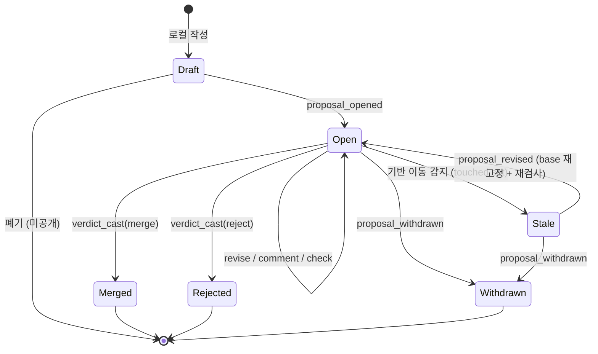

# supragnosis - 제안 워크플로 설계 (Proposal Workflow)

> 여러 주체(사람 + 에이전트)가 공유하는 지식에서 "정본(canon)으로의 승격"을
> 관리하는 워크플로 - 지식의 Pull Request.
>
> - 규범 근거: [principles.md](principles.md) 원칙 23 (정본으로의 관문)의 구체화.
> - 상태: 설계 노트. 구현 마일스톤은 13절 참조.
> - 핵심 목표: **각 단계가 헌법과 논리적으로 모순되지 않을 것.** 이를 위해
>   모든 단계를 불변식(invariant)으로 먼저 고정하고(2절), 흐름은 그 위에 세운다.

---

## 1. 문제와 비유

적재(observe)는 자유롭다 (원칙 22). 그러나 모든 주장이 같은 무게로 취급되면
그래프는 쓰레기장이 된다 (원칙 18). 따라서 **개인의 주장**과 **공유된 정본**
사이에 관문이 필요하고, 그 관문의 워크플로가 제안(proposal)이다.

git PR과의 대응:

| git | supragnosis | 차이 |
|-----|-------------|------|
| commit | 관측(observation) | 동일하게 불변, append-only |
| branch | 호스트/워크스페이스의 로컬 믿음 | 명시적 분기 없이 자연 발생 |
| PR | 제안(proposal) | **쓰기가 아니라 승격의 관문** |
| diff | 믿음 diff (5절) | 줄 비교가 아니라 믿음 변화의 비교 |
| CI | 검사(checks) (6절) | 정합성/모순/영향 분석 |
| merge | 승격 이벤트 적재 (8절) | 코드 복사가 아니라 신뢰 등급 상승 |
| revert | 강등 제안 | 되감기가 아니라 새 이벤트 (원칙 3) |

**결정적 차이**: git은 머지 전까지 main에 코드가 없지만, supragnosis에서
주장은 제안과 무관하게 **이미 존재**한다 (낮은 신뢰 등급으로). 제안은 존재의
관문이 아니라 **등급의 관문**이다. 이 차이가 원칙 22(마찰 최소)와 원칙 18
(오염 방어)을 동시에 만족시키는 열쇠다.

---

## 2. 불변식 (Invariants)

흐름의 모든 단계는 아래 불변식을 위반할 수 없다. 각 불변식은 헌법 원칙의
직접 귀결이다.

| # | 불변식 | 근거 원칙 |
|---|--------|-----------|
| I1 | **제안도 지식이다.** 제안의 생성/갱신/검토/판정은 전부 관측 이벤트로 적재된다. 별도의 사이드 스토어는 없다. | 1, 3 |
| I2 | **상태는 폴드다.** 제안의 현재 상태는 그 제안에 속한 이벤트 스트림을 HLC 순서로 접은(fold) 결정적 함수다. 상태를 별도로 저장하면 위반이다. | 16 |
| I3 | **병행 판정은 수렴한다.** 서로 다른 노드에서 동시에 내려진 판정은 HLC 순서상 첫 결정적 판정(decisive verdict)이 이기고, 이후의 상충 판정은 무효화되어 코멘트로 기록된다. 모든 노드가 같은 결론에 도달한다. | 16 |
| I4 | **벽시계 금지.** 시간 경과 자체는 어떤 상태 전이도 일으키지 않는다. 만료/자동 병합은 반드시 명시적 이벤트(정책 실행자가 적재)로 표현된다. | 16, 18 |
| I5 | **기각은 부정이 아니다.** 제안 기각은 "주장이 거짓"이 아니라 "승격하지 않음"이다. 기각된 주장은 원래 등급으로 계속 존재한다. | 5 |
| I6 | **병합은 추가다.** 병합은 주장을 복사/수정하지 않고 승격 이벤트를 추가할 뿐이다. 취소도 새 강등 이벤트로 한다 (되감기 없음). | 3 |
| I7 | **기반은 고정된다.** 제안은 열릴 때의 정본 프런티어(버전 벡터)를 기록하고, diff와 검사는 그 기반에 대해 계산된다. 기반이 움직이면(touched set 변경) 제안은 stale이 되고 재검사 없이 병합할 수 없다. | 16, 9 |
| I8 | **검사는 순수 함수다.** 검사 결과 = f(제안, 기반 프런티어). 같은 입력이면 어느 노드에서든 같은 결과 - 재실행으로 언제든 재현 가능하다. | 16, 19 |
| I9 | **자기 승인 금지.** 판정의 권한 주체(위임 사슬의 principal)는 제안의 권한 주체와 달라야 한다. 에이전트가 대리한 제안을 그 위임자가 승인하는 것은 자기 승인이다. principal 비교는 **정규 신원**(해소된 엔티티 id 또는 서명 키) 기준이며, 미해소 principal 간 판정은 자기 승인 의심으로 사람 리뷰를 강제한다. **예외: claim-demotion/recall 은 자기 승인을 허용**한다 - 자신이 유입시킨 것의 강등은 원칙 3 덕에 저위험이고(자기 커밋 revert 와 동지위) fast-path(9절)와 정합한다. | 2, 15, 18 |
| I10 | **적재는 게이트하지 않는다.** 제안 절차의 어떤 부분도 observe를 막거나 지연시키지 않는다. | 22 |
| I11 | **HLC 인과 전파.** 관측의 생성/ingest/sync 시 HLC를 인과적으로 갱신한다. 폴드의 prefix 판정(참조 무결성, "첫 유효 판정")이 이 성질에 의존하며, 없으면 다중 노드 수렴이 성립하지 않는다. | 16 |
| I12 | **판정은 base에 묶인다.** verdict 는 자신이 검토한 base 프런티어를 참조한다. 현재 base 와 불일치하는 판정은 무효화되어 코멘트로 강등되고, revise(base 재고정)는 이전 판정을 자동 무효화한다(쿼럼 카운트 리셋). 스테일 diff 에 대한 승인이 병합에 새지 않는다. | 9, 16 |
| I13 | **blocking 검사는 폴드가 재계산한다.** 병합 유효성의 blocking 통과 여부는 `check_reported` 이벤트를 신뢰하지 않고 폴드가 재계산한다(I8 이 재현성 보장). `check_reported` 는 UX 캐시/advisory 일 뿐, 위조된 "통과"로 오염을 승격할 수 없다. | 8, 18 |
| I14 | **병합 효과는 멱등이다.** 같은 효과의 중복 적재는 무해하며, entity-merge 는 정규 id 순서로 정준화해 동시 중복 제안이 발산하지 않는다. | 3 |
| I15 | **자동 판정은 라우팅 조건을 폴드가 재검증한다.** 정책 실행자(자동)의 verdict 는 그 라우팅 전제(새 모순 0, 영향 반경 임계 이하)를 폴드가 병합 시점 상태에서 재계산해 통과할 때만 유효하다 - 오염/버그 실행자가 고영향 제안을 자동 병합해도 폴드가 무효화한다. 사람 verdict 에는 적용하지 않는다. | 8, 16, 18 |

---

## 3. 도메인 모델

### 3.1 정본 (Canon)

정본 = 워크스페이스의 "공유 믿음 뷰". 물질화된 프로젝션의 일종으로,
**신뢰 등급이 임계값 이상인 주장들로만** 계산된 current belief다.

- 정본은 저장물이 아니라 뷰다 (원칙 1). 같은 로그에서 등급 임계값을 바꾸면
  다른 정본이 계산된다.
- 워크스페이스마다 정본 정책(등급 임계값, 판정 권한, 자동 병합 규칙)이 있고,
  이 정책 자체도 버전 있는 지식이다 (10절).

### 3.2 제안 (Proposal)

코어 온톨로지(원칙 10의 메타 수준)에 추가되는 엔티티.

| 필드 | 설명 |
|------|------|
| `id` | 안정 식별자 (`supragnosis://proposal/{id}`) |
| `kind` | 제안 종류 (3.3) |
| `payload` | 대상 주장/엔티티/타입의 참조 목록 (관측 id 기반) |
| `target` | 대상 워크스페이스(정본)와 요청 등급 |
| `rationale` | 제안 사유 (자연어) |
| `base` | 열릴 때의 정본 프런티어 (버전 벡터) - I7의 기준점 |
| `proposer` | 위임 사슬 포함 provenance (원칙 2) |

### 3.3 제안의 종류 (정본에 영향을 주는 의도 5종)

원칙 23에 의해, 아래 다섯 가지는 **오직 제안을 통해서만** 정본에 반영된다.

1. **claim-promotion** - 주장 묶음의 신뢰 등급 승격 (가장 흔한 경우)
2. **claim-demotion** - 등급 강등 (사실상의 revert, 오염 대응 포함)
3. **entity-merge / split** - 정체성 해소의 확정/취소 (원칙 15의 "사람 확인" 경로)
4. **tbox-change** - 정본 T-Box의 타입/관계 추가/개정 (원칙 11의 "명시적 승격")
5. **recall** - 오염 원천의 파생 트리 일괄 retraction (원칙 18의 소독)

각 종류는 같은 상태 기계를 공유하고, 검사 스위트(6절)만 다르다.

### 3.4 이벤트 (전부 관측이다 - I1)

| 이벤트 | 의미 |
|--------|------|
| `proposal_opened` | 제안 생성 (base 프런티어 고정) |
| `proposal_revised` | payload/rationale 수정 (base 재고정) |
| `check_reported` | 검사 결과 기록 (파생 관측, 재현 가능 - I8) |
| `review_commented` | 리뷰 코멘트 (판정 아님) |
| `verdict_cast` | 판정: `merge` / `reject` (결정적 이벤트 - I3) |
| `proposal_withdrawn` | 제안자 철회 |
| 병합 효과 | `tier_promoted` / `entities_merged` / `type_defined` / `claims_retracted` 등 - verdict(merge)의 귀결로 적재 |

이벤트가 전부 관측이므로 제안은 sync 계층을 그대로 타고 페더레이션되고
(원칙 16), 어느 노드에서 리뷰해도 수렴한다. 제안 시스템을 위한 별도 복제
프로토콜은 존재하지 않는다.

---

## 4. 상태 기계

상태는 저장되지 않고 이벤트 폴드로 계산된다 (I2).



전이 규칙:

| 전이 | 조건 | 비고 |
|------|------|------|
| Draft -> Open | proposer가 공개 | base 프런티어 고정 (I7) |
| Open -> Stale | touched set에 새 관측 도달 | 폴드가 감지 - 전이 이벤트 불필요 (아래 주석) |
| Stale -> Open | revise로 base 재고정 | 검사 재실행 + 이전 판정 무효화(쿼럼 리셋) 필수 (I7, I8, I12) |
| Open -> Merged | 결정적 verdict(merge), blocking 검사 통과, 권한 유효 (I9) | 병합 효과 이벤트 적재 (I6) |
| Open -> Rejected | 결정적 verdict(reject) | 주장은 원 등급 유지 (I5) |
| Merged/Rejected 이후 | 재론은 **새 제안**으로 | 종결 상태는 불변 (I6) |

주석 - Stale의 논리적 지위: Stale은 이벤트로 만들어지는 상태가 아니라
**폴드의 계산 결과**다 ("이 제안의 base 이후 touched set에 관측이 있는가"는
로그만으로 결정 가능). 따라서 벽시계도, 별도 감시 프로세스의 판단도 필요
없다 - 어느 노드가 계산해도 같은 답이 나온다 (I2, I4 준수).

touched set의 정의: payload가 참조하는 주장들 + 그 주장들과 (subject,
predicate)를 공유하는 주장들 + entity-merge의 경우 해당 엔티티의 별칭 공간.
의도적으로 좁게 정의한다 - 정본 전체의 변화에 반응하면 활발한 워크스페이스
에서 어떤 제안도 병합될 수 없다 (livelock 방지).

단, 영향 반경(diff 4항)의 신선도는 별도로 지킨다: payload의 `derived_from`
하위 트리에 base 이후 새 파생이 도달하면, touched set 을 넓혀 stale 로 만드는
대신 **영향 분석만 병합 시점에 재계산**한다 - 과소평가로 인한 자동 병합
오라우팅(9절)을 막으면서 livelock 은 부르지 않는다.

---

## 5. 믿음 diff (Belief Diff)

리뷰 가능성의 핵심. git PR의 diff에 해당하며, **결정적 프로젝션(원칙 16)이
공짜로 주는 능력**이다:

```
diff = materialize(canon, base) 와 materialize(canon, base + 병합효과) 의 차
```

두 물질화 모두 순수 함수이므로 diff도 순수 함수다 (I8). 계산은 정본 전체가
아니라 **touched set + 영향 반경 슬라이스**에 국한한다 - 결정성은 유지하면서
비용을 O(정본)에서 O(영향 범위)로 낮춘다. 구성 요소:

1. **승격되는 주장** - 무엇이 정본에 새로 들어오는가.
2. **뒤집히는 믿음** - 해소 정책상 current belief가 바뀌는 지점 (예: 기존
   정본 주장이 supersede됨).
3. **새로 생기는/해소되는 모순** - 원칙 6에 따라 모순은 병합을 막지 않지만
   반드시 리뷰어에게 보인다.
4. **영향받는 파생 지식** - `derived_from` 계보를 따라 내려가며 이 믿음에
   의존하는 지식의 목록 (영향 반경 = 리뷰 강도의 입력, 9절).
5. **해소 변화** - entity-merge 제안의 경우, 어떤 참조들이 재배선되는가.

---

## 6. 검사 (Checks)

검사는 순수 함수이고 (I8), 두 부류로 나뉜다. **blocking과 informative의
구분 기준은 원칙에서 나온다**: 스키마/구조의 모순은 시스템의 버그이므로
막고 (원칙 9), 주장 간의 모순은 세계의 성질이므로 보여주기만 한다 (원칙 6).

| 검사 | 부류 | 내용 |
|------|------|------|
| T-Box 정합성 | **blocking** | 순환 subtype, 도메인/레인지 충돌, rigidity 위반 후보 (원칙 9, 13) |
| provenance 완전성 | **blocking** | 위임 사슬/서명/계보 누락 (원칙 2, 18) |
| 참조 무결성 | **blocking** | payload가 참조하는 관측이 로컬 로그에 존재하는가 (sync 미완이면 병합 불가 - 없는 것을 승격할 수 없다) |
| 권한 검사 | **blocking** | 제안 종류에 대한 proposer/reviewer 권한, 자기 승인 여부 (I9) |
| 모순 분석 | informative | diff 3항 - 새 모순의 목록과 상대 주장의 provenance |
| 영향 분석 | informative | diff 4항 - 파생 트리 크기, 정본 내 인용 빈도 |
| 신뢰 프로파일 | informative | payload 주장들의 현재 등급/출처 분포 (미검증 외부 소스 비율 등) |

recall 제안의 특칙: recall은 blocking 검사에 **계보 완전성**이 추가된다 -
지목된 원천에서 도달 가능한 파생 트리가 payload와 일치해야 한다 (빠뜨린
파생물이 있으면 소독이 불완전하다).

**검사 결과는 캐시다 (I13).** `check_reported` 이벤트는 UX/재현 편의를 위한
기록일 뿐이고, 병합 유효성의 blocking 통과 여부는 폴드가 그 HLC prefix 에서
재계산한다. 위조된 "통과" 이벤트로는 오염을 정본으로 승격할 수 없다.

---

## 7. 판정과 병행성

여기가 논리적으로 가장 위험한 지점이다. 분산 환경에서 두 리뷰어가 서로
모르는 채 상반된 판정을 내릴 수 있다.

### 7.1 결정 규칙 (I3의 구체화)

- verdict_cast는 관측 이벤트이고 HLC를 지닌다.
- 폴드는 HLC 순서상 **첫 번째 유효한 결정적 판정**(merge 또는 reject)을
  제안의 결론으로 삼는다. "유효"란 그 HLC prefix 기준으로: (a) 권한 검사 통과
  (자기 승인 아님, I9), (b) blocking 검사를 폴드가 재계산해 통과(I13),
  (c) 판정이 참조한 base 가 현재 base 와 일치(I12), (d) 제안이 Open 상태였음,
  (e) 판정 주체가 자동(정책 실행자)이면 라우팅 전제를 폴드가 재계산해 통과(I15).
- 이후 도착한 상충 판정은 결론을 바꾸지 못하고 `review_commented`와 동등한
  기록으로 강등된다 (정보는 보존 - 원칙 3).

예시: 노드 A에서 리뷰어 갑이 merge(HLC=t1), 오프라인이던 노드 B에서 리뷰어
을이 reject(HLC=t2, t1 < t2). sync 후 모든 노드의 폴드는 t1의 merge를
결론으로 계산하고, 을의 reject는 사후 이의 코멘트로 남는다. 을이 실제로
번복을 원하면 **강등 제안**(claim-demotion)을 새로 연다 - 종결 상태의
불변성(I6)과 수렴(I3)이 동시에 지켜진다.

### 7.2 병합 효과의 원자성

verdict(merge)와 병합 효과 이벤트(tier_promoted 등)는 별개의 관측이지만,
**폴드가 병합 효과를 verdict에서 유도**하므로 원자성 문제가 없다: 승격의
효력은 "verdict_cast(merge)가 결론"이라는 사실에서 나오고, 효과 이벤트는
그 귀결의 물질화 편의를 위한 기록이다. 효과 이벤트가 아직 sync되지 않은
노드도 verdict만 있으면 같은 정본을 계산한다 (I2).

### 7.3 쿼럼 정책

기본 정책은 "유효한 단일 판정" (위 7.1). 워크스페이스 정책(10절)으로 N인
쿼럼을 요구할 수 있고, 이때 폴드는 "HLC 순서로 누적된, **현재 base 에 대한**
동일 방향 유효 판정이 N에 도달하는 첫 시점"을 결론으로 삼는다. revise 로 base 가
바뀌면 이전 판정은 카운트에서 빠진다(I12) - 스테일 diff 에 대한 승인이 병합에
새지 않는다. 어느 쪽이든 결정 규칙은 로그만의 함수다 (I2).

---

## 8. 병합, 기각, 철회의 의미론

- **병합** = 승격 이벤트의 추가 (I6). 주장 자체는 그대로다 - 등급 메타데이터가
  추가되어 정본 뷰의 임계값을 넘게 될 뿐이다. 리뷰어의 verdict는 그 자체가
  높은 신뢰의 attestation이기도 하다 (원칙 18의 "사람 확인" 승격 경로).
- **기각** = 승격하지 않기로 한 기록 (I5). 주장은 원래 등급으로 존재를
  계속한다. 리뷰어가 "이 주장은 틀렸다"고 믿는다면 기각에 그치지 말고
  **반대 주장을 적재**해야 한다 - 부정은 명시적 주장으로 표현한다 (원칙 5).
  기각 사유는 rationale로 남겨 같은 제안의 재제출 시 참조하게 한다.
- **철회** = 제안자의 종료. 판정이 아니므로 어떤 등급에도 영향 없다.
- **번복** = 항상 새 제안 (강등/재승격). 종결된 제안의 상태는 불변이다.

---

## 9. 리뷰 경제학 (Review Economics)

사람의 주의가 병목이다. 원칙: **대부분은 자동으로, 소수만 사람에게.**

리뷰 강도의 라우팅 (정본 정책으로 조정 가능):

| 조건 | 경로 |
|------|------|
| 새 모순 0 + 영향 반경 소 + proposer 등급 충분 | **자동 병합 가능** - 정책 실행자가 verdict를 적재 (I4: 실행자의 명시 이벤트이지 시간 경과가 아님). 라우팅 전제는 폴드가 재검증 (I15) |
| 새 모순 존재 | 사람 리뷰 필수 (원칙 6의 중재 지점) |
| 영향 반경 대 (파생 다수/정본 핵심부) | 사람 리뷰 필수, 쿼럼 상향 고려 |
| tbox-change, recall | 항상 사람 리뷰 (구조 변경과 소독은 자동화하지 않는다) |
| entity-merge | 해소 confidence 상위 구간만 자동, 나머지 사람 (원칙 15의 보수성) |

운영 원리:

- **자동 병합도 판정이다**: 정책 실행자(데몬/에이전트)가 자신의 위임 사슬로
  verdict를 적재한다. 나중에 "누가 이걸 병합했나"에 항상 답이 있다 (원칙 2).
  단, 자동 verdict 의 라우팅 전제(새 모순 0, 영향 반경 임계 이하)는 실행자의
  규율이 아니라 **폴드가 유효성 조건으로 재검증**한다 (I15) - 오염/버그 실행자가
  고영향 제안을 자동 병합해도 결론이 서지 않는다.
- **리뷰 큐는 큐레이션 UX다**: 원칙 22에 따라, 리뷰 대기 목록은 별도의 일이
  아니라 질의 결과와 introspection에 자연스럽게 노출한다 ("이 답의 근거 중
  당신의 확인을 기다리는 제안이 2건 있다").
- **에이전트 사전 리뷰**: LLM 에이전트가 informative 검사 결과를 요약하고
  쟁점을 표시하는 1차 리뷰를 할 수 있다. 단, 에이전트의 리뷰는 코멘트이지
  판정이 아니다 - 정본 최상위 등급의 verdict 권한은 사람 principal에 둔다
  (원칙 19: LLM은 심판이 아니다).
- **강등/리콜 fast-path**: 이미 정본에 있는 것의 강등(claim-demotion)과 오염
  리콜은 승격보다 문턱을 낮춘다(쿼럼 1, 고신뢰 리뷰어 즉시). 승격은 빠르고
  정정은 느린 비대칭이 오염 노출창을 만들기 때문이며, 정보는 보존되므로
  (원칙 3) 성급한 강등의 비용은 낮다. recall 의 blocking(계보 완전성)은 유지한다.
  강등/리콜에 한해 **자기 승인을 허용**한다 (I9 예외) - 자신이 유입시킨 오염의
  즉시 강등에 남의 승인을 기다리는 것이 오히려 노출창을 늘린다.

---

## 10. 거버넌스

- **정책도 지식이다**: 워크스페이스의 정본 정책(등급 임계값, 판정 권한,
  쿼럼, 자동 병합 규칙)은 그 워크스페이스의 지식으로 저장되고, 정책의 변경
  자체가 tbox-change에 준하는 제안을 요구한다 (자기 언급이지만 순환은 아니다
  - 부트스트랩 정책은 노드 설정 파일에서 온다).
- **판정 권한**: 정책이 지정한 principal(사람) 또는 위임받은 고신뢰 호스트.
  위임 사슬로 판정한 경우에도 책임 주체는 사슬의 principal이다 (원칙 2).
- **자기 승인 금지 (I9)**: proposer와 approver의 principal이 같으면 병합
  불가. principal 동일성은 **정규 신원**(해소된 principal 엔티티 id 또는 서명
  키) 기준이고, 신원 앵커는 노드 설정에서 부트스트랩한다(해소 순환 차단).
  미해소 principal 간 판정은 자기 승인 의심으로 사람 리뷰를 강제한다.
  **예외 (강등/리콜)**: claim-demotion 과 recall 은 자기 승인을 허용한다 (I9)
  - 자신이 유입시킨 오염의 즉시 정정은 저위험이고 fast-path(9절)와 정합한다.
  1인 워크스페이스(solo)의 특례: 정책으로 자기 승인을 허용하되, 그
  승격은 "self-attested" 표지를 달아 다른 정본으로 sync될 때 신뢰 평가에서
  구분된다 (원칙 18) - 혼자 쓸 때의 마찰은 없애고, 연합할 때의 신뢰는 지킨다.

---

## 11. MCP 표면 확장

원칙 21(좁은 표면)에 따라 의도 단위 도구 4개만 추가한다.

| 도구 | 역할 |
|------|------|
| `propose` | 제안 생성 (kind, payload, target, rationale) |
| `list_proposals` | 상태/워크스페이스/내 리뷰 대기 필터 |
| `get_proposal` | 제안 + 믿음 diff + 검사 결과 (diff 계산이 오래 걸리면 태스크 핸들 반환 - MCP Tasks) |
| `review` | 코멘트 또는 판정. 사람 확인이 필요한 판정은 elicitation / multi round-trip으로 위임 |

Resources: `supragnosis://proposal/{id}`, `supragnosis://workspace/{ws}/canon-policy`.

Prompts: `review-proposal {id}` - diff와 검사 결과를 채워 에이전트의 1차
리뷰(9절)를 유도하는 가이드 프롬프트.

---

## 12. 원칙 정합성 매트릭스

각 단계가 헌법과 어떻게 정합하는지의 요약 (리뷰용):

| 단계 | 지켜야 할 원칙 | 이 설계의 장치 |
|------|----------------|----------------|
| 적재 | 22 (마찰 최소) | 제안은 적재와 무관 (I10) - 승격만 게이트 |
| 제안 생성 | 1, 3 (주장/불변) | 제안 = 관측 이벤트 (I1) |
| 검사 | 9 vs 6 (스키마 모순은 버그, 주장 모순은 신호) | blocking / informative 이분 (6절) |
| diff | 16 (결정적 프로젝션) | 두 물질화의 차 = 순수 함수 (I8) |
| stale | 16, I4 (벽시계 금지) | Stale은 이벤트가 아니라 폴드의 계산 결과 (4절 주석) |
| 판정 | 16 (수렴) | HLC 첫 유효 판정 규칙 + 번복은 새 제안 (7절) |
| 병합 | 3 (추가만) | 승격 이벤트 추가, 주장 불변 (I6) |
| 기각 | 5 (OWA) | 기각 != 부정, 부정은 명시적 주장으로 (8절) |
| 자동화 | 2, 18, 19 (책임, 오염방어, LLM은 심판 아님) | 자동 병합도 위임 사슬 달린 판정, 라우팅 전제는 폴드가 재검증 (I15), 에이전트는 코멘트까지 (9절) |
| 거버넌스 | 18 (명시적 승격) | 정책도 지식, 자기 승인 금지 + solo 특례 (10절) |

의도적으로 해결한 엣지케이스 8종:

1. **병행 상반 판정** -> HLC 첫 유효 판정 + 번복은 새 제안 (7.1).
2. **시간 기반 자동 병합의 비결정성** -> 만료/자동화는 명시적 이벤트만 (I4).
3. **활발한 정본에서의 stale 무한루프** -> touched set을 좁게 정의 (4절).
4. **스테일 diff 승인** -> 판정을 base 에 묶고 revise 가 판정 리셋 (I12).
5. **검사 결과 위조** -> blocking 은 폴드가 재계산, check_reported 는 캐시 (I13).
6. **동시 중복 병합** -> 병합 효과 멱등 + entity-merge 정준화 (I14).
7. **영향 과소평가로 인한 자동 병합** -> 영향 반경 병합 시점 재계산 (4절, 9절).
8. **오염/버그 실행자의 고영향 자동 병합** -> 자동 verdict 의 라우팅 전제를 폴드가 재검증 (I15).

---

## 13. 마일스톤과 열린 결정

의존 관계: 신뢰 등급/해소 계층(M3)이 전제다. 또한 **다중 노드 수렴은 HLC
순서(M4)에 의존한다(I11)** - 따라서 M3.5는 solo/단일 정본에서 완전히 동작하고,
다중 노드/페더레이션 판정의 결정적 수렴은 HLC 도입(M4) 이후 보장된다. 제안
워크플로는 **M3.5**로 M3와 M4 사이에 넣는다 (solo/허브 환경에서 선가치).

- M3.5a: Proposal 엔티티 + 이벤트 + 폴드 상태 기계 + claim-promotion **및 claim-demotion**. (강등은 승격과 대칭이라 구현이 싸고, 9절 fast-path 의 안전장치로 조기 필요 - 승격만 있고 정정이 없는 기간이 곧 오염 노출창.)
- M3.5b: 믿음 diff + blocking 검사 + `propose`/`get_proposal`/`review`.
- M4+: 쿼럼 정책, entity-merge/tbox-change/recall 종류, 자동 병합 정책 실행자.

열린 결정:

- touched set의 정확한 반경 (subject/predicate 공유까지 vs 1-hop 이웃까지) -
  livelock과 안전성의 트레이드오프. 초기값: 좁게.
- 자동 병합 실행자의 위치: 각 노드의 데몬 vs 허브 전용 - 어느 쪽이든 verdict
  관측의 provenance로 식별되므로 의미론은 동일. 운영 선택.
- 기각된 제안의 재제출 쿨다운을 정책에 둘 것인가 (스팸 방지) - I4 위반이
  아닌 형태(재제출 시 이전 기각 rationale 첨부 강제)로 먼저 시도.
