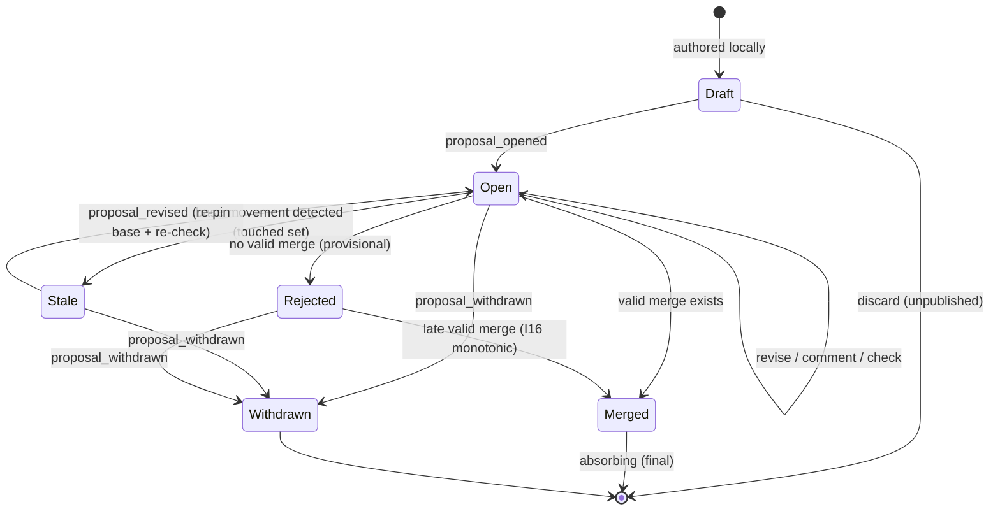

# supragnosis - Proposal Workflow Design

> A workflow that manages "promotion to canon" in knowledge shared across
> multiple parties (humans + agents) - the Pull Request of knowledge.
>
> - Normative basis: the concretization of [principles.md](principles.md) Principle 23 (the gate to canon).
> - Status: design note. See Section 13 for implementation milestones.
> - Core goal: **each step must not logically contradict the principles.** To that end,
>   all steps are first fixed as invariants (Section 2), and the flow is built on top of them.

---

## 1. Problem and Analogy

Observation (observe) is free (Principle 22). But if every assertion is treated with
equal weight, the graph becomes a junkyard (Principle 18). Therefore a gate is needed
between **an individual's assertion** and the **shared canon**, and the workflow of
that gate is the proposal.

Correspondence with a git PR:

| git | supragnosis | Difference |
|-----|-------------|------------|
| commit | observation | equally immutable, append-only |
| branch | a host's/workspace's local belief | arises naturally without an explicit branch |
| PR | proposal | **a gate for promotion, not for writing** |
| diff | belief diff (Section 5) | a comparison of belief change, not a line comparison |
| CI | checks (Section 6) | consistency/contradiction/impact analysis |
| merge | loading a promotion event (Section 8) | a rise in trust tier, not copying code |
| revert | demotion proposal | a new event, not a rewind (Principle 3) |

**The decisive difference**: in git there is no code on main until merge, but in
supragnosis an assertion **already exists** regardless of a proposal (at a low trust
tier). A proposal is not a gate of existence but a **gate of tier**. This difference is
the key to satisfying Principle 22 (minimal friction) and Principle 18 (contamination
defense) at the same time.

---

## 2. Invariants

Every step of the flow is forbidden to violate the invariants below. Each invariant is
a direct consequence of a principle.

| # | Invariant | Basis principle |
|---|-----------|-----------------|
| I1 | **A proposal is also knowledge.** The creation/update/review/verdict of a proposal are all loaded as observation events. There is no separate side store. | 1, 3 |
| I2 | **State is a fold.** A proposal's current state is a deterministic function that folds the event stream belonging to that proposal in HLC order. Storing the state separately is a violation. | 16 |
| I3 | **Concurrent verdicts converge and are monotonic.** The conclusion is a function of the verdict set (it does not depend on HLC arrival order): if even one valid merge exists the conclusion is Merged, and reject becomes the conclusion only when none exists. Merged is an absorbing state, so from the moment a valid merge is in the log it is never overturned (I16). Conflicting verdicts are invalidated and recorded as comments. Every node reaches the same conclusion. | 16 |
| I4 | **No wall clock.** The mere passage of time causes no state transition. Expiry/auto-merge must be expressed as an explicit event (loaded by a policy executor). | 16, 18 |
| I5 | **Rejection is not negation.** Rejecting a proposal means "not promoting", not "the assertion is false". A rejected assertion continues to exist at its original tier. | 5 |
| I6 | **Merge is additive.** A merge does not copy/modify the assertion; it only appends a promotion event. Cancellation, too, is done via a new demotion event (no rewind). | 3 |
| I7 | **The base is fixed.** A proposal records the canon frontier (version vector) at the time it opens, and the diff and checks are computed against that base. If the base moves (touched set changes), the proposal becomes stale and cannot be merged without re-checking. | 16, 9 |
| I8 | **Checks are pure functions.** Check result = f(proposal, base frontier). Given the same input, the same result on any node - always reproducible by re-running. | 16, 19 |
| I9 | **No self-approval.** The authority principal of a verdict (the principal of the delegation chain) must differ from the authority principal of the proposal. For an agent to approve, on behalf of its delegator, a proposal that same delegator authored is self-approval. The principal comparison is based on **canonical identity** (resolved entity id or signing key), and a verdict between unresolved principals is treated as suspected self-approval and forces human review. **Exception: claim-demotion/recall permit self-approval** - demoting what you yourself introduced is low-risk thanks to Principle 3 (on par with reverting your own commit) and is consistent with the fast-path (Section 9). **However, a recall's verdict cannot be delegated** (I17) - self-approval is a matter of the principal acting directly, and does not hold for a proxied verdict cast by an agent. | 2, 15, 18 |
| I17 | **A recall verdict is a human's direct act.** A recall's verdict cannot become valid through proxied loading via a delegation chain - it is valid only through a human principal's direct signature or elicitation response. The fold inspects the verdict's provenance and invalidates (demotes to comment) a proxied recall verdict. This blocks the path where a contaminated agent opens a recall via an `on_behalf_of` chain and immediately self-approves it by proxy, mass-withdrawing a derivation tree without human eyes - the clause that keeps Section 9's "recall is always human review" from being vacuous even in the face of delegation. claim-demotion is not subject to this constraint because its blast radius is at the granularity of an assertion bundle (the fast-path is preserved). | 18, 19, 23 |
| I10 | **Loading is not gated.** No part of the proposal procedure blocks or delays observe. | 22 |
| I11 | **HLC causal propagation.** On the creation/ingest/sync of an observation, the HLC is updated causally. The fold's prefix-based determination (referential integrity, "first valid verdict") depends on this property; without it, multi-node convergence does not hold. | 16 |
| I12 | **Verdicts are bound to base.** A verdict references the base frontier it reviewed. A verdict inconsistent with the current base is invalidated and demoted to a comment, and revise (re-pinning the base) automatically invalidates prior verdicts that are **not yet finalized (merge/quorum met)** (resetting the quorum count). An approval of a stale diff does not leak into a merge. However, a revise that arrives after a valid merge has already been finalized cannot move the base and is demoted to a comment - finality beats revise (the monotonicity of I16). | 9, 16 |
| I13 | **The fold recomputes blocking checks.** Whether the blocking gate for merge validity passes is recomputed by the fold rather than trusting the `check_reported` event (I8 guarantees reproducibility). `check_reported` is merely a UX cache/advisory; a forged "pass" cannot promote contamination. | 8, 18 |
| I14 | **Merge effects are idempotent.** Duplicate loading of the same effect is harmless, and entity-merge canonicalizes by canonical id order so concurrent duplicate proposals do not diverge. | 3 |
| I15 | **The fold re-validates the routing conditions of an automatic verdict.** A policy executor's (automatic) verdict is valid only when the fold recomputes its routing premises (zero new contradictions, impact radius at or below the threshold) at the merge-time state and they pass - even if a contaminated/buggy executor auto-merges a high-impact proposal, the fold invalidates it. This does not apply to human verdicts. | 8, 16, 18 |
| I16 | **Finality is monotonic.** Promotion (Merged) is a monotonic function of the event set and an absorbing state - as long as a valid merge exists in the log, no later event arrival can cancel the promotion. A reject conclusion is a provisional state meaning "absence of a valid merge" (a late-arriving valid merge is promoted to Merged), and a reversal of a promotion is always expressed as a new proposal (claim-demotion, etc.). Since derived knowledge accumulates only on top of Merged, making Merged the absorbing state is the only arrangement that prevents retroactive invalidation (a reject-absorbing choice would make Merged provisional and tear derivations down again). | 16, 3 |

---

## 3. Domain Model

### 3.1 Canon

Canon = the workspace's "shared belief view". A kind of materialized projection, it is
the current belief computed **only from assertions whose trust tier is at or above a
threshold**.

- Canon is not a stored artifact but a view (Principle 1). Changing the tier threshold
  over the same log computes a different canon.
- Each workspace has a canon policy (tier threshold, verdict authority, auto-merge
  rules), and this policy itself is versioned knowledge (Section 10).

### 3.2 Proposal

An entity added to the core ontology (the meta level of Principle 10).

| Field | Description |
|-------|-------------|
| `id` | Stable identifier (`supragnosis://proposal/{id}`) |
| `kind` | Proposal kind (3.3) |
| `payload` | List of references to target assertions/entities/types (based on observation ids) |
| `target` | Target workspace (canon) and requested tier |
| `rationale` | Proposal rationale (natural language) |
| `base` | Canon frontier at the time it opens (version vector) - the reference point of I7 |
| `proposer` | Provenance including the delegation chain (Principle 2) |

### 3.3 Proposal Kinds (the 5 intents that affect canon)

Per Principle 23, the following five are reflected into canon **only through a
proposal**.

1. **claim-promotion** - promotion of the trust tier of an assertion bundle (the most common case)
2. **claim-demotion** - tier demotion (a de facto revert, including contamination response)
3. **entity-merge / split** - finalizing/canceling an identity resolution (the "human confirmation" path of Principle 15)
4. **tbox-change** - adding/revising a type/relation in the canon T-Box (the "explicit promotion" of Principle 11)
5. **recall** - bulk retraction of the derivation tree from a contamination source (the sanitization of Principle 18)

Each kind shares the same state machine and differs only in its check suite (Section 6).

### 3.4 Events (all are observations - I1)

| Event | Meaning |
|-------|---------|
| `proposal_opened` | Proposal creation (pins the base frontier) |
| `proposal_revised` | Modifying payload/rationale (re-pins base) |
| `check_reported` | Recording a check result (a derived observation, reproducible - I8) |
| `review_commented` | Review comment (not a verdict) |
| `verdict_cast` | Verdict: `merge` / `reject` (the deciding event - I3) |
| `proposal_withdrawn` | Withdrawal by the proposer |
| merge effects | `tier_promoted` / `entities_merged` / `type_defined` / `claims_retracted`, etc. - loaded as the consequence of a verdict(merge) |

Because every event is an observation, proposals federate straight over the sync layer
(Principle 16), and reviewing on any node converges. There is no separate replication
protocol for the proposal system.

---

## 4. State Machine

State is not stored; it is computed by an event fold (I2).



Note - Rejected is not an absorbing state: a reject conclusion is a provisional state
meaning "there is not yet a valid merge", and a late-arriving valid merge raises the
conclusion to Merged (the monotonic promotion of I16). Since a wall clock cannot close
this provisional conclusion (I4), the only means of permanent finality is the proposer's
withdrawal (proposal_withdrawn). Conversely, Merged is an absorbing state, so no event
can undo the promotion - a reversal is expressed only as a new demotion proposal
(I6, I16).

Transition rules:

| Transition | Condition | Note |
|------------|-----------|------|
| Draft -> Open | the proposer publishes | pin the base frontier (I7) |
| Open -> Stale | a new observation reaches the touched set | the fold detects it - no transition event needed (see note below) |
| Stale -> Open | re-pin base via revise | check re-run + invalidation of prior verdicts (quorum reset) required (I7, I8, I12) |
| Open -> Merged | at least one valid merge exists (blocking passed, authority valid I9). Merged is an absorbing state (I16) | load merge effect events (I6) |
| Open -> Rejected | no valid merge exists (provisional conclusion) | assertions keep their original tier (I5) |
| Rejected -> Merged | a late-arriving valid merge | monotonic promotion - reject is provisional, not final (I16) |
| After Merged | a reversal via a **new proposal** (demotion) | promotion is immutable (I6, I16) |
| Permanent finality of Rejected | only proposal_withdrawn closes the provisional conclusion | cannot be closed by a wall clock (I4) |

Note - the logical status of Stale: Stale is not a state made by an event but
**a computed result of the fold** ("is there an observation in the touched set after this
proposal's base" is decidable from the log alone). So neither a wall clock nor the
judgment of a separate watchdog process is needed - any node computes the same answer
(compliant with I2, I4).

Definition of the touched set: the assertions referenced by the payload + assertions
sharing a (subject, predicate) with those assertions + for entity-merge, the alias space
of the entity in question. It is defined deliberately narrowly - if it reacted to changes
across the whole canon, no proposal could ever merge in an active workspace (livelock
prevention).

However, the freshness of the impact radius (diff item 4) is guarded separately: if a
new derivation reaches the `derived_from` subtree of the payload after the base, then
instead of widening the touched set to make it stale, **only the impact analysis is
recomputed at merge time** - this blocks auto-merge misrouting (Section 9) caused by
underestimation while not inducing livelock.

---

## 5. Belief Diff

The heart of reviewability. It corresponds to the diff of a git PR, and is **a capability
that deterministic projection (Principle 16) gives for free**:

```
diff = the difference between materialize(canon, base) and materialize(canon, base + merge effects)
```

Since both materializations are pure functions, the diff is a pure function too (I8). The
computation is confined to the **touched set + impact radius slice** rather than the whole
canon - preserving determinism while lowering the cost from O(canon) to O(impact scope).
Components:

1. **Assertions being promoted** - what newly enters canon.
2. **Beliefs being overturned** - the point where the current belief changes under the
   resolution policy (e.g., an existing canon assertion is superseded).
3. **Contradictions newly created/resolved** - per Principle 6, contradictions do not
   block a merge but must be shown to the reviewer.
4. **Affected derived knowledge** - the list of knowledge that depends on this belief,
   descending along the `derived_from` lineage (impact radius = an input to review
   intensity, Section 9).
5. **Resolution changes** - for an entity-merge proposal, which references get rewired.

---

## 6. Checks

Checks are pure functions (I8) and fall into two classes. **The criterion distinguishing
blocking from informative comes from the principles**: a contradiction of schema/structure
is a bug in the system so it is blocked (Principle 9), while a contradiction between
assertions is a property of the world so it is only shown (Principle 6).

| Check | Class | Content |
|-------|-------|---------|
| T-Box consistency | **blocking** | cyclic subtype, domain/range conflicts, rigidity violation candidates (Principles 9, 13) |
| provenance completeness | **blocking** | missing delegation chain/signature/lineage (Principles 2, 18) |
| referential integrity | **blocking** | does the observation referenced by the payload exist in the local log (if sync is incomplete, merge is impossible - you cannot promote what is not there) |
| authority check | **blocking** | proposer/reviewer authority for the proposal kind, whether it is self-approval (I9) |
| contradiction analysis | informative | diff item 3 - the list of new contradictions and the provenance of the opposing assertions |
| impact analysis | informative | diff item 4 - derivation tree size, citation frequency within canon |
| trust profile | informative | current tier/source distribution of the payload assertions (e.g., proportion of unverified external sources) |

Special rule for recall proposals: recall adds **lineage completeness** to the blocking
checks - the derivation tree reachable from the named source must match the payload (if a
derivation is missed, the sanitization is incomplete).

**Check results are a cache (I13).** The `check_reported` event is only a record for
UX/reproduction convenience, and whether the blocking gate for merge validity passes is
recomputed by the fold at that HLC prefix. A forged "pass" event cannot promote
contamination into canon.

**Monotonicity note (consistency with I16).** The fold's blocking recomputation uses the
fixed base frontier (I7) as input - check result = f(proposal, base) (I8). Even if a
late-arriving early-HLC event slips into the prefix, the check input (the fixed base) does
not change, so the verdict "a valid merge exists" does not flip pass -> fail after the
fact. That is, the monotonicity of I16 runs all the way through the blocking checks.
I13's "prefix recomputation" means the fold computes directly, distrusting
`check_reported`; it does not mean re-folding the base anew according to arrival order.
(This property is continuously verified by a property test - see the open decisions in
Section 13.)

---

## 7. Verdicts and Concurrency

This is the most logically dangerous point. In a distributed environment, two reviewers
can cast opposing verdicts without knowing about each other.

### 7.1 Decision Rule (the concretization of I3/I16)

- verdict_cast is an observation event and carries an HLC.
- The fold's conclusion is a function of the verdict **set** (it does not depend on HLC
  arrival order):
  - If even one valid merge exists, the conclusion is **Merged**.
  - If no valid merge exists and a valid reject exists, the conclusion is **Rejected**
    (provisional - if a valid merge arrives late, it is promoted to Merged, I16).
- The definition of "valid" is unchanged: (a) passes the authority check (not
  self-approval, I9), (b) the fold recomputes the blocking checks and they pass (I13),
  (c) the base the verdict referenced matches the current base (I12), (d) the proposal was
  in the Open state, (e) if the verdict-casting party is automatic, the fold recomputes the
  routing premises and they pass (I15).
- The decision rule is a join over the chain pending <= reject <= merge. Since the join is
  associative/commutative/idempotent and merge is the absorbing element (top), the
  conclusion is independent of arrival order (convergence) and is fixed from the moment a
  valid merge is in the log (monotonicity/finality). Without any separate machinery such as
  watermarks or waiting for straggler verdicts, we get both convergence and finality
  ("from when may I trust this conclusion and accumulate derivations on it") at once - and
  since it does not drag in a wall clock, it is consistent with I4.
- If there are multiple valid merges, the representative verdict is canonicalized to the
  **minimum HLC** (since effects are idempotent there is no semantic issue; the
  canonicalization is only for the determinism of choosing the representative - I14).
- A conflicting reject or revise that arrives after Merged cannot change the conclusion and
  is demoted to a record equivalent to `review_commented` (information is preserved -
  Principle 3).

Example 1 (convergence): on node A, Alice casts merge (HLC=t1); on node B, which was
offline, Bob casts reject (HLC=t2, t1 < t2). After sync, since a valid merge exists in the
set, the fold on every node converges to Merged, and Bob's reject remains as a comment.

Example 2 (the point of monotonicity): node A computes merge (HLC=t2) as the conclusion,
promotes to canon, and begins accumulating derivations on top of it. After the partition
heals, Bob's reject (HLC=t1, t1 < t2) arrives belatedly. Since a valid merge exists in the
set, the conclusion **stays Merged** - even an earlier-HLC reject cannot cancel the
promotion (I16). The already-promoted canon and the derivations on top of it are not
retroactively invalidated. If Bob genuinely wants a reversal, they open a new **demotion
proposal** (claim-demotion) - the immutability of finality (I6, I16) and convergence (I3)
are upheld at once.

### 7.2 Atomicity of Merge Effects

verdict(merge) and the merge effect events (tier_promoted, etc.) are separate observations,
but since **the fold derives the merge effect from the verdict**, there is no atomicity
problem: the force of the promotion comes from the fact that "verdict_cast(merge) is the
conclusion", and the effect events are records for the convenience of materializing that
consequence. A node where the effect events have not yet synced still computes the same
canon as long as it has the verdict (I2).

### 7.3 Quorum Policy

The default policy is "a single valid merge" (7.1 above). A workspace policy (Section 10)
can require an N-person quorum. The condition for the conclusion to become Merged is then
defined not as the final state of a sequential fold but as a **set-existential**: "is there
a prefix in which N valid merges **against the current base** hold without a reset, for
some base B." Once this prefix holds, Merged is an absorbing state (I16), so a
later-arriving early-HLC revise cannot roll back the count. Only until finalization (before
the prefix holds) can a revise move the base and reset the count (I12) - an approval of a
stale diff does not leak into a merge.

Caution: if "the first moment N is reached" is mis-implemented as a sequential final state,
a late-arriving early-HLC revise could reset the count and retroactively cancel an
already-finalized Merged (a monotonicity violation). It must be implemented as a set
function, "the existence of a prefix without a reset" (see the open decisions in
Section 13). A reject-direction quorum is defined symmetrically but is provisional - a late
merge quorum being met raises the conclusion to Merged. Either way, the decision rule is a
function of the log set alone (I2).

---

## 8. Semantics of Merge, Reject, and Withdraw

- **Merge** = appending a promotion event (I6). The assertion itself is unchanged - only
  tier metadata is added so that it crosses the threshold of the canon view. A reviewer's
  verdict is itself also a high-trust attestation (the "human confirmation" promotion path
  of Principle 18).
- **Reject** = a record of the decision not to promote (I5). The assertion continues to
  exist at its original tier. If a reviewer believes "this assertion is wrong", they should
  not stop at rejecting but should **load a counter-assertion** - negation is expressed as
  an explicit assertion (Principle 5). The rejection rationale is kept in the rationale so
  it can be referenced on resubmission of the same proposal.
- **Withdraw** = termination by the proposer. Since it is not a verdict, it has no effect on
  any tier. It is also the only means to permanently close a provisional conclusion
  (Rejected) (it cannot be closed by a wall clock, I4).
- **Reversal** = undoing a promotion is always a new proposal (demotion). **Merged is an
  absorbing state and thus immutable** (I16). But Rejected is provisional, so a
  late-arriving valid merge raises the conclusion to Merged even without a new proposal -
  since derivations accumulate only on top of Merged, a transition in this direction causes
  no retroactive invalidation (it merely creates a promotion that was not there before).

---

## 9. Review Economics

Human attention is the bottleneck. Principle: **most automatically, only a few to humans.**

Routing of review intensity (adjustable by canon policy):

| Condition | Path |
|-----------|------|
| zero new contradictions + small impact radius + sufficient proposer tier | **auto-merge allowed** - the policy executor loads the verdict (I4: an explicit event by the executor, not the passage of time). The routing premise is re-validated by the fold (I15) |
| a new contradiction exists | human review required (the mediation point of Principle 6) |
| large impact radius (many derivations / core of canon) | human review required, consider raising the quorum |
| tbox-change, recall | always human review (structural change and sanitization are not automated) |
| entity-merge | only the top band of resolution confidence is automatic, the rest to humans (the conservatism of Principle 15) |

Operating principles:

- **Auto-merge is also a verdict**: the policy executor (daemon/agent) loads the verdict
  with its own delegation chain. There is always an answer to "who merged this" later
  (Principle 2). However, the routing premises of an automatic verdict (zero new
  contradictions, impact radius at or below the threshold) are **re-validated by the fold as
  validity conditions** (I15) rather than being left to the executor's discipline - even if
  a contaminated/buggy executor auto-merges a high-impact proposal, no conclusion stands.
- **The review queue is curation UX**: per Principle 22, the review backlog is not a
  separate task but is naturally exposed in query results and introspection ("among the
  grounds for this answer, there are 2 proposals awaiting your confirmation").
- **Agent pre-review**: an LLM agent can do a first-pass review that summarizes the
  informative check results and flags the points at issue. But the agent's review is a
  comment, not a verdict - the verdict authority for the top canon tier rests with a human
  principal (Principle 19: the LLM is not a judge).
- **Demotion/recall fast-path**: demotion of something already in canon (claim-demotion) and
  contamination recall have a lower threshold than promotion (quorum 1, a high-trust reviewer
  immediately). This is because an asymmetry of fast promotion and slow correction creates a
  contamination exposure window, and since information is preserved (Principle 3) the cost of
  a hasty demotion is low. The blocking of recall (lineage completeness) is retained. For
  demotion/recall only, **self-approval is permitted** (the I9 exception) - waiting for
  someone else's approval to immediately demote contamination you introduced would instead
  widen the exposure window. However, a recall's verdict must be **a human's direct act**
  (I17) - permitting self-approval does not mean permitting a proxied verdict cast by an
  agent.
- **The contamination trade-off of merge absorption**: the decision rule of 7.1 (a valid
  merge wins and absorbs) slightly widens the contamination exposure window - if during a
  partition a contaminated assertion is merged while a legitimate reject also existed, the
  merge wins. This is not a new defense mechanism but a scenario already designed to be
  absorbed by the demotion fast-path above. The rationale is two-fold:
  (1) **cost structure** - a merge is merely the addition of tier metadata and can be cheaply
  undone by a demotion, so the fast-path's justifying logic, "thanks to Principle 3 the cost
  of a hasty demotion is low", applies equally to merge. Finalizing optimistically and going
  through a new proposal for correction is right by the cost structure. (2) **the goal forces
  it** - since derivations accumulate only on top of Merged, to prevent retroactive
  invalidation Merged must be the absorbing state. The seemingly conservative
  reject-absorbing choice would instead make Merged provisional and tear derivations down
  again, so it does not solve this problem - the choice of absorbing state is effectively
  forced to be merge. The residual risk (a single valid reviewer principal creating a
  promotion that persists until detection) is blocked in the automatic-verdict case because
  the fold re-validates the routing premises (zero new contradictions, low impact) (I15), and
  the real exposure surface narrows to human merges.

---

## 10. Governance

- **Policy is also knowledge**: a workspace's canon policy (tier threshold, verdict
  authority, quorum, auto-merge rules) is stored as that workspace's knowledge, and changing
  the policy itself requires a proposal on par with a tbox-change (self-referential but not
  circular - the bootstrap policy comes from the node's config file).
- **Verdict authority**: the principal (a human) designated by the policy, or a delegated
  high-trust host. Even when a verdict is cast through a delegation chain, the responsible
  party is the principal of the chain (Principle 2).
- **No self-approval (I9)**: if the principals of the proposer and approver are the same,
  merge is impossible. Principal identity is based on **canonical identity** (resolved
  principal entity id or signing key), and the identity anchor is bootstrapped from the node
  config (blocking a resolution cycle). A verdict between unresolved principals is treated as
  suspected self-approval and forces human review. **Exception (demotion/recall)**:
  claim-demotion and recall permit self-approval (I9) - immediate correction of contamination
  you introduced is low-risk and consistent with the fast-path (Section 9). Only recall must
  be a human principal's direct verdict rather than a proxy via a delegation chain (I17).
  The special case of a single-person (solo) workspace: the policy permits self-approval, but
  that promotion carries a "self-attested" mark so it is distinguished in trust evaluation
  when synced to another canon (Principle 18) - it removes the friction of working alone
  while preserving trust when federating.

---

## 11. MCP Surface Extension

Per Principle 21 (a narrow surface), only 4 intent-level tools are added.

| Tool | Role |
|------|------|
| `propose` | Create a proposal (kind, payload, target, rationale) |
| `list_proposals` | Filter by state/workspace/awaiting-my-review |
| `get_proposal` | Proposal + belief diff + check results (if diff computation takes long, returns a task handle - MCP Tasks) |
| `review` | Comment or verdict. A verdict requiring human confirmation is delegated via elicitation / multi round-trip |

Resources: `supragnosis://proposal/{id}`, `supragnosis://workspace/{ws}/canon-policy`.

Prompts: `review-proposal {id}` - a guide prompt that fills in the diff and check results
to elicit the agent's first-pass review (Section 9).

---

## 12. Principle Alignment Matrix

A summary of how each step aligns with the principles (for review):

| Step | Principle to uphold | This design's mechanism |
|------|---------------------|-------------------------|
| loading | 22 (minimal friction) | proposals are independent of loading (I10) - only promotion is gated |
| proposal creation | 1, 3 (assertion/immutable) | proposal = observation event (I1) |
| checks | 9 vs 6 (schema contradiction is a bug, assertion contradiction is a signal) | blocking / informative dichotomy (Section 6) |
| diff | 16 (deterministic projection) | the difference of two materializations = a pure function (I8) |
| stale | 16, I4 (no wall clock) | Stale is not an event but a computed result of the fold (Section 4 note) |
| verdict | 16 (convergence + monotonic) | valid-merge-absorbing decision rule (a function of the set) + Merged absorbing + a reversal is a new proposal (Section 7, I16) |
| merge | 3 (additive only) | append a promotion event, assertion immutable (I6) |
| reject | 5 (OWA) | reject != negation, negation via an explicit assertion (Section 8) |
| automation | 2, 18, 19 (responsibility, contamination defense, the LLM is not a judge) | auto-merge is also a verdict with a delegation chain, the routing premise is re-validated by the fold (I15), the agent goes only as far as a comment (Section 9) |
| governance | 18 (explicit promotion) | policy is also knowledge, no self-approval + solo special case (Section 10) |

The 9 kinds of edge cases deliberately resolved:

1. **Concurrent opposing verdicts** -> valid-merge-absorbing decision rule (a function of the set) + a reversal is a new proposal (7.1).
2. **Nondeterminism of time-based auto-merge** -> expiry/automation only via explicit events (I4).
3. **Infinite stale loop in an active canon** -> define the touched set narrowly (Section 4).
4. **Approval of a stale diff** -> bind the verdict to the base and revise resets the verdict (I12).
5. **Forgery of check results** -> blocking is recomputed by the fold, check_reported is a cache (I13).
6. **Concurrent duplicate merges** -> merge effects idempotent + entity-merge canonicalization (I14).
7. **Auto-merge due to impact underestimation** -> recompute the impact radius at merge time (Sections 4, 9).
8. **High-impact auto-merge by a contaminated/buggy executor** -> the fold re-validates the routing premise of an automatic verdict (I15).
9. **Retroactive reversal by a late early-HLC verdict** -> finality is a monotonic function of the event set, Merged is an absorbing state (I16, 7.1).
10. **Proxied recall self-approval by a contaminated agent** -> a recall verdict cannot be delegated, only a human principal's direct act is valid (I17).

---

## 13. Milestones and Open Decisions

Dependencies: the trust tier / resolution layer (M3) is a prerequisite. Also,
**multi-node convergence depends on HLC ordering (M4) (I11)** - so M3.5 works fully in
solo/single-canon, while deterministic convergence of multi-node/federation verdicts is
guaranteed only after HLC is introduced (M4). The proposal workflow goes in as **M3.5**,
between M3 and M4 (pre-value in solo/hub environments).

- M3.5a: Proposal entity + events + fold state machine + claim-promotion **and
  claim-demotion**. (Demotion is symmetric with promotion so it is cheap to implement, and
  it is needed early as the safety device of the Section 9 fast-path - a period with only
  promotion and no correction is itself a contamination exposure window.) The fold state
  machine reflects the monotonic decision rule of I16 - it computes the conclusion not as a
  sequential final-state fold but as the set function "a valid merge exists" (quorum as the
  reset-free prefix-existential, 7.3), and treats Merged as an absorbing state.
- M3.5b: belief diff + blocking checks + `propose`/`get_proposal`/`review`.
- M4+: quorum policy, the entity-merge/tbox-change/recall kinds, the auto-merge policy
  executor.

Open decisions:

- The exact radius of the touched set (up to subject/predicate sharing vs up to the 1-hop
  neighborhood) - a trade-off between livelock and safety. Initial value: narrow.
- The location of the auto-merge executor: a daemon on each node vs hub-only - either way
  the semantics are the same since it is identified by the provenance of the verdict
  observation. An operational choice.
- Whether to put a resubmission cooldown for rejected proposals in the policy (spam
  prevention) - try first in a form that is not an I4 violation (forcing attachment of the
  prior rejection rationale on resubmission).
- Monotonicity of quorum N>1: the details of implementing "N same-direction valid verdicts
  reached" as a set-existential (reset-free prefix) - mis-implementing it as a sequential
  final state lets a late revise retroactively cancel a finalization (7.3). To be finalized
  together with the rule for revise invalidation (demotion to comment) after N is reached.
- Canonicalization of the representative verdict among multiple valid merges: choosing the
  minimum HLC (since effects are idempotent there is no semantic issue; it is only for the
  fold's determinism - I14).
- Monotonicity of blocking checks: pinning the recomputation input to the fixed base
  frontier (I7, I8) so validity does not flip after the fact (the Section 6 monotonicity
  note), continuously verified by a property test that checks the conclusion is identical
  even when the same event set is injected in random order/partitioning (Principle 16).
